# Agile Methodology Comprehensive Guide

## Table of Contents
1. [Introduction to Agile](#introduction-to-agile)
2. [Agile Manifesto](#agile-manifesto)
3. [Agile Principles](#agile-principles)
4. [Popular Agile Frameworks](#popular-agile-frameworks)
5. [Agile Workflow](#agile-workflow)
6. [Roles in Agile](#roles-in-agile)
7. [Agile Artifacts](#agile-artifacts)
8. [Agile Ceremonies](#agile-ceremonies)
9. [Benefits and Challenges](#benefits-and-challenges)
10. [Agile Metrics](#agile-metrics)

## Introduction to Agile

Agile is an iterative approach to project management and software development that helps teams deliver value to their customers faster and with fewer headaches. Instead of betting everything on a "big bang" launch, an agile team delivers work in small, but consumable, increments.

### Key Characteristics:
- **Iterative Development**: Work is divided into small iterations
- **Customer Collaboration**: Continuous customer involvement
- **Adaptive Planning**: Flexible to changes
- **Continuous Improvement**: Regular reflection and adaptation

## Agile Manifesto

The Agile Manifesto was created in 2001 by 17 software developers who defined four core values:

### The Four Values:
1. **Individuals and Interactions** over processes and tools
2. **Working Software** over comprehensive documentation
3. **Customer Collaboration** over contract negotiation
4. **Responding to Change** over following a plan

### The Twelve Principles:
1. Customer satisfaction through early and continuous software delivery
2. Accommodate changing requirements throughout the development process
3. Frequent delivery of working software
4. Collaboration between the business stakeholders and developers throughout the project
5. Support, trust, and motivate the people involved
6. Enable face-to-face interactions
7. Working software is the primary measure of progress
8. Agile processes to support a consistent development pace
9. Attention to technical excellence and good design
10. Simplicity
11. Self-organizing teams encourage great architectures, requirements, and designs
12. Regular reflections on how to become more effective

## Popular Agile Frameworks

### Scrum Framework Overview

## Agile Workflow

### Typical Agile Development Cycle

### Detailed Sprint Cycle

## Roles in Agile

### Core Scrum Roles

```mermaid
graph TB
    A[Product Owner] --> D[Development Team]
    B[Scrum Master] --> D
    C[Stakeholders] --> A
    D --> E[Working Software]
    
    A --> A1[Manages Product Backlog]
    A --> A2[Defines Features]
    A --> A3[Prioritizes Work]
    
    B --> B1[Facilitates Process]
    B --> B2[Removes Obstacles]
    B --> B3[Ensures Scrum Framework]
    
    D --> D1[Cross-functional]
    D --> D2[Self-organizing]
    D --> D3[7±2 Members]
```

## Agile Artifacts

### Product Backlog Structure

### Definition of Ready vs Definition of Done

## Agile Ceremonies

### Scrum Events Timeline

### Ceremony Duration Guidelines

## Benefits and Challenges

### Agile Benefits

### Common Challenges

## Agile Metrics

### Key Performance Indicators

### Velocity Tracking

*Note: Blue line = Actual Velocity, Green bars = Planned Velocity*

### Burndown Chart Example

## Best Practices

### Successful Agile Implementation

1. **Start Small**: Begin with pilot projects
2. **Get Management Buy-in**: Ensure organizational support
3. **Invest in Training**: Proper coaching and education
4. **Empower Teams**: Trust teams to self-organize
5. **Focus on Value**: Prioritize customer value delivery
6. **Embrace Change**: Welcome changing requirements
7. **Continuous Improvement**: Regular retrospectives
8. **Technical Excellence**: Maintain quality standards

### Common Anti-patterns to Avoid

- **Water-Scrum-Fall**: Doing mini-waterfalls within sprints
- **Command and Control**: Micromanaging teams
- **Ignoring Technical Debt**: Not addressing quality issues
- **Skipping Retrospectives**: Missing improvement opportunities
- **Over-committing**: Taking on too much work
- **Feature Factory**: Focusing on output over outcomes

## Tools and Technologies

### Popular Agile Tools

- **Project Management**: Jira, Azure DevOps, Trello
- **Collaboration**: Slack, Microsoft Teams, Confluence
- **CI/CD**: Jenkins, GitLab CI, GitHub Actions
- **Version Control**: Git, SVN
- **Testing**: Selenium, JUnit, Cypress

---

*This comprehensive guide covers the essential aspects of Agile methodology. Remember that Agile is a mindset, not just a set of practices. Successful implementation requires cultural change and continuous adaptation to your specific context.*
