# Kanban Methodology Comprehensive Guide

## Table of Contents
1. [Introduction to Kanban](#introduction-to-kanban)
2. [Kanban Principles](#kanban-principles)
3. [Core Practices](#core-practices)
4. [Kanban vs Scrum](#kanban-vs-scrum)
5. [Kanban Board Structure](#kanban-board-structure)
6. [Workflow States](#workflow-states)
7. [Metrics and Analytics](#metrics-and-analytics)
8. [Roles and Responsibilities](#roles-and-responsibilities)
9. [Implementation Guide](#implementation-guide)
10. [Advanced Concepts](#advanced-concepts)

## Introduction to Kanban

Kanban is a visual workflow management method that helps organizations visualize work, maximize efficiency, and improve continuously. Originating from the Toyota Production System, Kanban focuses on delivering work just-in-time while minimizing waste.

### Key Characteristics:
- **Visual Work Management**: Work is represented on Kanban boards
- **Work-in-Progress Limits**: Constraints on simultaneous work items
- **Flow Optimization**: Focus on smooth work movement
- **Continuous Improvement**: Evolutionary change based on metrics

## Kanban Principles

### The Four Fundamental Principles:

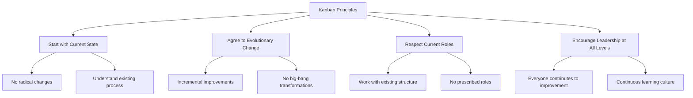

### The Six Core Practices:

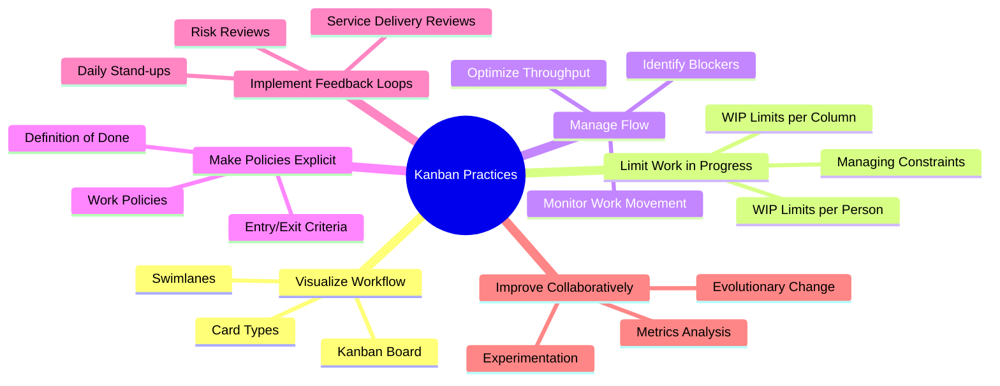

## Core Practices

### Visualizing Work with Kanban Board

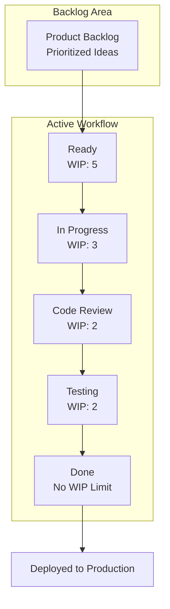

### WIP Limits Implementation

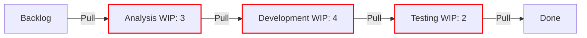

## Kanban vs Scrum

### Framework Comparison

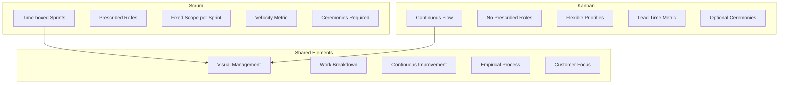

### When to Use Each Approach

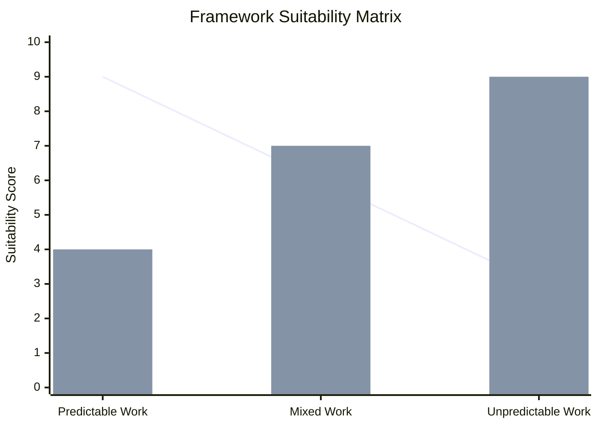

*Note: Blue line = Scrum, Green bars = Kanban*

## Kanban Board Structure

### Basic Board Components

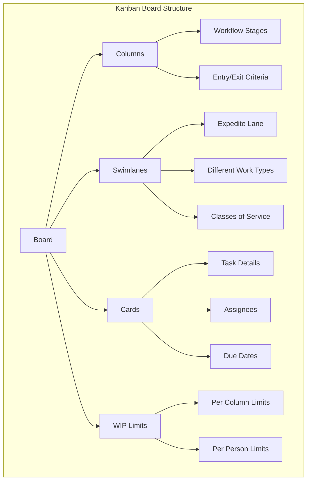

### Advanced Board with Swimlanes

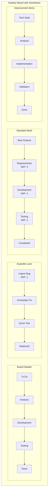

## Workflow States

### Typical Workflow Progression

```mermaid
stateDiagram-v2
    [*] --> Backlog : New Idea
    Backlog --> Ready : Prioritized
    Ready --> InProgress : Team Capacity
    InProgress --> Review : Development Done
    Review --> Testing : Code Reviewed
    Testing --> Done : All Tests Pass
    Done --> [*] : Delivered
    
    note right of InProgress : WIP Limit: 3
    note right of Review : WIP Limit: 2
    note right of Testing : WIP Limit: 2
```

### Work Item Types and Classes of Service

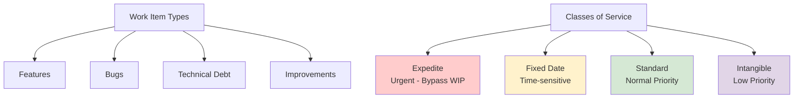

## Metrics and Analytics

### Key Kanban Metrics

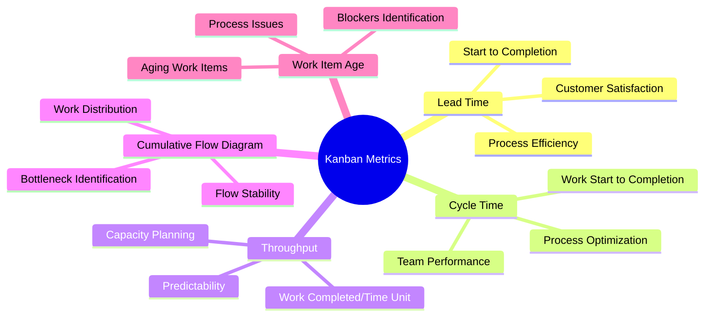

### Cumulative Flow Diagram

```mermaid
xychart-beta
    title "Cumulative Flow Diagram - Typical Pattern"
    x-axis [Mon, Tue, Wed, Thu, Fri, Mon, Tue]
    y-axis "Number of Items" 0 --> 25
    area [5, 6, 7, 8, 9, 8, 7] --> "Done"
    area [8, 9, 10, 9, 10, 11, 10] --> "Testing"
    area [6, 7, 6, 7, 6, 7, 8] --> "Development"
    area [4, 5, 6, 5, 6, 5, 6] --> "Backlog"
```

### Lead Time and Cycle Time Analysis

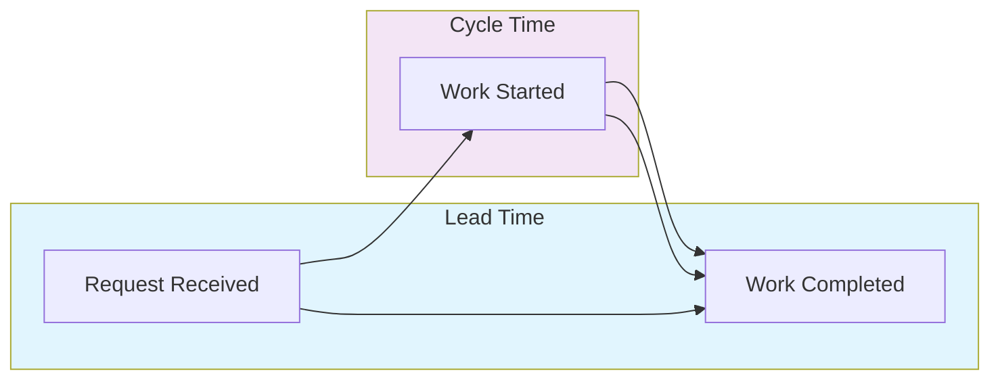

## Roles and Responsibilities

### Kanban Roles Evolution

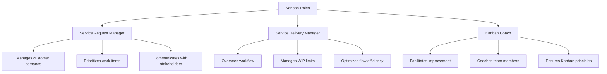

### Team Structure

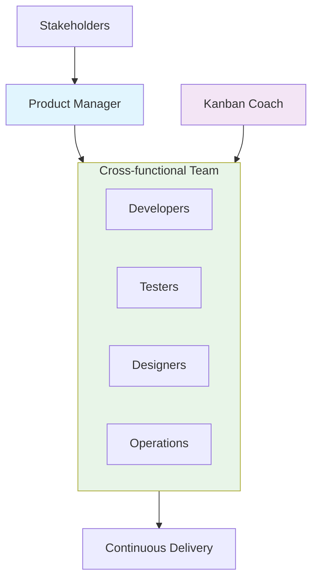

## Implementation Guide

### Kanban Implementation Steps

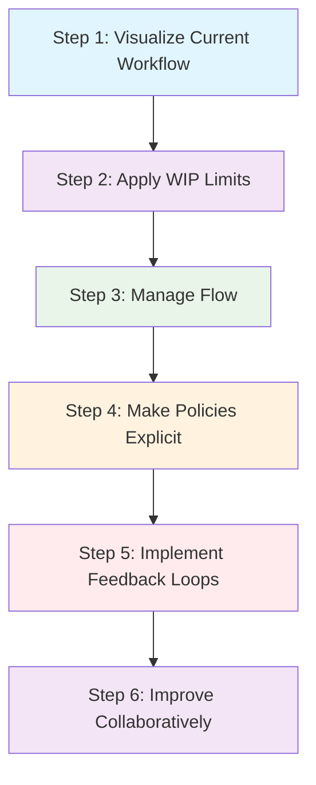

### Step-by-Step Implementation Timeline

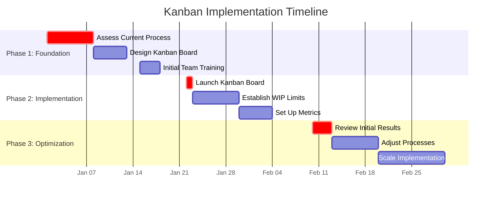

## Advanced Concepts

### STATIK - Systems Thinking Approach to Implementing Kanban

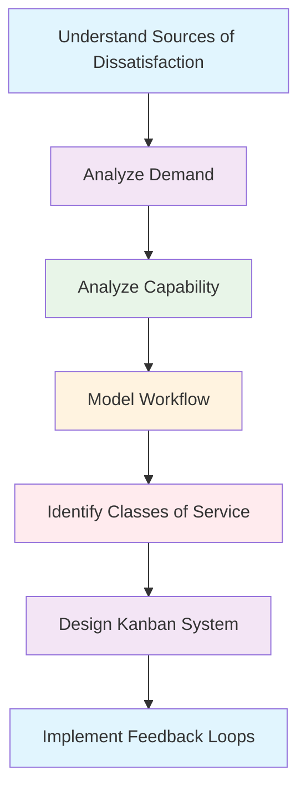

### Service Delivery Principles

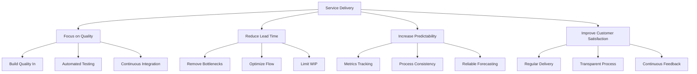

## Common Pitfalls and Solutions

### Implementation Challenges

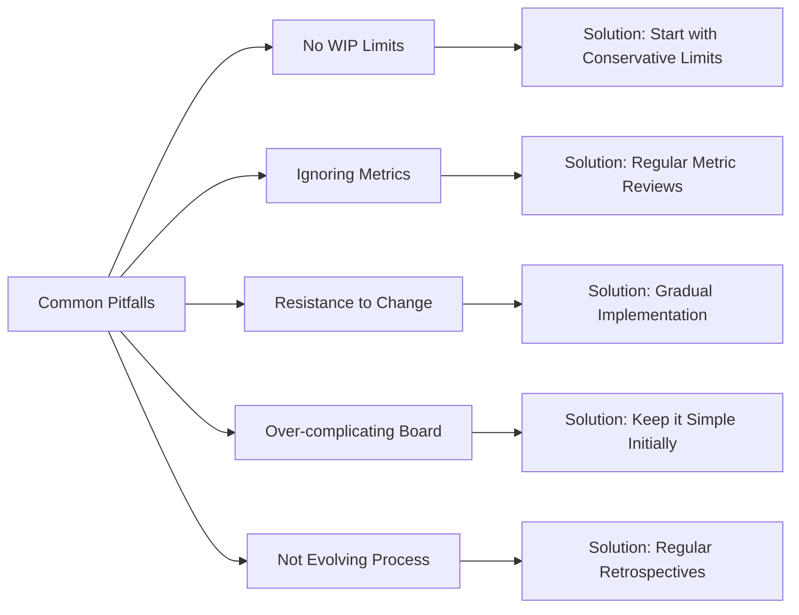

## Tools and Technologies

### Kanban Software Solutions

- **Visual Management**: Trello, Jira, Azure Boards
- **Enterprise Scale**: LeanKit, Kanbanize
- **Metrics & Analytics**: SwiftKanban, Kanban Tool
- **Physical Boards**: Whiteboards, sticky notes
- **Integration Tools**: Slack integrations, API connections

### Tool Selection Criteria

```mermaid
graph TD
    A[Tool Selection] --> B[Team Size]
    A --> C[Organization Scale]
    A --> D[Integration Needs]
    A --> E[Reporting Requirements]
    A --> F[Budget Constraints]
    
    B --> B1[Small: Trello]
    B --> B2[Medium: Jira]
    B --> B3[Large: Enterprise Tools]
    
    C --> C1[Single Team vs Portfolio]
    
    D --> D1[CI/CD Integration]
    D --> D2[Communication Tools]
    
    E --> E1[Basic vs Advanced Analytics]
    
    F --> F1[Open Source vs Commercial]
```

---

*Kanban is a powerful methodology for visualizing work, limiting work-in-progress, and maximizing efficiency. Its flexibility makes it suitable for various contexts from software development to marketing and operations. Remember that Kanban is about evolutionary change - start with your current process and improve incrementally based on data and feedback.*