# Project Planning Comprehensive Guide

## Table of Contents
1. [Introduction to Project Planning](#introduction-to-project-planning)
2. [Planning Principles](#planning-principles)
3. [Planning Process](#planning-process)
4. [Strategic Planning](#strategic-planning)
5. [Tactical Planning](#tactical-planning)
6. [Agile Planning](#agile-planning)
7. [Risk Planning](#risk-planning)
8. [Resource Planning](#resource-planning)
9. [Timeline Planning](#timeline-planning)
10. [Planning Tools and Techniques](#planning-tools-and-techniques)

## Introduction to Project Planning

Project planning is the systematic process of defining project objectives, scope, deliverables, and the steps required to achieve project goals. It serves as a roadmap that guides the team from project initiation to completion.

### Key Characteristics:
- **Forward-looking**: Anticipates future activities and requirements
- **Systematic**: Follows a structured approach
- **Adaptive**: Allows for changes and adjustments
- **Comprehensive**: Covers all aspects of the project

## Planning Principles

### Fundamental Planning Principles

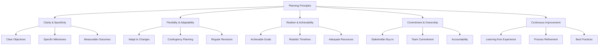

### SMART Goals Framework

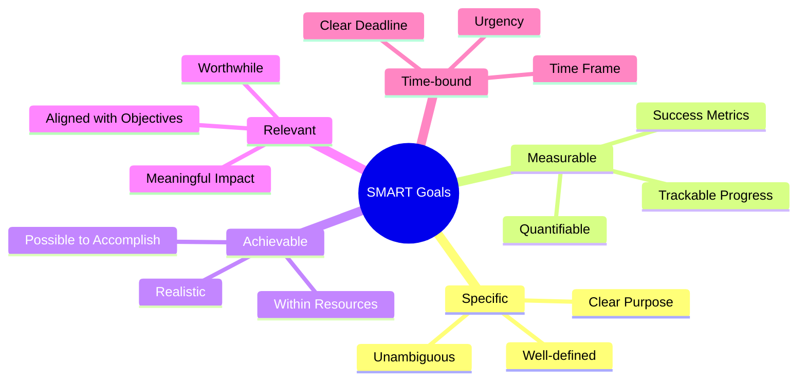

## Planning Process

### Comprehensive Planning Workflow

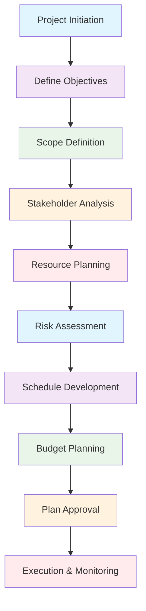

### Planning Phase Timeline

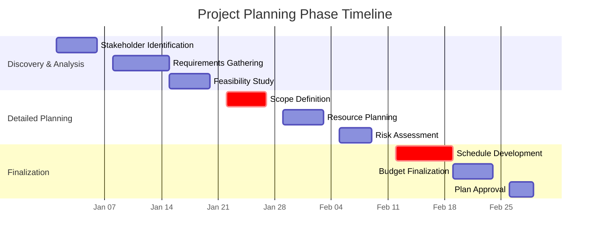

## Strategic Planning

### Strategic Planning Process

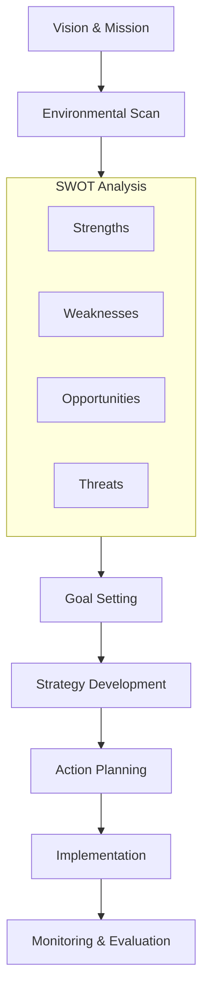

### SWOT Analysis Framework

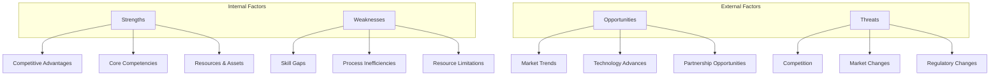

### Balanced Scorecard Approach

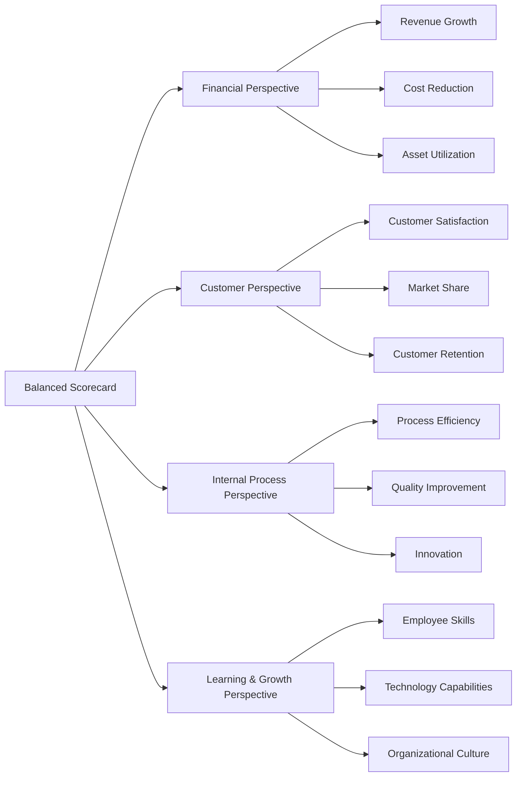

## Tactical Planning

### Work Breakdown Structure (WBS)

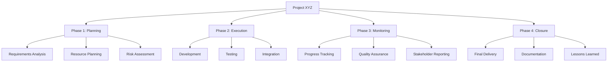

### Detailed Task Planning

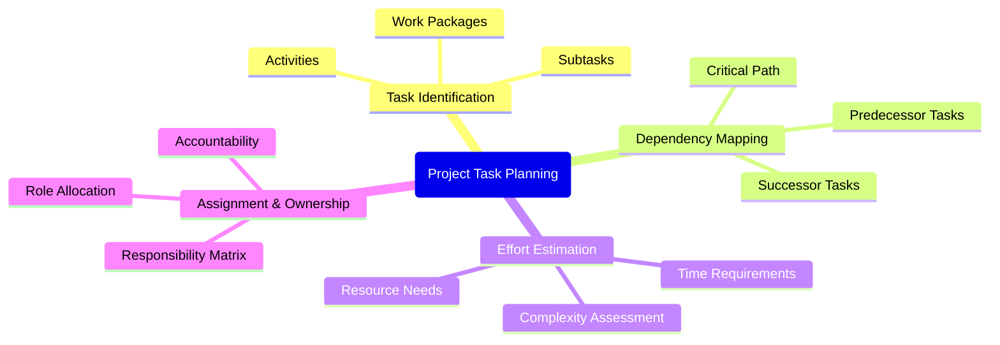

## Agile Planning

### Agile Planning Hierarchy

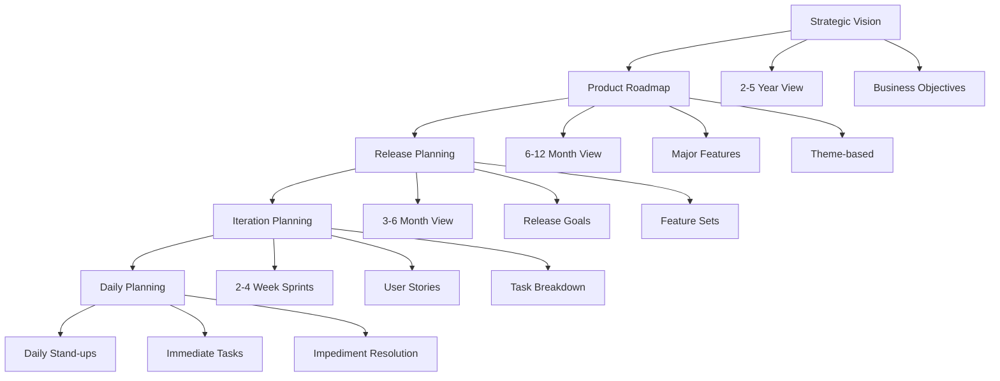

### User Story Mapping

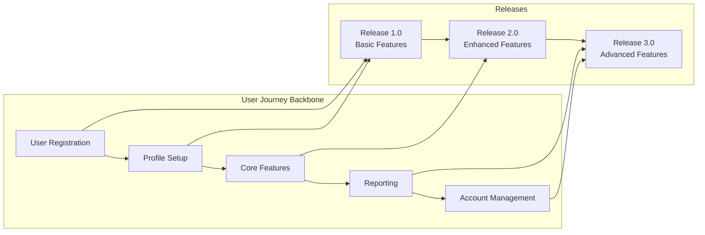

### Sprint Planning Process

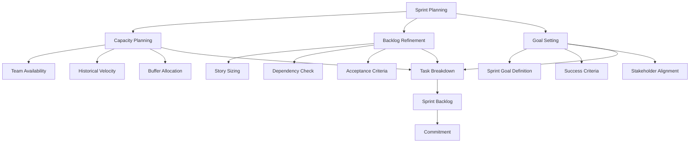

## Risk Planning

### Risk Management Process

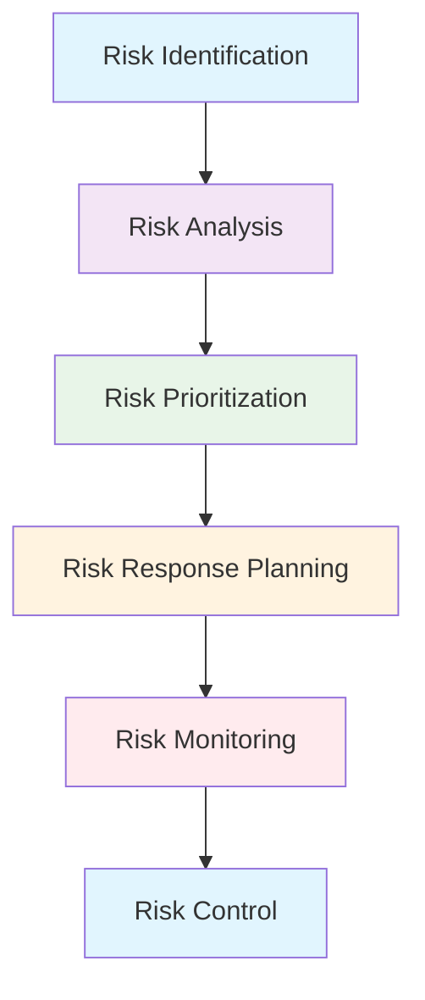

### Risk Assessment Matrix

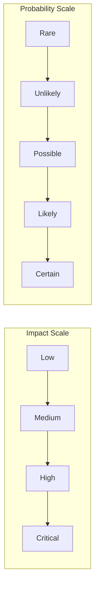

### Risk Response Strategies

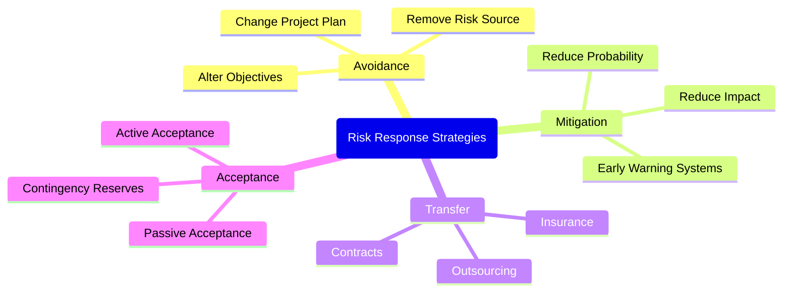

## Resource Planning

### Resource Allocation Framework

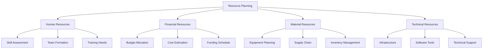

### Resource Loading and Leveling

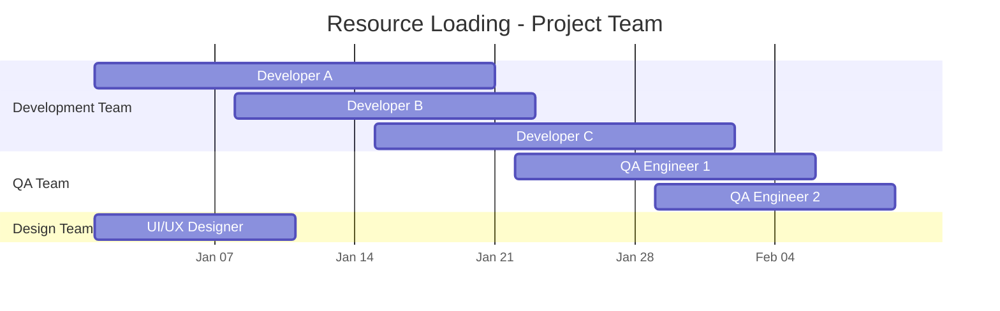

### RACI Matrix Example

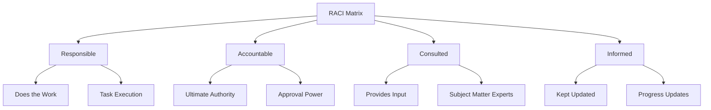

## Timeline Planning

### Critical Path Method (CPM)

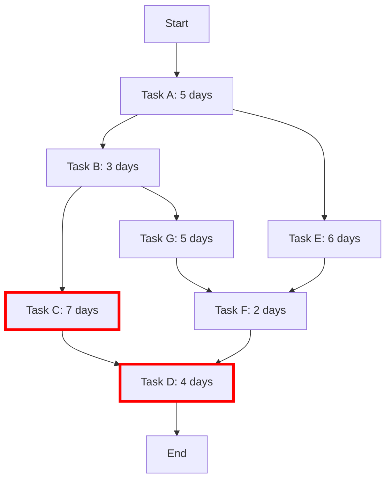

*Note: Red path indicates critical path*

### Gantt Chart Planning

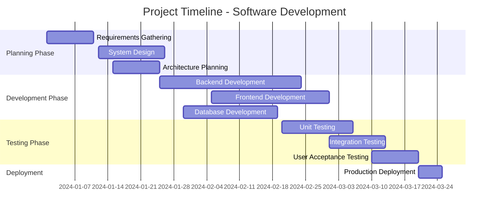

### Milestone Planning

```mermaid
graph LR
    A[Project Kick-off] --> B[Requirements Signed-off]
    B --> C[Design Approved]
    C --> D[Development Complete]
    D --> E[Testing Complete]
    E --> F[UAT Signed-off]
    F --> G[Go-Live]
    G --> H[Project Closure]
    
    style A fill:#e1f5fe
    style B fill:#f3e5f5
    style C fill:#e8f5e8
    style D fill:#fff3e0
    style E fill:#ffebee
    style F fill:#e1f5fe
    style G fill:#f3e5f5
    style H fill:#e8f5e8
```

## Planning Tools and Techniques

### Planning Tool Ecosystem

```mermaid
graph TB
    A[Planning Tools] --> B[Strategic Tools]
    A --> C[Tactical Tools]
    A --> D[Operational Tools]
    
    B --> B1[SWOT Analysis]
    B --> B2[PESTLE Analysis]
    B --> B3[Balanced Scorecard]
    
    C --> C1[Gantt Charts]
    C --> C2[Critical Path Method]
    C --> C3[Work Breakdown Structure]
    
    D --> D1[Kanban Boards]
    D --> D2[Daily Stand-ups]
    D --> D3[Burndown Charts]
```

### Estimation Techniques Comparison

```mermaid
xychart-beta
    title "Estimation Technique Accuracy Comparison"
    x-axis ["Expert Judgment", "Analogous", "Parametric", "Three-point", "Planning Poker"]
    y-axis "Accuracy Score" 0 --> 10
    line [6, 5, 7, 8, 9]
    bar [7, 6, 8, 8, 9]
```

*Note: Blue line = Early Project, Green bars = Detailed Planning*

### Planning Success Factors

```mermaid
mindmap
  root(Planning Success Factors)
    Clear Objectives
      Well-defined Goals
      Measurable Outcomes
      Stakeholder Alignment
    Comprehensive Analysis
      Thorough Research
      Risk Assessment
      Resource Evaluation
    Realistic Assumptions
      Achievable Timelines
      Adequate Resources
      Practical Constraints
    Stakeholder Engagement
      Regular Communication
      Feedback Incorporation
      Change Management
    Continuous Monitoring
      Progress Tracking
      Plan Adjustments
      Lessons Learned
```

## Planning Best Practices

### Effective Planning Checklist

```mermaid
graph LR
    A[Planning Best Practices] --> B[Start with Why]
    A --> C[Involve the Right People]
    A --> D[Use Historical Data]
    A --> E[Plan for Uncertainty]
    A --> F[Keep it Simple]
    A --> G[Review and Adapt]
    
    B --> B1[Clear Purpose]
    B --> B2[Business Value]
    
    C --> C1[Cross-functional Team]
    C --> C2[Stakeholder Input]
    
    D --> D1[Past Performance]
    D --> D2[Industry Benchmarks]
    
    E --> E1[Risk Management]
    E --> E2[Contingency Planning]
    
    F --> F1[Minimal Viable Plan]
    F --> F2[Progressive Elaboration]
    
    G --> G1[Regular Reviews]
    G --> G2[Continuous Improvement]
```

### Common Planning Pitfalls

```mermaid
graph TD
    A[Common Pitfalls] --> B[Over-planning]
    A --> C[Under-planning]
    A --> D[Ignoring Risks]
    A --> E[Poor Communication]
    A --> F[Scope Creep]
    
    B --> B1[Solution: Agile Approach]
    C --> C1[Solution: Adequate Time]
    D --> D1[Solution: Risk Register]
    E --> E1[Solution: Regular Updates]
    F --> F1[Solution: Change Control]
```

## Planning in Different Methodologies

### Methodology Comparison

```mermaid
graph TB
    A[Planning Approaches] --> B[Waterfall]
    A --> C[Agile]
    A --> D[Hybrid]
    
    B --> B1[Detailed Upfront]
    B --> B2[Fixed Scope]
    B --> B3[Sequential Phases]
    
    C --> C1[Iterative Planning]
    C --> C2[Flexible Scope]
    C --> C3[Adaptive Approach]
    
    D --> D1[Balanced Approach]
    D --> D2[Structured Flexibility]
    D --> D3[Risk Mitigation]
```

### Planning Tools by Methodology

```mermaid
graph LR
    A[Waterfall Tools] --> A1[Gantt Charts]
    A --> A2[WBS]
    A --> A3[CPM]
    
    B[Agile Tools] --> B1[Product Backlog]
    B --> B2[Sprint Planning]
    B --> B3[Story Points]
    
    C[Hybrid Tools] --> C1[Roadmaps]
    C --> C2[Release Planning]
    C --> C3[Milestone Tracking]
```

---

*Effective planning is the foundation of successful project execution. Remember that plans should be living documents that evolve as new information emerges. The goal of planning is not to predict the future perfectly, but to create a flexible framework that enables teams to navigate uncertainty while delivering value consistently.*