# Scrum Framework Comprehensive Guide

## Table of Contents
1. [Introduction to Scrum](#introduction-to-scrum)
2. [Scrum Theory](#scrum-theory)
3. [Scrum Values](#scrum-values)
4. [Scrum Roles](#scrum-roles)
5. [Scrum Events](#scrum-events)
6. [Scrum Artifacts](#scrum-artifacts)
7. [Sprint Cycle](#sprint-cycle)
8. [Planning and Estimation](#planning-and-estimation)
9. [Metrics and Tracking](#metrics-and-tracking)
10. [Scaling Scrum](#scaling-scrum)

## Introduction to Scrum

Scrum is an agile framework for developing, delivering, and sustaining complex products. It is an iterative and incremental approach that emphasizes empirical process control, transparency, inspection, and adaptation.

### Key Characteristics:
- **Iterative Development**: Work is organized in fixed-length iterations called Sprints
- **Time-boxed Events**: All events have specific durations
- **Empirical Process Control**: Based on transparency, inspection, and adaptation
- **Cross-functional Teams**: Teams have all necessary skills to deliver value

## Scrum Theory

### Empirical Process Control

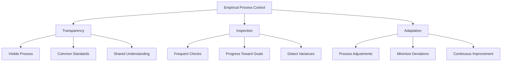

### Three Pillars of Scrum

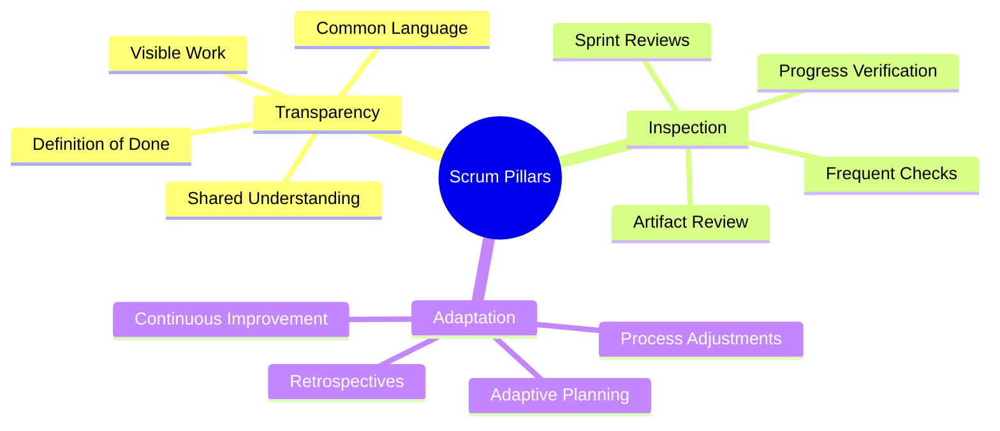

## Scrum Values

### The Five Scrum Values

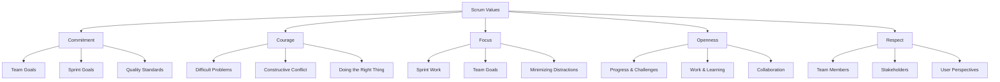

## Scrum Roles

### Core Scrum Roles Overview

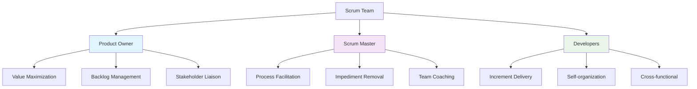

### Product Owner Responsibilities

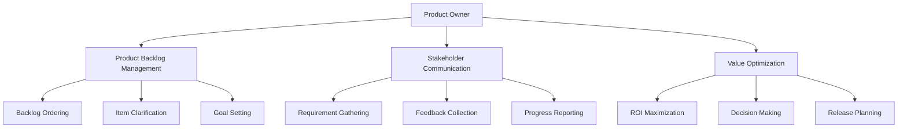

### Scrum Master Responsibilities

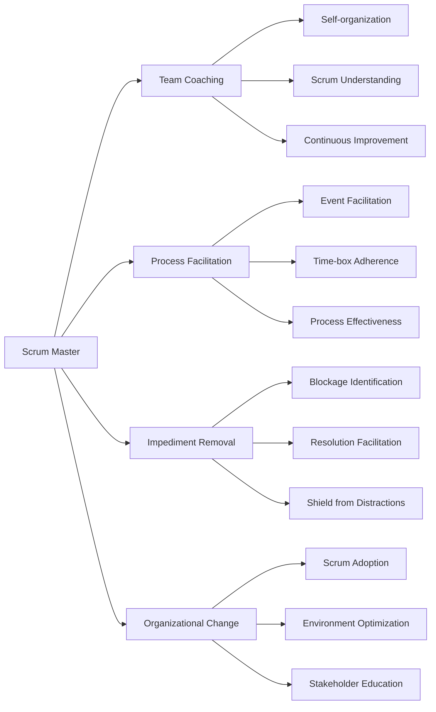

### Development Team Characteristics

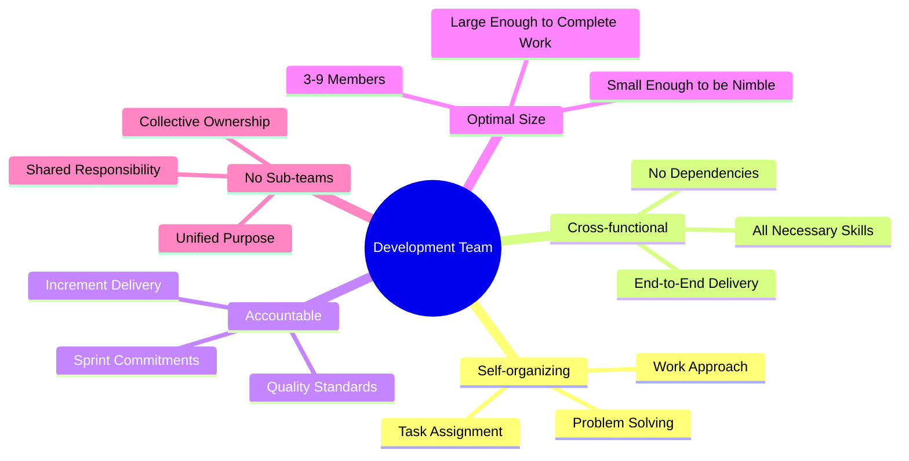

## Scrum Events

### Scrum Events Overview

```mermaid
gantt
    title Scrum Events in a 2-Week Sprint
    dateFormat  D
    axisFormat  Day %d
    
    section Sprint (14 Days)
    Sprint Planning           :done,    d1, 1d
    Daily Scrum               :active,  d2, 10d
    Development Work           :        d2, 10d
    Sprint Review             :crit,    d12, 1d
    Sprint Retrospective      :         d13, 1d
```

### Sprint Planning

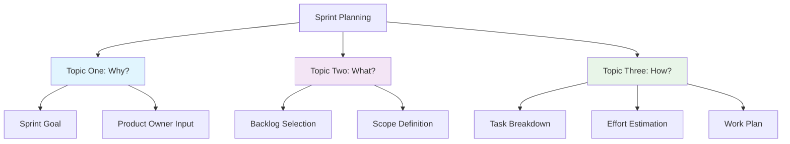

### Daily Scrum Structure

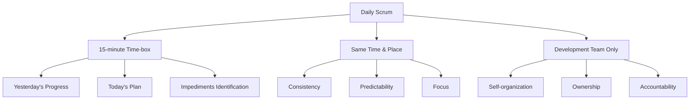

### Sprint Review Agenda

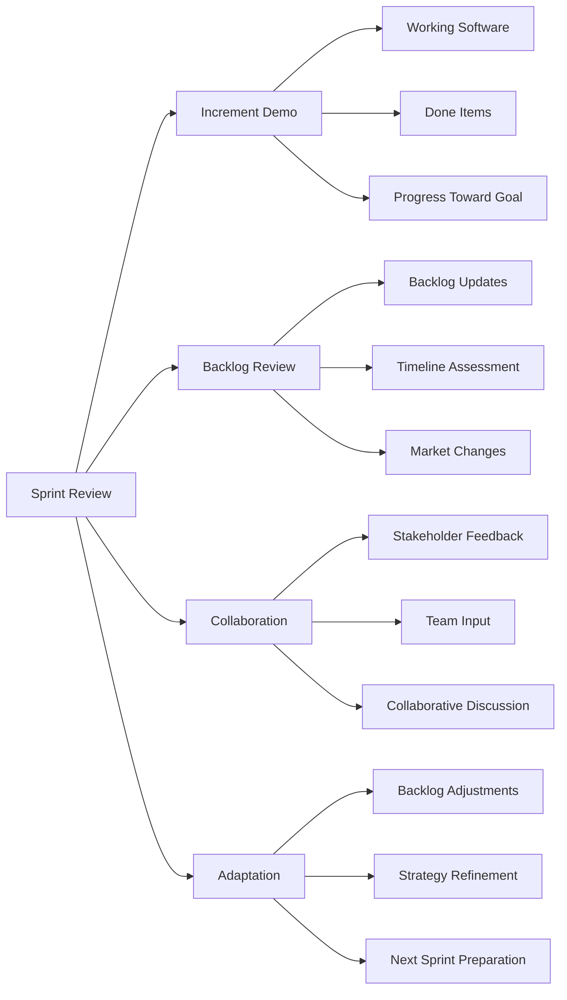

### Sprint Retrospective Process

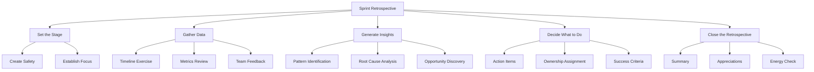

## Scrum Artifacts

### Product Backlog Structure

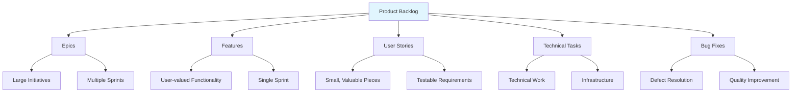

### Sprint Backlog Composition

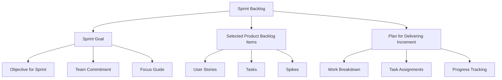

### Definition of Done

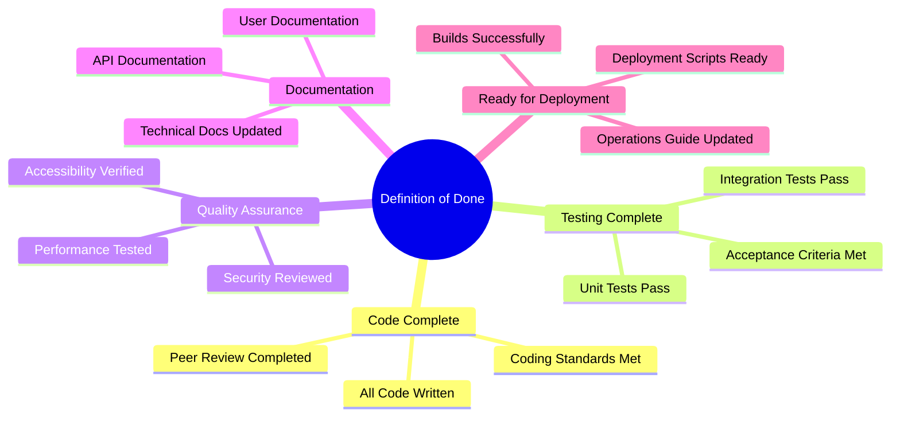

## Sprint Cycle

### Complete Sprint Workflow

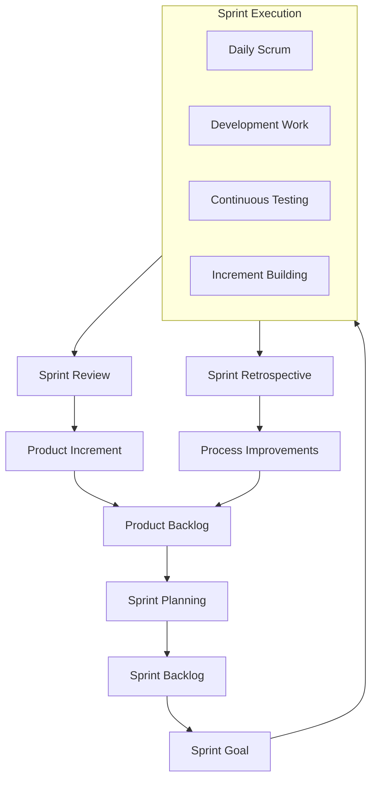

### Sprint Timeline Visualization

```mermaid
gantt
    title Detailed 2-Week Sprint Timeline
    dateFormat D
    axisFormat Day %d
    
    section Planning & Setup
    Sprint Planning :d1, 1d
    Environment Setup :d2, 1d
    Task Clarification :d2, 1d
    
    section Development
    Core Development :d2, 6d
    Daily Stand-ups :d2, 6d
    Continuous Integration :d3, 5d
    
    section Testing & Review
    System Testing :d8, 3d
    Bug Fixing :d9, 2d
    Sprint Review Prep :d10, 1d
    
    section Review & Improvement
    Sprint Review :d11, 1d
    Sprint Retrospective :d12, 1d
```

## Planning and Estimation

### Story Point Estimation with Planning Poker

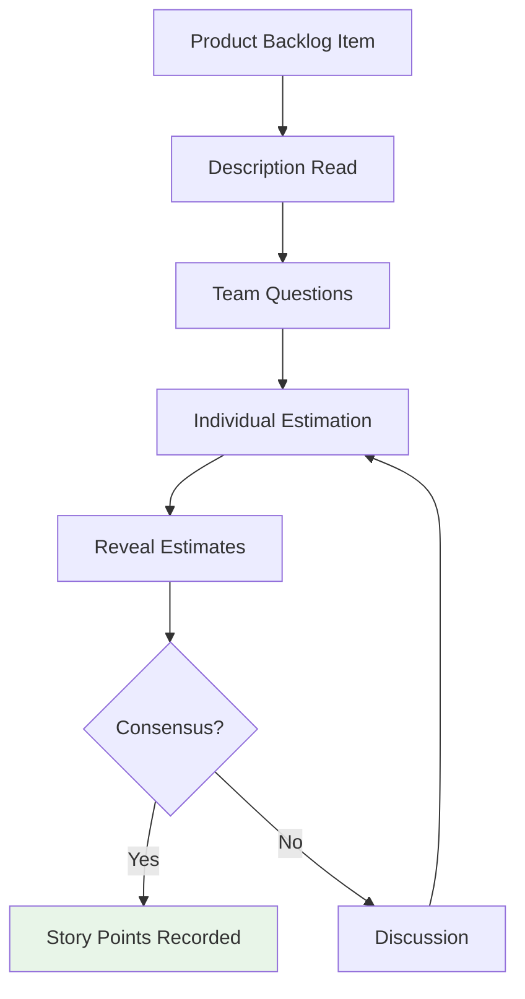

### Fibonacci Scale for Estimation

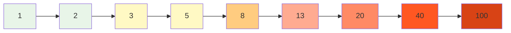

### Velocity Tracking

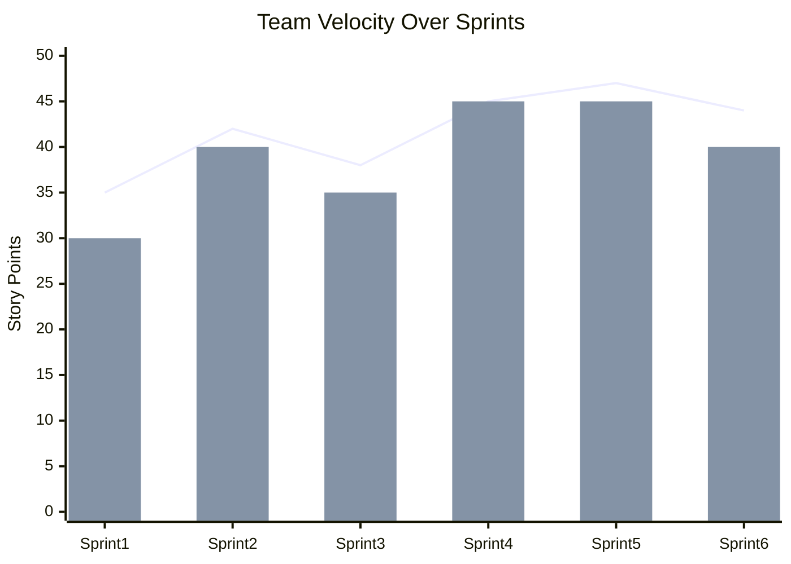

*Note: Blue line = Actual Velocity, Green bars = Planned Velocity*

## Metrics and Tracking

### Burndown Charts

```mermaid
graph LR
    subgraph IdealBurndown [Ideal Burndown]
        A[Start: 40 SP] --> B[Day 3: 30 SP] --> C[Day 6: 20 SP] --> D[Day 9: 10 SP] --> E[End: 0 SP]
    end
    
    subgraph ActualBurndown [Actual Burndown]
        F[Start: 40 SP] --> G[Day 3: 35 SP] --> H[Day 6: 28 SP] --> I[Day 9: 15 SP] --> J[End: 0 SP]
    end
```

### Cumulative Flow Diagram

```mermaid
xychart-beta
    title "Cumulative Flow Diagram"
    x-axis [Sprint Start, Week 1, Week 2, Sprint End]
    y-axis "Number of Items" 0 --> 25
    area [5, 8, 10, 12] --> "Done"
    area [8, 10, 8, 6] --> "Testing"
    area [12, 10, 8, 5] --> "Development"
    area [15, 12, 9, 7] --> "Backlog"
```

### Sprint Goal Success Metrics

```mermaid
graph TD
    A[Sprint Goal Success] --> B[Business Value Delivered]
    A --> C[Stakeholder Satisfaction]
    A --> D[Team Morale]
    A --> E[Process Efficiency]
    
    B --> B1[Feature Completion]
    B --> B2[Quality Standards]
    B --> B3[User Acceptance]
    
    C --> C1[Feedback Scores]
    C --> C2[Engagement Levels]
    C --> C3[Adoption Rates]
    
    D --> D1[Team Surveys]
    D --> D2[Retrospective Feedback]
    D --> D3[Retention Rates]
    
    E --> E1[Velocity Stability]
    E --> E2[Cycle Time Reduction]
    E --> E3[Defect Reduction]
```

## Scaling Scrum

### Scrum of Scrums

```mermaid
graph TB
    A[Product Owner] --> B[Chief Product Owner]
    
    subgraph C [Team Level]
        D[Team A PO] --> E[Team A]
        F[Team B PO] --> G[Team B]
        H[Team C PO] --> I[Team C]
    end
    
    subgraph J [Scrum of Scrums]
        K[Team A Rep] --> L[SoS Meeting]
        M[Team B Rep] --> L
        N[Team C Rep] --> L
    end
    
    B --> D
    B --> F
    B --> H
    
    E --> K
    G --> M
    I --> N
    
    style J fill:#f3e5f5
```

### Scaling Frameworks Comparison

```mermaid
graph TD
    A[Scaling Frameworks] --> B["Scrum@Scale"]
    A --> C[Nexus]
    A --> D[LeSS]
    A --> E[SAFe]
    
    B --> B1[Lightweight Framework]
    B --> B2[Modular Approach]
    B --> B3[Minimal Prescription]
    
    C --> C1[Scrum.org Framework]
    C --> C2[3-9 Teams]
    C --> C3[Integrated Sprint]
    
    D --> D1[Large Scale Scrum]
    D --> D2[Simple Rules]
    D --> D3[Whole Product Focus]
    
    E --> E1[Comprehensive Framework]
    E --> E2[Multiple Configurations]
    E --> E3[Enterprise Focus]
```

## Common Anti-patterns and Solutions

### Scrum Implementation Challenges

```mermaid
graph LR
    A[Common Anti-patterns] --> B[Water-Scrum-Fall]
    A --> C[Command and Control]
    A --> D[Skipping Retrospectives]
    A --> E[Over-committing]
    A --> F[Ignoring Technical Debt]
    
    B --> B1[Solution: True Cross-functional Teams]
    C --> C1[Solution: Empower Self-organization]
    D --> D1[Solution: Mandate Retrospectives]
    E --> E1[Solution: Use Historical Velocity]
    F --> F1[Solution: Include Tech Debt in Backlog]
```

## Tools and Best Practices

### Recommended Scrum Tools

- **Project Management**: Jira, Azure DevOps, VersionOne
- **Collaboration**: Confluence, Slack, Microsoft Teams
- **Virtual Boards**: Miro, Mural, Trello
- **Metrics**: ActionableAgile, Nave, Scrum Poker apps
- **CI/CD**: Jenkins, GitLab, GitHub Actions

### Best Practices Checklist

```mermaid
mindmap
  root((Scrum Best Practices))
    Regular Events
      Consistent Time-boxes
      Full Participation
      Action-oriented Outcomes
    Clear Artifacts
      Transparent Backlog
      Visible Progress
      Shared Definition of Done
    Empowered Team
      Self-organization
      Collective Ownership
      Continuous Improvement
    Stakeholder Engagement
      Regular Demos
      Transparent Communication
      Collaborative Planning
    Technical Excellence
      Continuous Integration
      Automated Testing
      Regular Refactoring
```

---

*Scrum is a lightweight framework that helps people, teams, and organizations generate value through adaptive solutions for complex problems. Remember that Scrum is not a methodology with prescribed practices but a framework within which you can employ various processes and techniques. The essence of Scrum is a small team of people that is highly flexible and adaptive to change.*