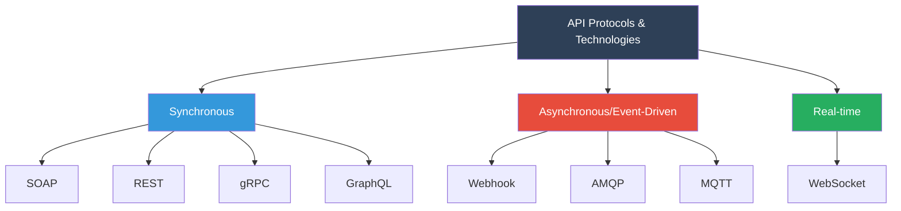
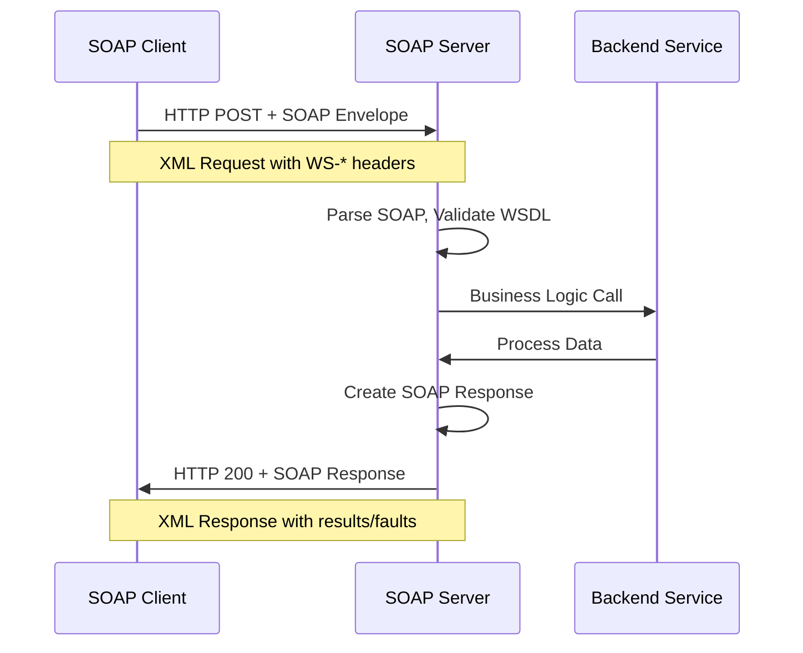
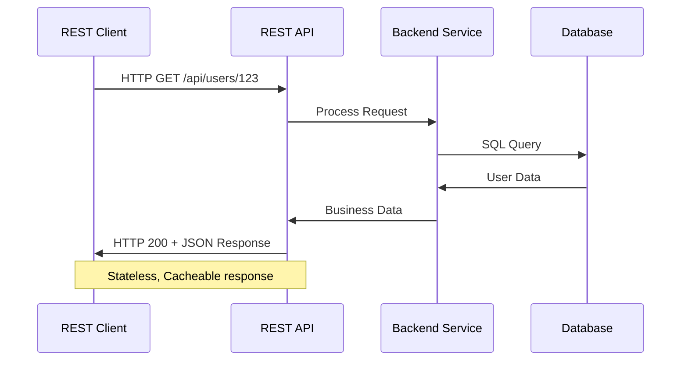
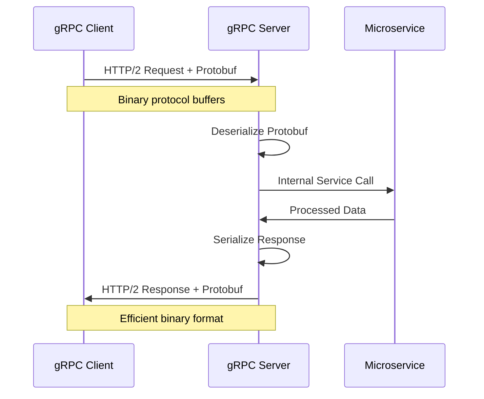
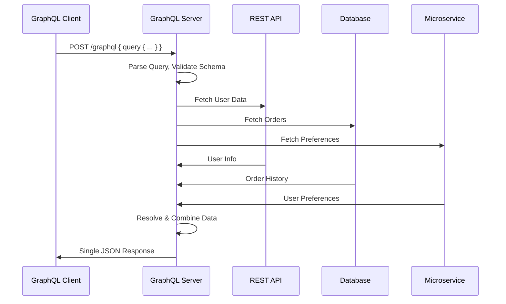
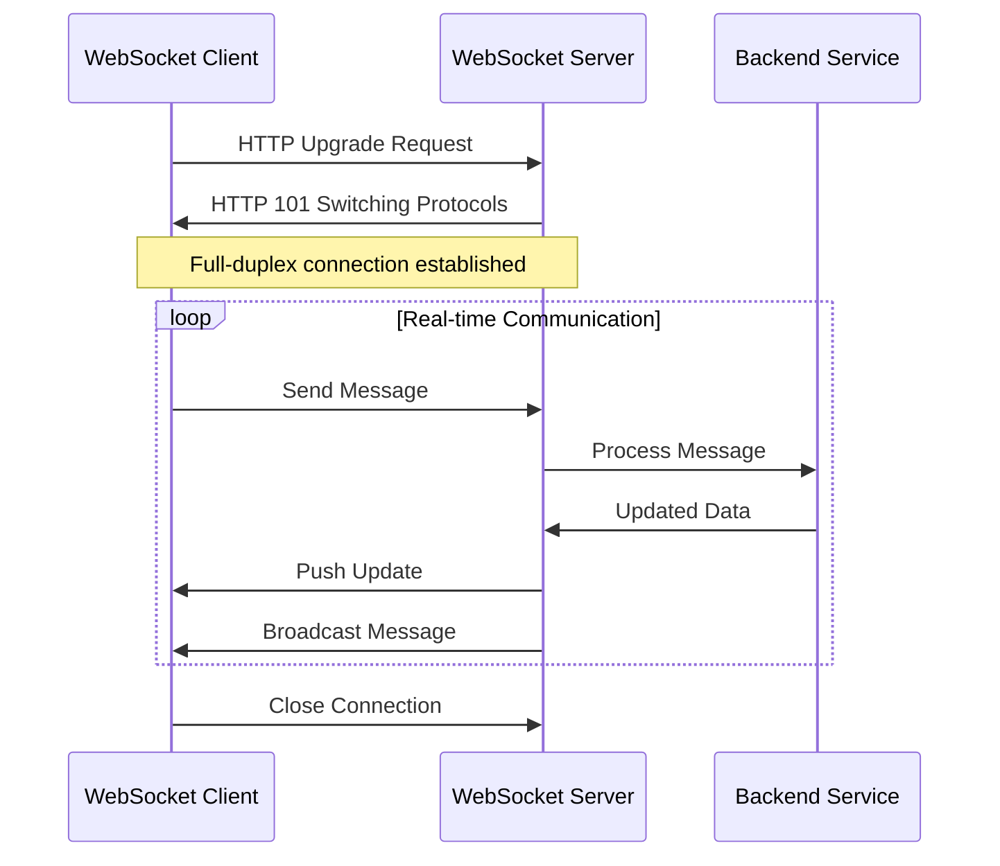
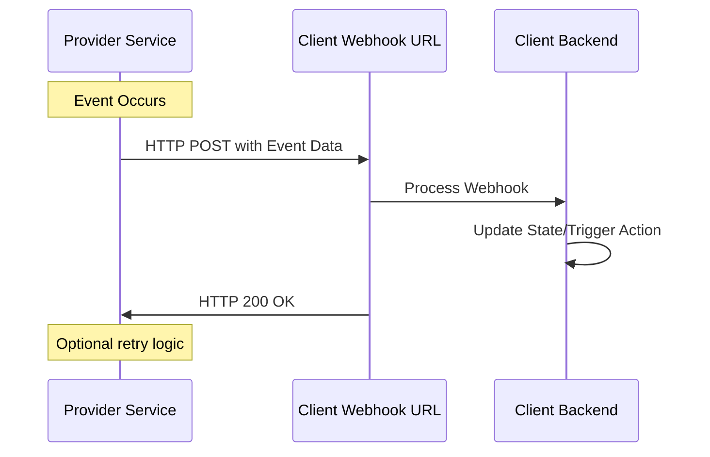
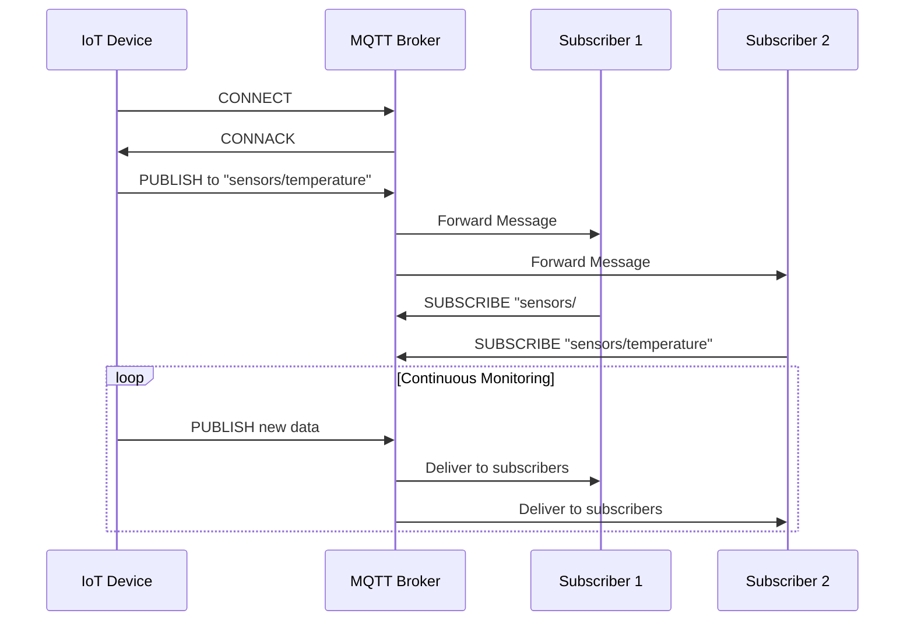
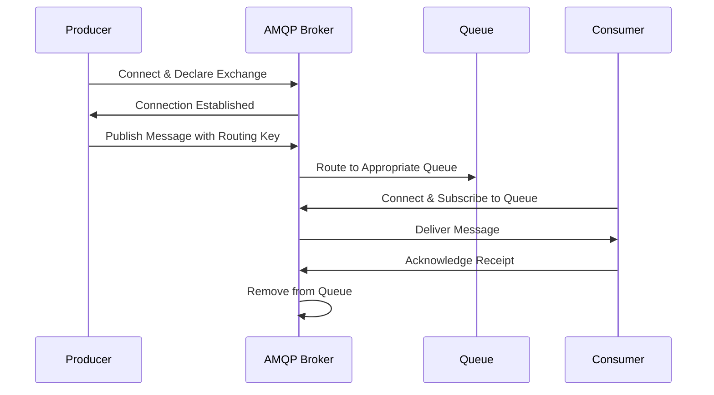

# Top 8 API Protocols & Technologies - Detailed Architecture

A comprehensive overview of the most important protocols and architectural styles with detailed communication flows.



## 1. SOAP (Simple Object Access Protocol)

**Communication Flow:**


**How it communicates:**
- Client sends XML-based SOAP envelope over HTTP POST
- Server validates against WSDL (Web Services Description Language)
- Processes business logic through backend services
- Returns XML response with success or SOAP fault

**Example Flow:**
```
Client → SOAP Server → Database/ERP → SOAP Server → Client
```

## 2. REST (Representational State Transfer)

**Communication Flow:**


**How it communicates:**
- Client makes HTTP requests to resource endpoints
- API processes request through controllers/services
- Backend services interact with databases/microservices
- Returns JSON/XML response with appropriate HTTP status

**Example Flow:**
```
Mobile App → REST API → Authentication → Business Logic → Database → REST API → Mobile App
```

## 3. gRPC (Google Remote Procedure Call)

**Communication Flow:**


**How it communicates:**
- Client calls remote methods as if they were local
- Uses Protocol Buffers for efficient binary serialization
- HTTP/2 enables multiplexing and bidirectional streaming
- Service-to-service communication in microservices

**Example Flow:**
```
gRPC Client → gRPC Stub → HTTP/2 → gRPC Server → Service Implementation → Other Microservices
```

## 4. GraphQL

**Communication Flow:**


**How it communicates:**
- Single endpoint for all operations (queries, mutations, subscriptions)
- Client defines exact data requirements in query
- Server resolves query by fetching from multiple sources
- Returns precisely requested data in single response

**Example Flow:**
```
React App → GraphQL Query → GraphQL Server → [User Service, Order Service, Product Service] → Combined Response → React App
```

## 5. WebSocket

**Communication Flow:**


**How it communicates:**
- Starts with HTTP upgrade handshake
- Maintains persistent bidirectional connection
- Server can push data to clients without request
- Real-time data synchronization

**Example Flow:**
```
Browser → WebSocket Handshake → WebSocket Server → Message Broker → Multiple Clients ← Real-time Updates
```

## 6. Webhook

**Communication Flow:**


**How it communicates:**
- Client registers callback URL with provider
- Provider makes HTTP POST to client's endpoint when event occurs
- Client processes the webhook and returns success
- Provider may retry on failure

**Example Flow:**
```
Payment Gateway → Payment Success Webhook → Customer's Server → Update Order Status → Send Confirmation Email
```

## 7. MQTT (Message Queuing Telemetry Transport)

**Communication Flow:**


**How it communicates:**
- Devices connect to MQTT broker
- Publishers send messages to topics
- Broker routes messages to subscribed clients
- Quality of Service levels ensure delivery

**Example Flow:**
```
Sensor → MQTT Publish → Broker → Multiple Subscribers [Mobile App, Database Service, Analytics Service]
```

## 8. AMQP (Advanced Message Queuing Protocol)

**Communication Flow:**


**How it communicates:**
- Producers send messages to exchanges
- Exchanges route messages to queues based on rules
- Consumers receive messages from queues
- Message acknowledgment ensures reliable delivery

**Example Flow:**
```
Order Service → AMQP Producer → Exchange → Queues [Email Queue, Inventory Queue, Analytics Queue] → Multiple Consumers
```

---

## Communication Patterns Summary

| Protocol | Communication Style | Data Format | Transport | Use Case Example |
|----------|-------------------|-------------|-----------|------------------|
| **SOAP** | Request-Response | XML | HTTP/SMTP | Bank Transactions |
| **REST** | Request-Response | JSON/XML | HTTP | Mobile App API |
| **gRPC** | RPC Streaming | Protobuf | HTTP/2 | Microservices |
| **GraphQL** | Query-Response | JSON | HTTP | Complex UI Data |
| **WebSocket** | Bidirectional | Any | TCP | Live Chat |
| **Webhook** | Event Callback | JSON/XML | HTTP | Payment Notifications |
| **MQTT** | Pub-Sub | Binary/Text | TCP | IoT Sensors |
| **AMQP** | Message Queuing | Binary | TCP | Order Processing |

## Architecture Considerations

**Synchronous Protocols** (SOAP, REST, gRPC, GraphQL):
- Direct request-response pattern
- Client waits for server response
- Suitable for immediate data needs

**Asynchronous Protocols** (Webhook, MQTT, AMQP):
- Event-driven and message-based
- Decoupled systems
- Better for scalability and reliability

**Real-time Protocols** (WebSocket):
- Persistent connections
- Instant data propagation
- Ideal for collaborative applications