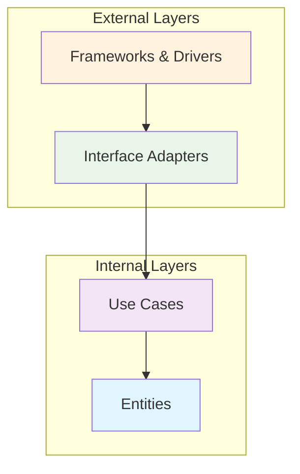
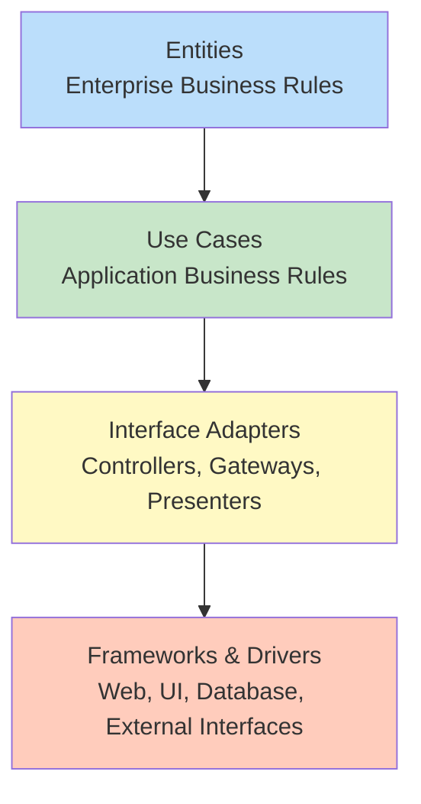
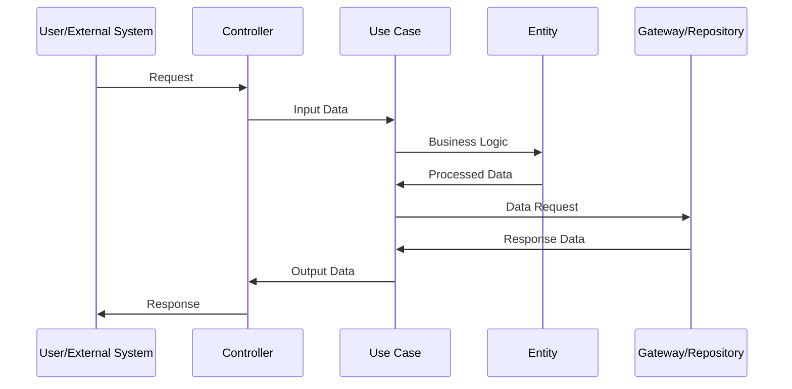
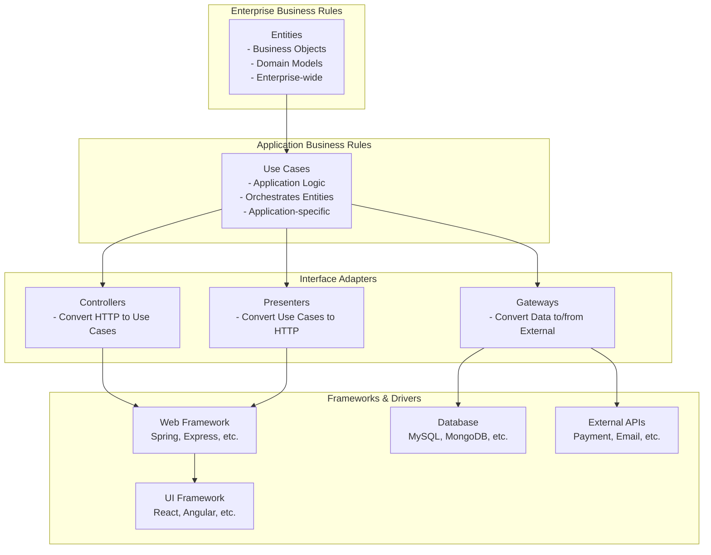
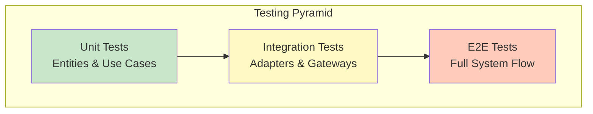
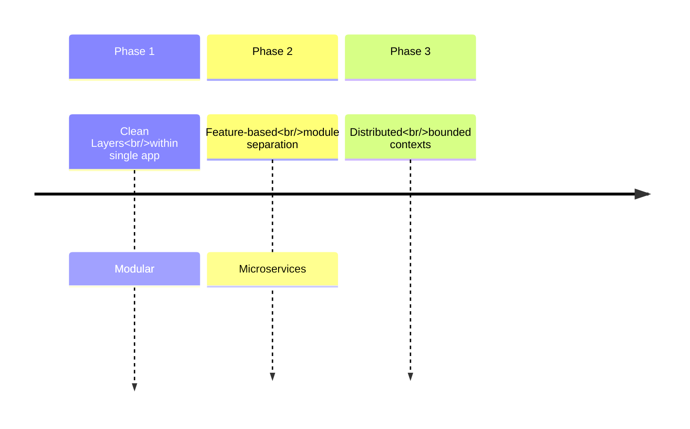

# Clean Architecture

Clean Architecture is a software design philosophy that emphasizes separation of concerns and independence from frameworks, UI, databases, and external agencies. It was introduced by Robert C. Martin (Uncle Bob) and promotes a highly maintainable and testable codebase.

## 🎯 Core Principles

- **Independence from Frameworks**: The architecture doesn't depend on the existence of some library or framework
- **Testable**: Business rules can be tested without the UI, Database, Web Server, or any external element
- **Independent of UI**: The UI can change easily, without changing the rest of the system
- **Independent of Database**: You can swap out Oracle or SQL Server for MongoDB, BigTable, or anything else
- **Independent of any External Agency**: Your business rules simply don't know anything about the outside world

## 🏗️ Architecture Layers



## 📊 Dependency Rule



*Dependencies point inward* - Nothing in an inner circle can know anything at all about something in an outer circle.

## 🔄 Data Flow



## 🏛️ Detailed Layer Structure



## 📁 Project Structure

```
src/
├── domain/                 # Enterprise Business Rules
│   ├── entities/          # Business objects
│   ├── repositories/      # Interface definitions
│   └── value-objects/     # Immutable objects
├── application/           # Application Business Rules
│   ├── use-cases/        # Application logic
│   ├── dto/              # Data Transfer Objects
│   └── ports/            # Input/Output ports
├── infrastructure/        # Frameworks & Drivers
│   ├── persistence/      # Database implementations
│   ├── web/              # Controllers, Middleware
│   └── external/         # External service clients
└── presentation/         # Interface Adapters
    ├── controllers/      # Route handlers
    ├── presenters/       # Response formatters
    └── middleware/       # Cross-cutting concerns
```

## 🛠️ Implementation Example

### Domain Layer (Entities)
```typescript
// domain/entities/user.ts
export class User {
  constructor(
    public readonly id: string,
    public readonly email: string,
    public readonly name: string
  ) {}
  
  isValid(): boolean {
    return this.email.includes('@') && this.name.length > 0;
  }
}
```

### Application Layer (Use Cases)
```typescript
// application/use-cases/create-user.ts
export class CreateUserUseCase {
  constructor(private userRepository: UserRepository) {}
  
  async execute(input: CreateUserInput): Promise<User> {
    const user = new User(uuid(), input.email, input.name);
    
    if (!user.isValid()) {
      throw new Error('Invalid user data');
    }
    
    return await this.userRepository.save(user);
  }
}
```

### Interface Adapters (Controllers)
```typescript
// presentation/controllers/user-controller.ts
export class UserController {
  constructor(private createUserUseCase: CreateUserUseCase) {}
  
  async createUser(req: Request, res: Response): Promise<void> {
    try {
      const user = await this.createUserUseCase.execute(req.body);
      res.status(201).json(UserPresenter.toJSON(user));
    } catch (error) {
      res.status(400).json({ error: error.message });
    }
  }
}
```

### Infrastructure Layer (Repository Implementation)
```typescript
// infrastructure/persistence/user-repository-impl.ts
export class UserRepositoryImpl implements UserRepository {
  constructor(private dataSource: DataSource) {}
  
  async save(user: User): Promise<User> {
    const userEntity = this.toEntity(user);
    const savedEntity = await this.dataSource.save(userEntity);
    return this.toDomain(savedEntity);
  }
  
  private toEntity(user: User): UserEntity {
    // Convert domain model to database entity
  }
  
  private toDomain(entity: UserEntity): User {
    // Convert database entity to domain model
  }
}
```

## ✅ Benefits

- **Framework Independence**: Easy to migrate to new technologies
- **Highly Testable**: Each layer can be tested in isolation
- **Clear Separation**: Business logic separated from implementation details
- **Team Scalability**: Different teams can work on different layers
- **Long-term Maintainability**: Changes in one layer don't affect others

## 🧪 Testing Strategy



### Testing Examples
```typescript
// Unit Test - Use Case
describe('CreateUserUseCase', () => {
  it('should create valid user', async () => {
    const mockRepo = { save: jest.fn() };
    const useCase = new CreateUserUseCase(mockRepo);
    
    const user = await useCase.execute({
      email: 'test@example.com',
      name: 'John Doe'
    });
    
    expect(user.isValid()).toBe(true);
    expect(mockRepo.save).toHaveBeenCalled();
  });
});
```

```typescript
// Integration Test - Controller
describe('UserController', () => {
  it('should return 201 on user creation', async () => {
    const controller = new UserController(useCase);
    const req = { body: { email: 'test@example.com', name: 'John' } };
    const res = { status: jest.fn(), json: jest.fn() };
    
    await controller.createUser(req, res);
    
    expect(res.status).toHaveBeenCalledWith(201);
  });
});
```

## 🔧 Common Adapters

### Input Adapters
- REST Controllers
- GraphQL Resolvers
- CLI Commands
- Message Queue Consumers

### Output Adapters
- Database Repositories
- External API Clients
- File System Operations
- Email Services

## 📈 Evolution & Scaling



## 🚀 Best Practices

1. **Dependency Inversion**: Depend on abstractions, not concretions
2. **Single Responsibility**: Each layer has one reason to change
3. **Explicit Boundaries**: Clear contracts between layers
4. **Test-Driven Development**: Write tests first for better design
5. **Continuous Refactoring**: Keep the architecture clean over time

## ⚠️ Common Pitfalls

- **Over-engineering**: Don't apply Clean Architecture to simple CRUD apps
- **Tight coupling between layers**: Violating dependency rule
- **Ignoring performance**: Too many layers can impact performance
- **Complex mapping**: Excessive data transformation between layers

## 📚 Related Patterns

- **Hexagonal Architecture** (Ports & Adapters)
- **Onion Architecture**
- **Domain-Driven Design** (DDD)
- **Command Query Responsibility Segregation** (CQRS)
- **Event Sourcing**

## 🔗 Useful Resources

- [Clean Architecture Book by Robert C. Martin](https://www.amazon.com/Clean-Architecture-Craftsmans-Software-Structure/dp/0134494164)
- [The Clean Architecture Blog Post](https://blog.cleancoder.com/uncle-bob/2012/08/13/the-clean-architecture.html)
- [Domain-Driven Design Reference](https://domainlanguage.com/ddd/)

---

*Based on Robert C. Martin's Clean Architecture principles*

<div align="center">

**⭐ Star this repository if you found it helpful!**

</div>