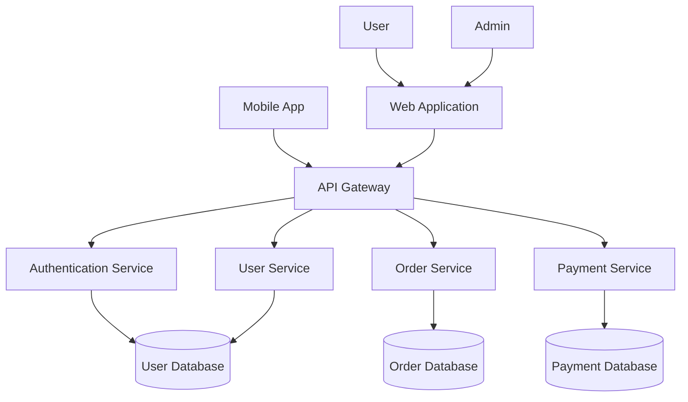
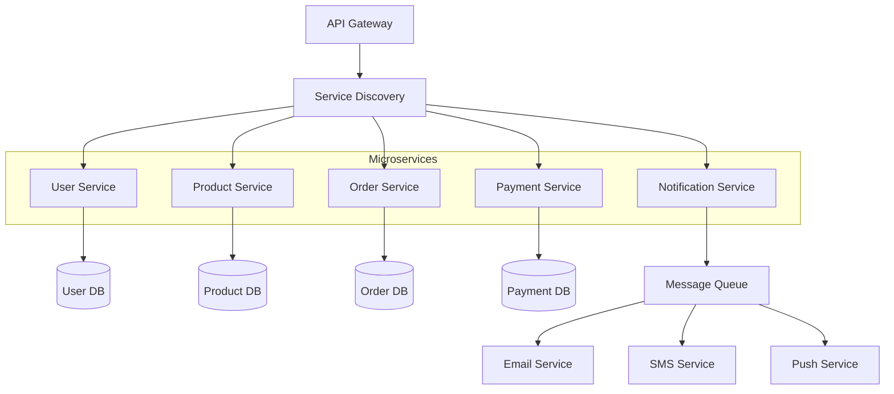
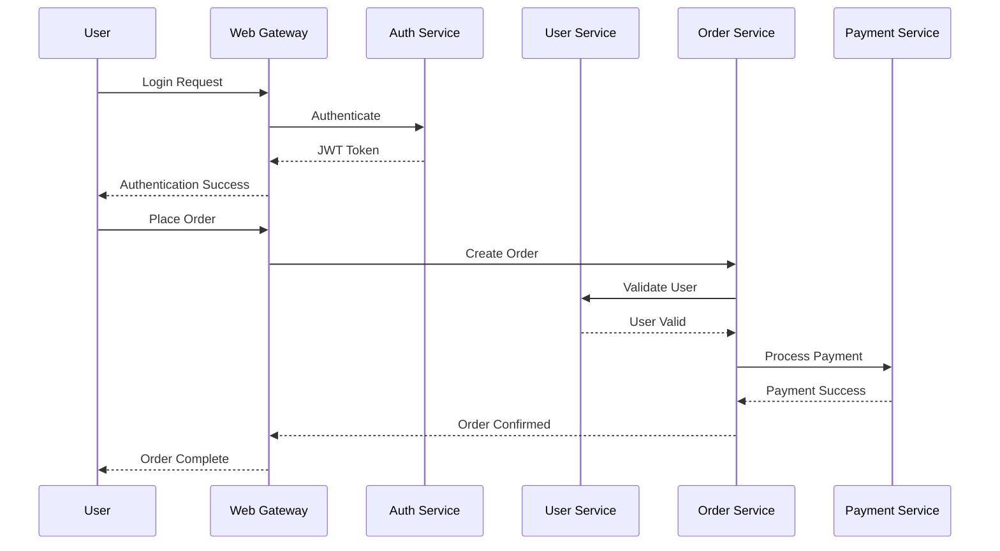
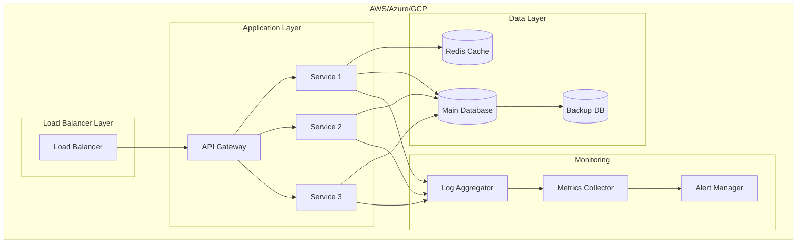
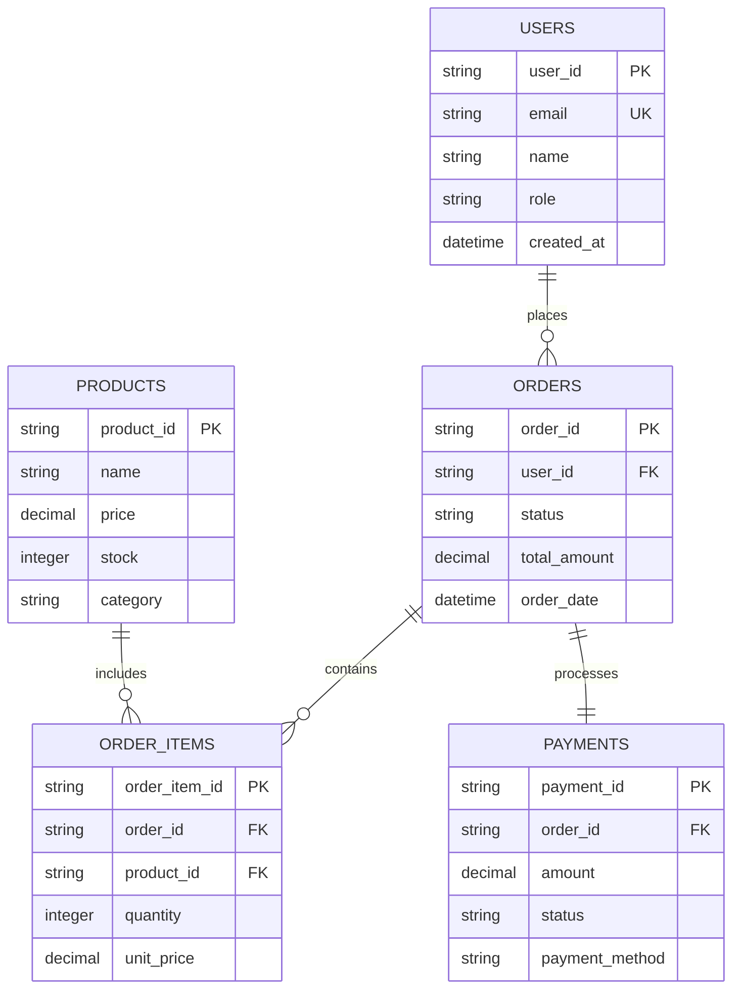

# Software Architecture

## System Overview

This document describes the software architecture of our application, including system components, data flow, and deployment strategies.

## Architecture Diagrams

### System Context Diagram

### Microservices Architecture

### Data Flow Diagram

### Deployment Architecture

### Database Schema Relationship

### CI/CD Pipeline

```mermaid
graph LR
    A[Developer Commit] --> B[Source Control]
    B --> C[CI Server]
    
    subgraph Continuous Integration
        C --> D[Run Tests]
        D --> E[Build Image]
        E --> F[Security Scan]
        F --> G[Push to Registry]
    end
    
    subgraph Continuous Deployment
        G --> H[Deploy to Staging]
        H --> I[Integration Tests]
        I --> J[Approval]
        J --> K[Deploy to Production]
    end
    
    K --> L[Monitoring]
    L --> M[Feedback Loop]
```

## Technology Stack

### Backend Services
- **API Gateway**: Spring Cloud Gateway / Kong
- **Microservices**: Spring Boot / Node.js
- **Authentication**: JWT + OAuth2
- **Database**: PostgreSQL / MongoDB
- **Cache**: Redis
- **Message Queue**: RabbitMQ / Apache Kafka

### Frontend
- **Web**: React / Angular
- **Mobile**: React Native / Flutter
- **State Management**: Redux / NgRx

### Infrastructure
- **Containerization**: Docker
- **Orchestration**: Kubernetes
- **Cloud**: AWS / Azure / GCP
- **Monitoring**: Prometheus + Grafana
- **Logging**: ELK Stack

## Design Patterns

### Architectural Patterns
- Microservices Architecture
- Event-Driven Architecture
- CQRS (Command Query Responsibility Segregation)
- API Gateway Pattern
- Circuit Breaker Pattern

### Implementation Patterns
- Repository Pattern
- Factory Pattern
- Strategy Pattern
- Observer Pattern
- Dependency Injection

## Security Considerations

### Authentication & Authorization
- JWT-based stateless authentication
- Role-based access control (RBAC)
- API key management for external services
- OAuth2 for third-party integrations

### Data Protection
- Encryption at rest (AES-256)
- Encryption in transit (TLS 1.3)
- Secure secret management
- Regular security audits

## Performance Optimization

### Caching Strategy
- Multi-level caching (L1/L2/L3)
- CDN for static assets
- Database query optimization
- Connection pooling

### Scalability
- Horizontal scaling with auto-scaling groups
- Database read replicas
- Load balancing with health checks
- Async processing for non-critical tasks

## Monitoring & Observability

### Metrics Collection
- Application performance monitoring (APM)
- Business metrics tracking
- Infrastructure monitoring
- Custom metrics for business logic

### Logging Strategy
- Structured logging (JSON format)
- Centralized log aggregation
- Log retention policies
- Real-time log analysis

## Deployment Strategy

### Environment Setup
- Development
- Staging
- Production
- Disaster Recovery

### Release Process
- Blue-green deployments
- Canary releases
- Feature flags
- Rollback procedures

## Development Guidelines

### Code Standards
- Follow language-specific style guides
- Comprehensive testing (unit, integration, e2e)
- Code review process
- Documentation requirements

### API Design
- RESTful principles
- OpenAPI/Swagger documentation
- Versioning strategy
- Rate limiting and throttling

---

*This architecture document is living and will be updated as the system evolves.*