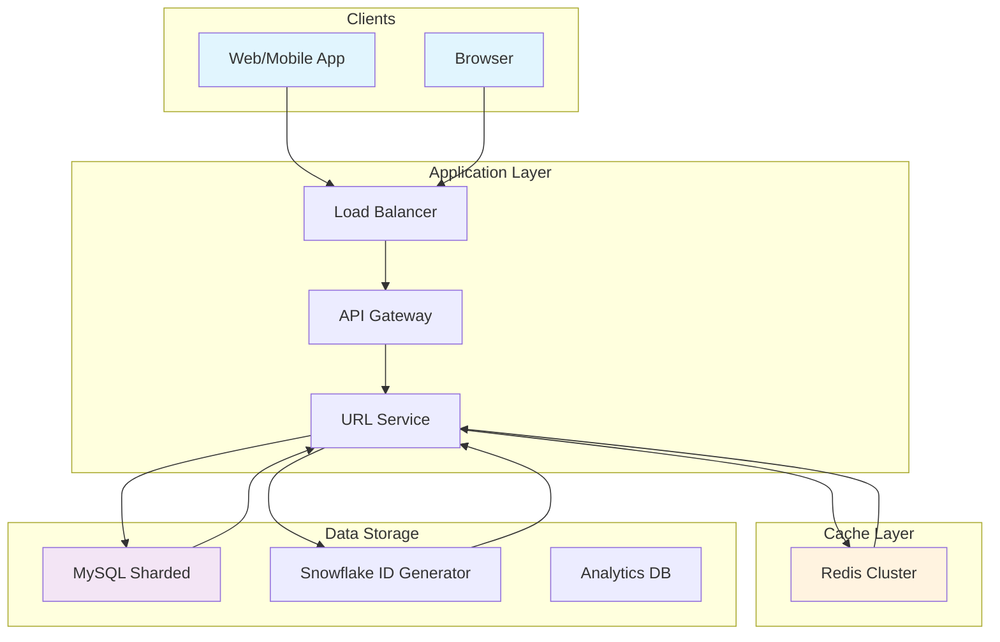
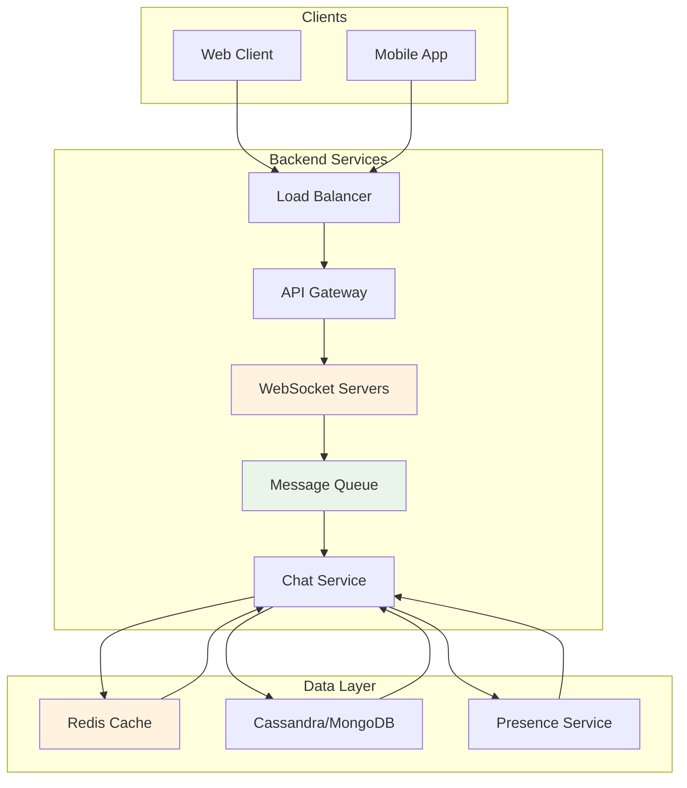
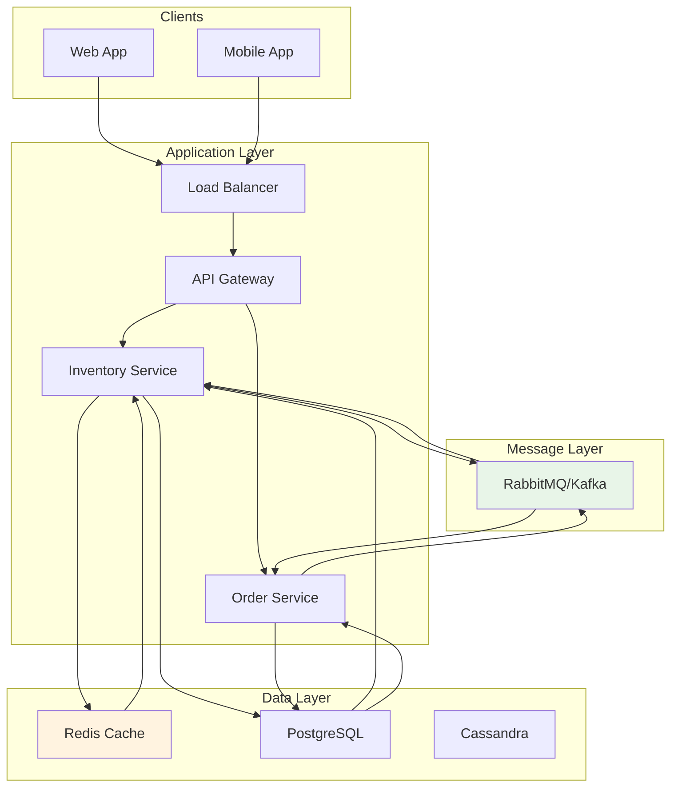
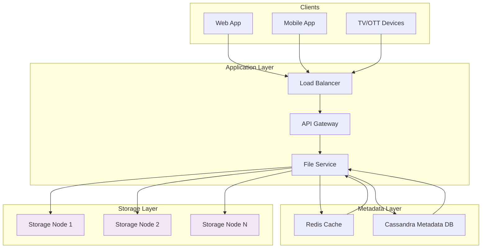
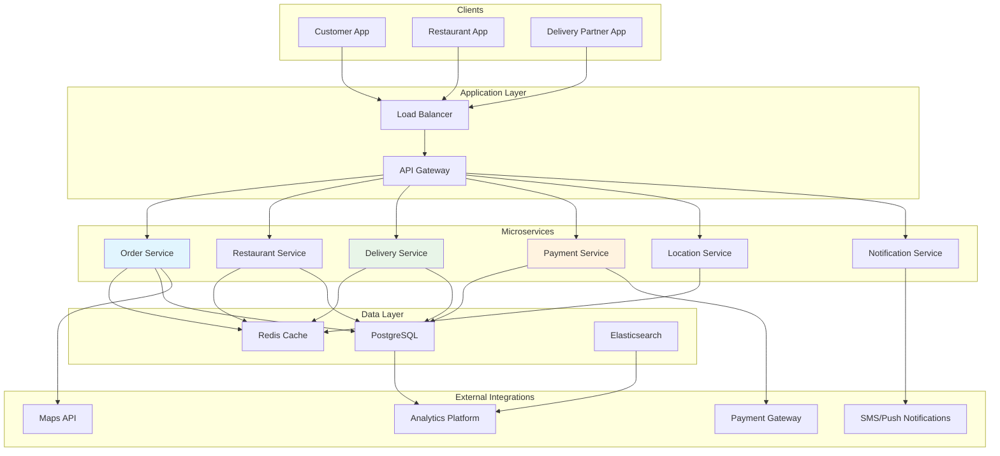
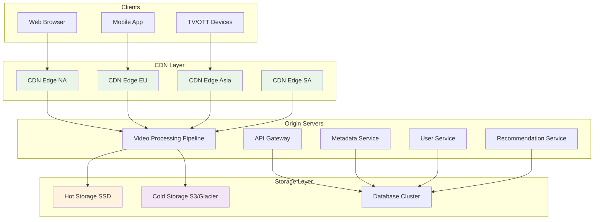
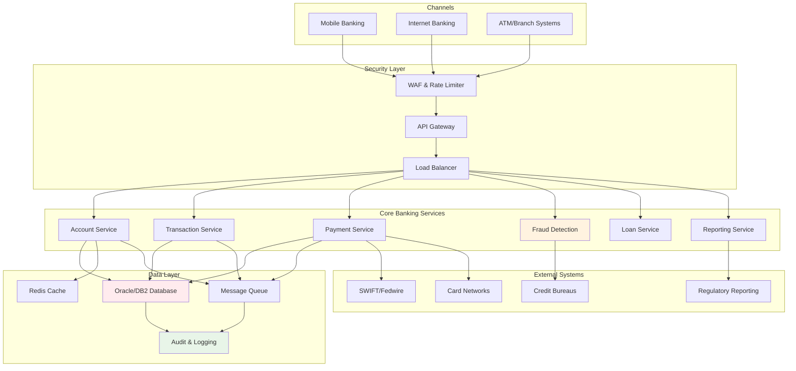
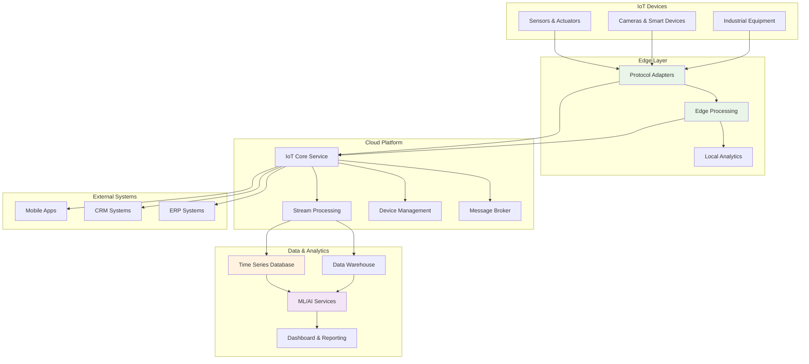
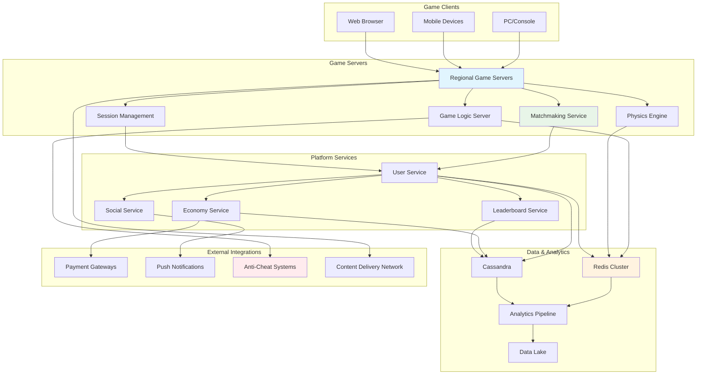

# System Architecture Interview Tasks & Solutions

This repository contains comprehensive system architecture tasks and solutions for technical interviews. Each solution includes detailed Mermaid.js diagrams and architectural explanations.

## Task 1: URL Shortening Service (like TinyURL)

### Requirements
- Shorten long URLs to short codes
- Redirect short URLs to original URLs
- Handle 100M+ URLs
- High availability and low latency

### Architecture Diagram

### Key Components
1. **Base62 Encoding**: For short, readable URLs
2. **Distributed ID Generation**: Snowflake for unique IDs across servers
3. **Caching Strategy**: Redis for hot data, reducing database load
4. **Database Sharding**: Scale horizontally by sharding on short code

### Data Flow
1. **Shorten URL**: Client → Load Balancer → API Server → ID Generator → DB + Cache
2. **Redirect**: Client → Load Balancer → API Server → Cache → DB (if cache miss)

---

## Task 2: Real-time Chat Application

### Requirements
- Support 1M+ concurrent users
- Deliver messages in <100ms
- Store chat history
- Support multiple chat rooms

### Architecture Diagram

### Real-time Message Flow
1. User A sends message → WebSocket Server → Message Queue → Chat Service
2. Chat Service → Database (store) + Presence Service (get online users)
3. Chat Service → WebSocket Servers → User B, User C, etc.

---

## Task 3: E-commerce Inventory System

### Requirements
- Handle high concurrent orders
- Prevent overselling
- Real-time inventory updates
- Support flash sales

### Architecture Diagram

### Key Features
1. **Redis for Atomic Operations**: Prevents race conditions using Lua scripts
2. **Circuit Breaker Pattern**: Prevents system overload during flash sales
3. **Event Sourcing**: Track all inventory changes
4. **Read/Write Separation**: Separate databases for reads and writes

---

## Task 4: Distributed File Storage System

### Requirements
- Store 1PB+ of files
- High durability (99.999999999%)
- Fast upload/download
- Cost-effective storage

### Architecture Diagram

### File Upload Flow
1. Client → API Gateway → File Service
2. File Service splits file into chunks
3. Each chunk replicated to 3 storage nodes (consistent hashing)
4. Metadata stored in Cassandra + Cache

---

## Task 5: Food Delivery System (like UberEats)

### Requirements
- Real-time order tracking
- Restaurant and delivery partner management
- Payment processing
- Location-based services

### Architecture Diagram

### Key Workflows
1. **Order Placement**: Customer → Order Service → Restaurant Service → Payment Service
2. **Delivery Matching**: Order Service → Delivery Service → Location-based matching
3. **Real-time Tracking**: Tracking Service → WebSocket → Customer/Delivery Partner Apps

---

## Task 6: Video Streaming Service (like YouTube/Netflix)

### Requirements
- Support millions of concurrent viewers
- Adaptive bitrate streaming
- Global content delivery
- Video processing pipeline

### Architecture Diagram

### Video Delivery Flow
1. **Upload**: Client → Ingest Service → Transcoding Pipeline → Multiple Quality Versions
2. **Storage**: Processed videos → Hot Storage (popular) + Cold Storage (archived)
3. **Delivery**: CDN Edge Nodes cache videos based on regional popularity
4. **Adaptive Streaming**: Client automatically switches quality based on bandwidth

---

## Task 7: Banking/Payment System

### Requirements
- ACID compliance for transactions
- High security and fraud detection
- Regulatory compliance
- 99.99%+ availability

### Architecture Diagram

### Key Features
1. **ACID Compliance**: Strong consistency for financial transactions
2. **Fraud Detection**: Real-time pattern analysis and machine learning
3. **Audit Trail**: Complete transaction logging for compliance
4. **High Availability**: 99.99%+ uptime requirements

---

## Task 8: IoT Platform (Smart Home/Industrial IoT)

### Requirements
- Handle millions of connected devices
- Real-time data processing
- Edge computing capabilities
- Predictive maintenance

### Architecture Diagram

### Data Flow
1. **Device to Cloud**: Sensors → Protocol Adapters → IoT Core → Stream Processing
2. **Real-time Processing**: Kafka/Kinesis → Spark Streaming → Real-time Alerts
3. **Batch Analytics**: Data Warehouse → ML Services → Predictive Maintenance
4. **Command & Control**: Dashboard → IoT Core → Actuators/Devices

---

## Task 9: Multi-player Gaming Platform

### Requirements
- Low latency real-time gameplay
- Matchmaking services
- Virtual economy system
- Anti-cheat mechanisms

### Architecture Diagram

### Key Features
1. **Low Latency**: Regional game servers for real-time gameplay
2. **Session Management**: Handle player connections and disconnections
3. **Anti-Cheat**: Real-time pattern detection and validation
4. **Economy System**: Secure virtual currency and item transactions

---

## Evaluation Criteria for System Design Interviews

### 1. System Scalability
- Horizontal vs vertical scaling strategies
- Database partitioning/sharding approaches
- Load balancing techniques

### 2. Data Consistency
- CAP theorem tradeoffs
- Consistency models chosen (strong, eventual)
- Conflict resolution strategies

### 3. Fault Tolerance
- Failure handling strategies
- Redundancy and backup plans
- Disaster recovery procedures

### 4. Performance Optimization
- Caching strategies at different levels
- Database optimization techniques
- Content delivery optimization

### 5. Technology Choices
- Appropriate database selections for use cases
- Message queue and caching solutions
- Monitoring and logging infrastructure

### 6. Security Considerations
- Authentication and authorization
- Data encryption
- API security and rate limiting

### 7. Cost Optimization
- Resource utilization efficiency
- Storage tiering strategies
- Compute optimization

---

## How to Use These Examples

1. **Study the Patterns**: Understand the common architectural patterns across different domains
2. **Practice Explaining**: Practice walking through each architecture and explaining design decisions
3. **Adapt to New Problems**: Learn to apply these patterns to new, unfamiliar problems
4. **Focus on Trade-offs**: Be prepared to discuss the trade-offs in your design choices

Each architecture demonstrates real-world scalability challenges and solutions that are commonly discussed in system design interviews at top tech companies.
