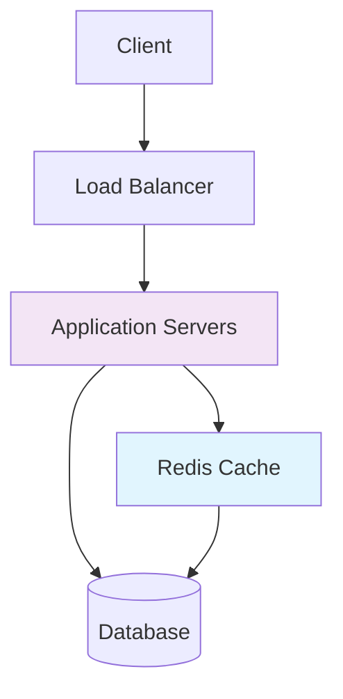
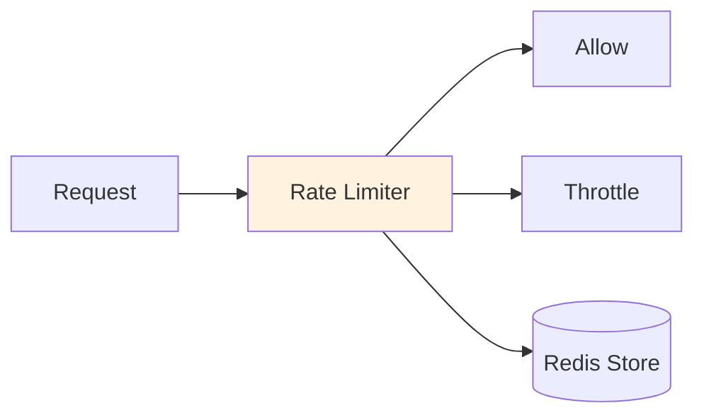
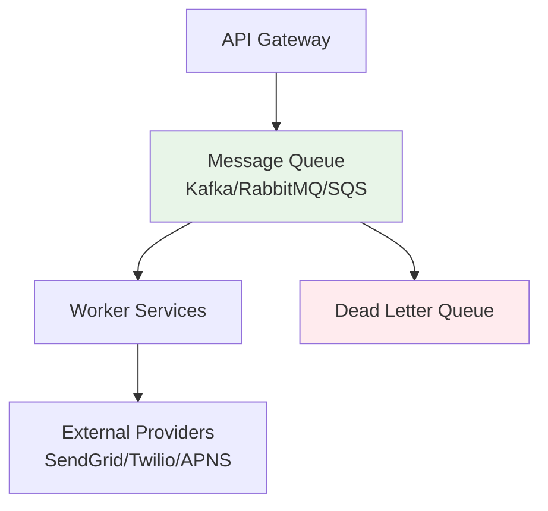
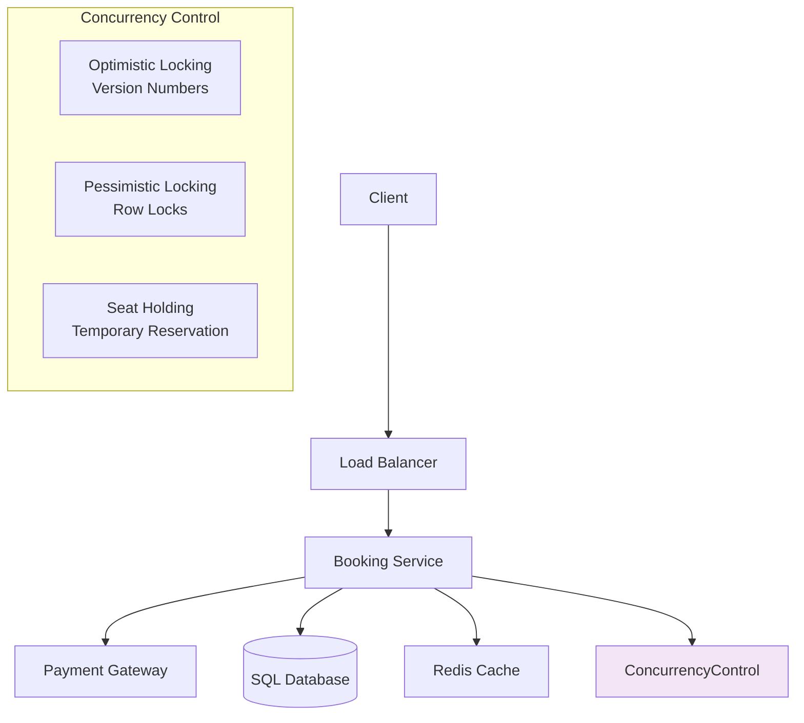
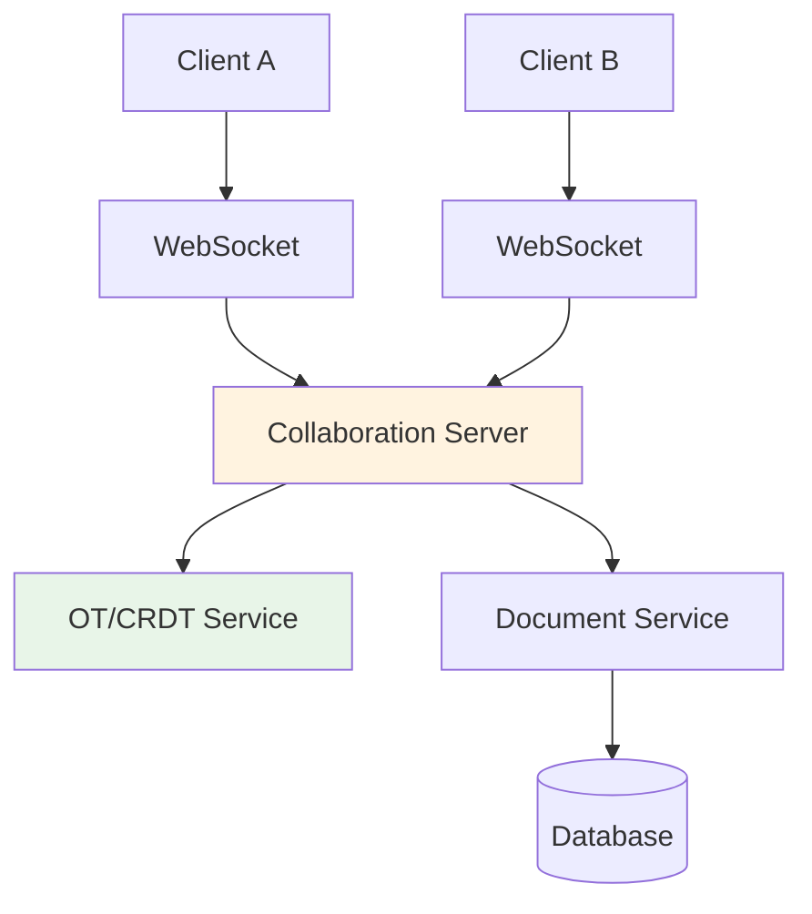
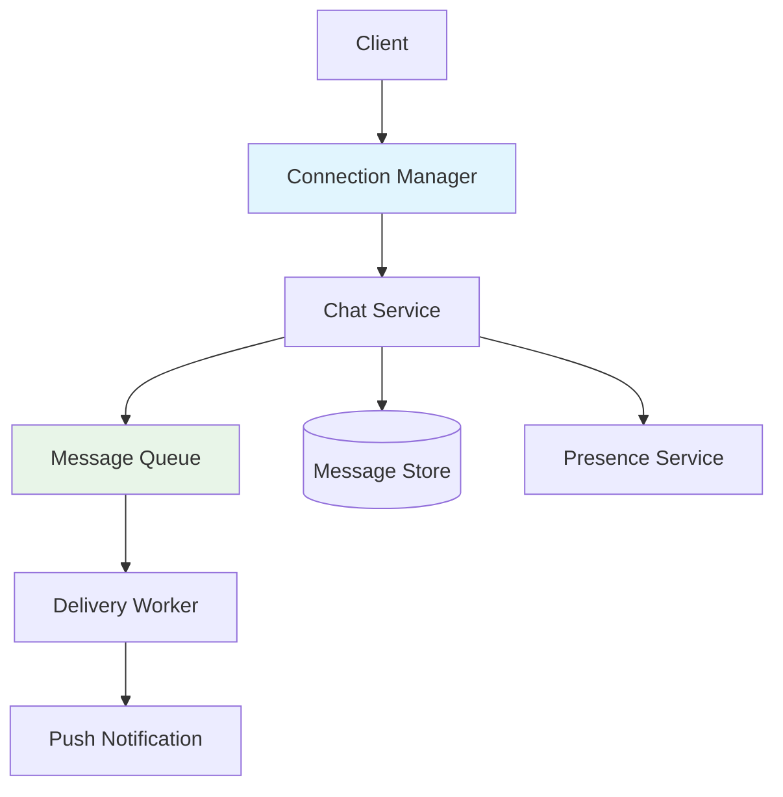
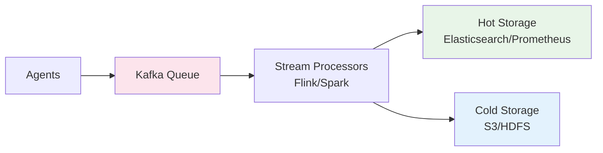
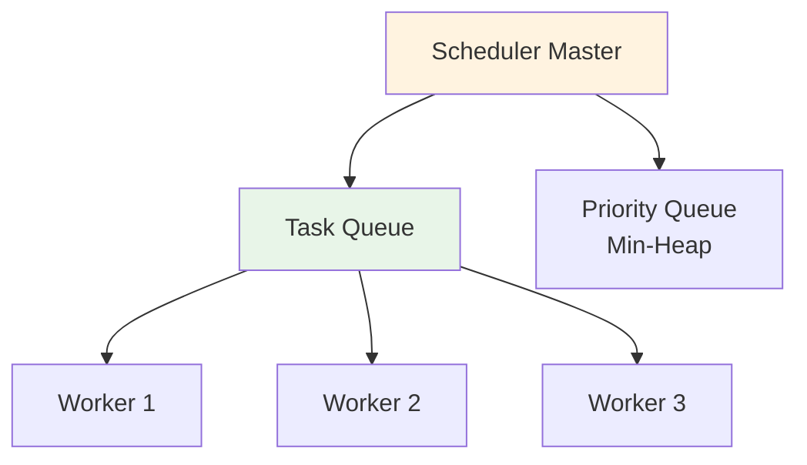

# System Design Interview Cheat Sheet

A structured guide to answering common system design questions, featuring key concepts, architectures, and trade-offs.

## Core Framework for System Design Questions

### 1. Clarify Requirements & Scope
- **Features**: What are the core functionalities?
- **Scale**: Requests per second, data volume, read/write ratio
- **Non-functionals**: Latency, availability, consistency, durability

### 2. High-Level Design
- **Clients**: Web, mobile, API consumers
- **Application Servers**: Core business logic
- **Data Stores**: Databases, caches, file storage
- **Additional Services**: Message queues, CDN, load balancers

### 3. Deep Dive Components
- Technology trade-offs
- Algorithms and data structures
- Scaling strategies

### 4. Identify & Resolve Bottlenecks
- Load handling
- Fault tolerance
- Performance optimization

---

## Core Foundations

### 1. URL Shortener

**Key Features**: Shorten URLs, Redirect to originals
**Scale**: High read throughput (300:1 read:write ratio)

**Key Components**:
- **Unique ID Generation**:
  - Base-62 encoding of DB auto-increment
  - Random string with collision checking
  - Distributed ID generator (Snowflake)
- **Database**: Simple KV store `short_code -> original_url`
- **Caching**: LRU cache for frequent redirects
- **Redirect**: 301 (permanent) vs 302 (temporary + analytics)

### 2. Rate Limiter

**Key Feature**: Allow/throttle requests based on user/IP/key

**Algorithms**:
- **Token Bucket**: Fixed capacity, refill rate - allows bursting
- **Leaky Bucket**: Fixed output rate - smoothens traffic
- **Fixed Window**: Simple counter per time window
- **Sliding Window**: More accurate, tracks timestamps

**Distributed Coordination**: Redis with atomic operations (`INCR`, `EXPIRE`)

### 3. Notification System

**Key Features**: Email, SMS, Push notifications with reliable delivery

**Reliability Patterns**:
- **Message Queue**: Decouples services, handles spikes
- **Retries**: Exponential backoff with jitter
- **DLQ**: Manual inspection for failed messages
- **Fan-out**: Separate service for broadcasting to millions

---

## Stateful + Consistency Focus

### 4. Ticket Booking System

**Core Challenge**: Prevent double-booking, handle high concurrency

**Concurrency Strategies**:
- **Optimistic Locking**: Check version numbers, retry on conflict
- **Pessimistic Locking**: `SELECT FOR UPDATE` - simpler but bottlenecks
- **Two-Phase**: Hold seat → Payment → Confirm
- **Idempotency**: Unique keys to prevent duplicate payments

### 5. Google Docs

**Core Challenge**: Real-time collaboration, conflict resolution

**Conflict Resolution**:
- **Operational Transformation (OT)**: Central server transforms operations
- **CRDTs**: Conflict-free replicated data types, automatic merge
- **Sync Flow**: Client ops → Server → Transform → Broadcast

### 6. Messaging System

**Key Features**: 1-on-1 chat, groups, delivery status, offline support

**Message Delivery**:
- **Ordering**: Sequence numbers per conversation
- **Delivery Semantics**:
  - At-least-once: Retries with deduplication
  - Exactly-once: Complex, requires idempotency
- **Offline Handling**: Per-user queues for pending messages

---

## Write Heavy Systems, Streaming, Realtime

### 7. Logging / Metrics System

**Core Challenge**: Ingest massive data streams, provide query access

**Data Pipeline**:
- **Buffering**: Kafka as massive buffer between producers/consumers
- **Backpressure**: Natural flow control via queue filling
- **Processing**: Real-time filtering, aggregation, transformation
- **Storage Tiers**: Hot (queryable) vs Cold (archival)

### 8. Distributed Task Scheduler

**Key Features**: One-time, delayed, and recurring job execution

**Scheduling Components**:
- **Master Scheduler**: Tracks timing via priority queue
- **Job Dispatch**: Queue-based to stateless workers
- **Reliability**:
  - **Retries**: Queue visibility timeout
  - **Idempotency**: Critical for exactly-once semantics
- **Special Execution**:
  - Delayed: Queue with delay support
  - Recurring: Re-insert after completion

---

## Key System Design Principles

### Database Selection
- **SQL**: ACID transactions, complex queries, strong consistency
- **NoSQL**: Horizontal scaling, flexible schema, high throughput
- **Cache**: Low-latency reads, session storage

### Caching Strategies
- **Write-through**: Write to cache and DB simultaneously
- **Write-behind**: Write to cache, async to DB
- **LRU**: Evict least recently used items

### Message Queue Patterns
- **Decoupling**: Separate service dependencies
- **Buffering**: Handle load spikes gracefully
- **Fan-out**: Deliver to multiple consumers

### Scaling Approaches
- **Horizontal**: Add more servers (stateless services)
- **Vertical**: Upgrade server resources (databases)
- **Sharding**: Distribute data across multiple databases

### Consistency Models
- **Strong**: All reads see latest write
- **Eventual**: Reads eventually see writes
- **Causal**: Preserves cause-effect relationships