# System Design Concepts

## Scalability

Definition: The ability of a system to handle increased load by adding resources.
Types of Scalability:

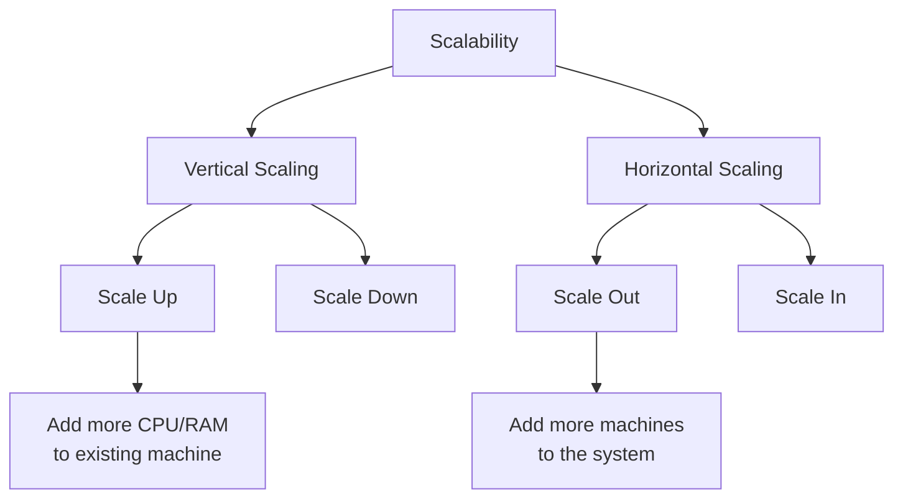

Vertical Scaling (Scale Up/Down):

    Adding more resources (CPU, RAM) to existing machines

    Example: Upgrading from 8GB to 32GB RAM on a database server

    Limitation: Single point of failure, hardware limits

Horizontal Scaling (Scale Out/In):

    Adding more machines to the system

    Example: Adding more web servers behind a load balancer

    Advantage: Better fault tolerance, virtually unlimited scaling

## Throughput & Bandwidth

Throughput: Number of units of work processed per time unit

    Example: 1000 requests/second, 50 transactions/minute

Bandwidth: Maximum data transfer rate of a network

    Example: 1 Gbps network connection

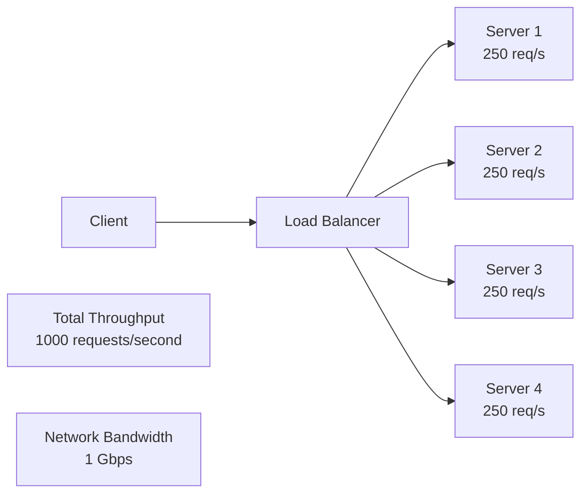

## Concurrency vs Parallelism

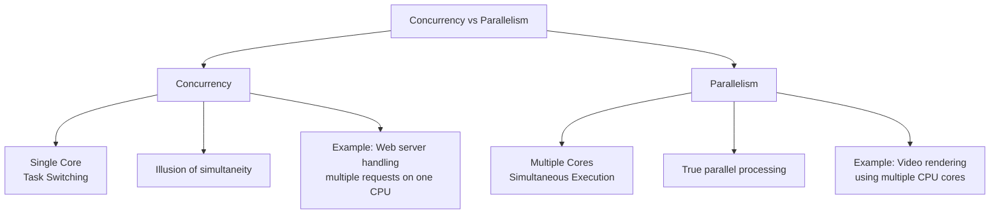

### Concurrency:

    Multiple tasks making progress without necessarily running simultaneously

    Example: A single-threaded web server handling multiple requests using async I/O

### Parallelism:

    Multiple tasks executing simultaneously

    Example: A multi-threaded application processing images using all CPU cores

### Consistency, Availability & Partition Tolerance

#### Core Concepts in Distributed Systems
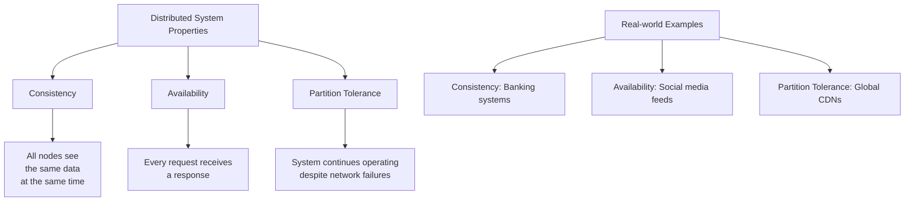

Consistency:

    Strong Consistency: All reads see the most recent write

    Eventual Consistency: All nodes will eventually have the same data

    Example: Banking systems require strong consistency for balance checks

Availability:

    System remains operational and responsive

    Example: Social media feeds prioritize availability over perfect consistency

Partition Tolerance:

    System continues functioning despite network partitions

    Example: Global CDNs that can serve content even if some regions are disconnected

### CAP Theorem

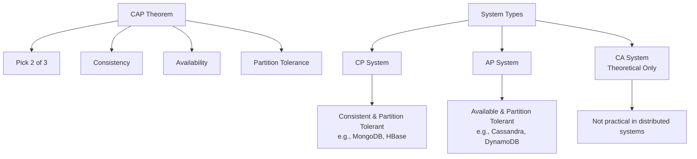

#### CAP Theorem: In distributed systems, you can only guarantee two of:

    Consistency: All nodes see the same data at the same time

    Availability: Every request receives a response

    Partition Tolerance: System continues operating despite network partitions

### PACELC Theorem

Extension of CAP: If Partition occurs, choose between Availability and Consistency; Else, choose between Latency and Consistency.

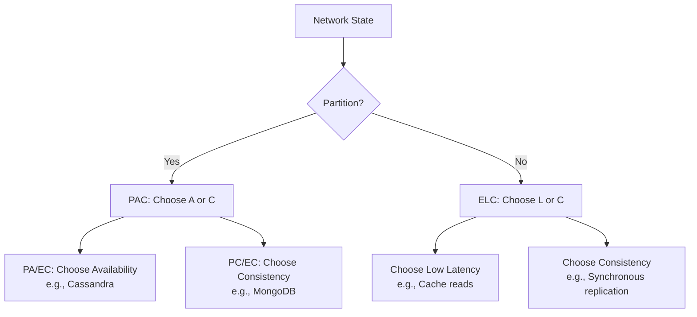

### Latency

Definition: Time delay between request and response
Latency Components:

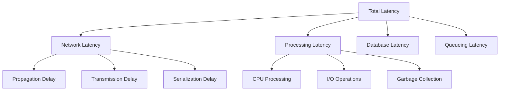

### Techniques That Reduce Latency

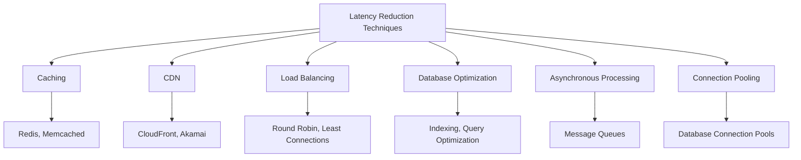

Examples:

    Caching: Redis for session storage

    CDN: CloudFront for static assets

    Database Optimization: Proper indexing, query optimization

    Async Processing: RabbitMQ for background jobs

### Relational vs Non-Relational Databases

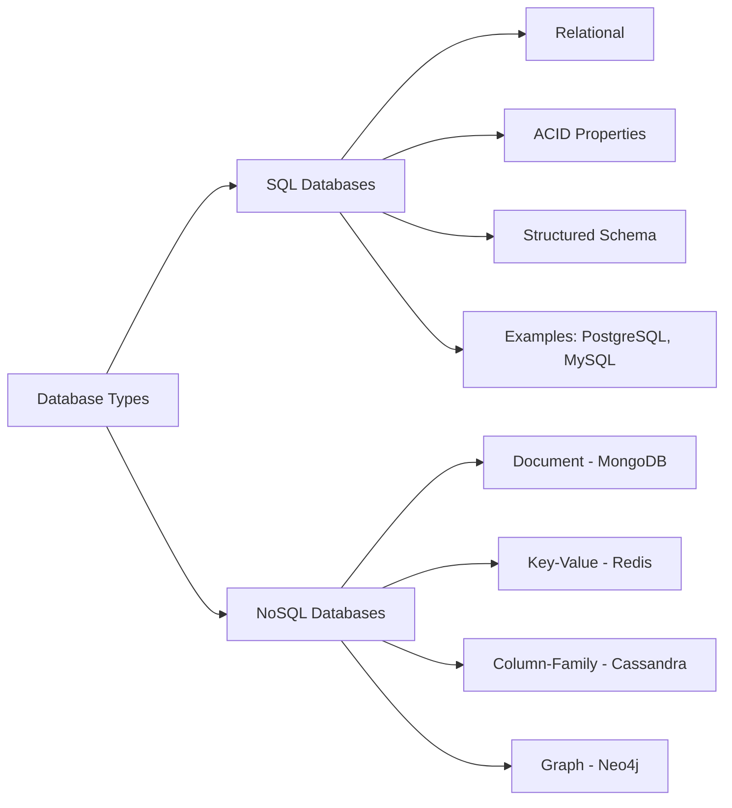

Comparison Table:
Aspect	SQL	NoSQL
Schema	Fixed, predefined	Dynamic, flexible
ACID	Strong consistency	Eventual consistency
Scaling	Vertical	Horizontal
Use Case	Complex queries, transactions	High throughput, flexible data

### Transactions & Their Types

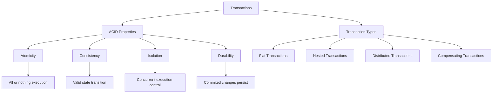

Isolation Levels:

    Read Uncommitted - Lowest isolation, dirty reads possible

    Read Committed - Prevents dirty reads

    Repeatable Read - Prevents non-repeatable reads

    Serializable - Highest isolation, complete isolation

### Additional Concepts
#### Load Balancing

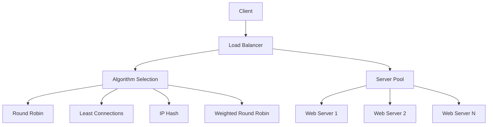

#### Microservices Architecture

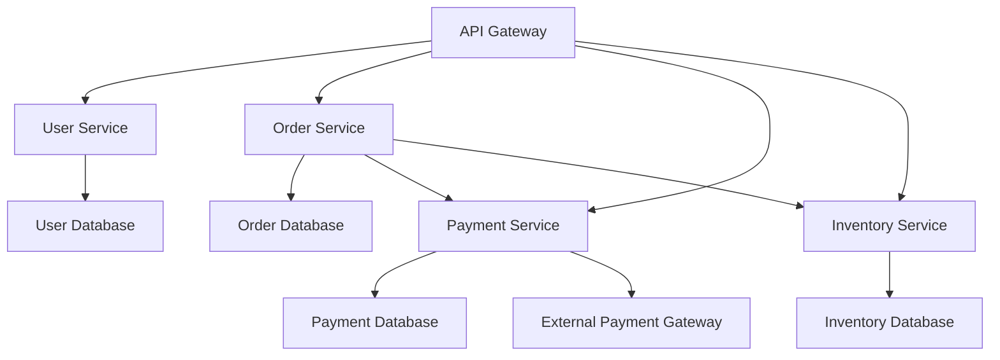

#### Message Queues

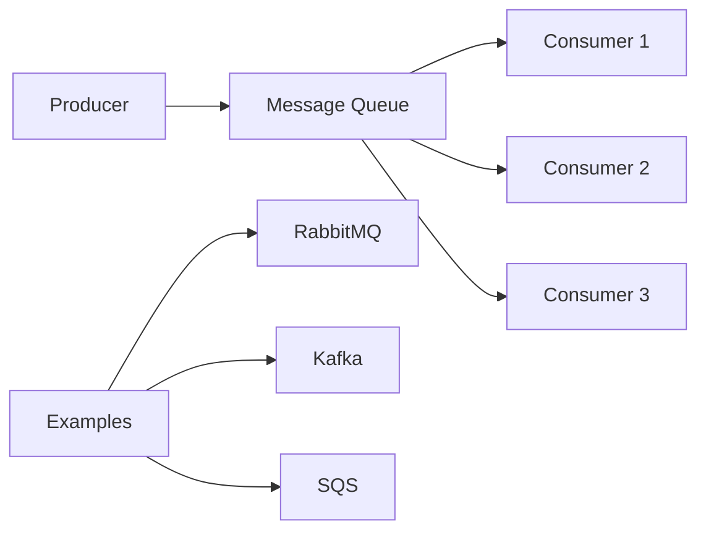

#### Caching Strategies

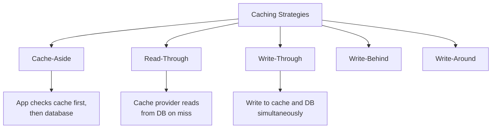

#### Database Replication

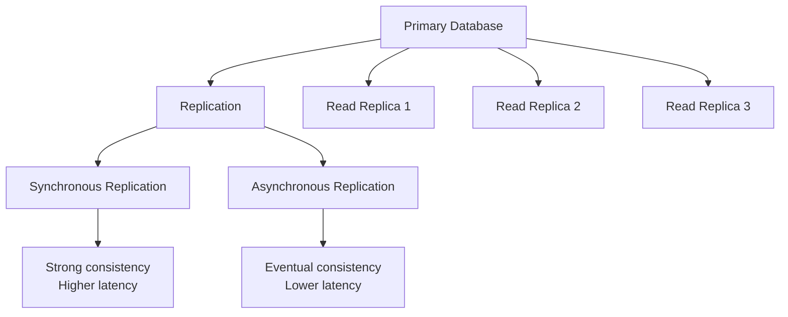

Key Performance Metrics

    RPS: Requests per second

    P99 Latency: 99th percentile latency

    Error Rate: Percentage of failed requests

    Uptime: System availability percentage

    MTTR: Mean Time To Recovery

    MTBF: Mean Time Between Failures

This README provides a comprehensive overview of essential system design concepts with visual diagrams for better understanding. Keep it as a reference for your system design preparations!