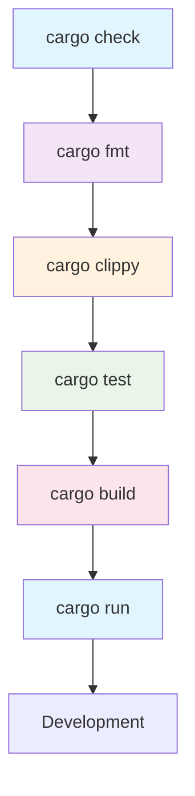
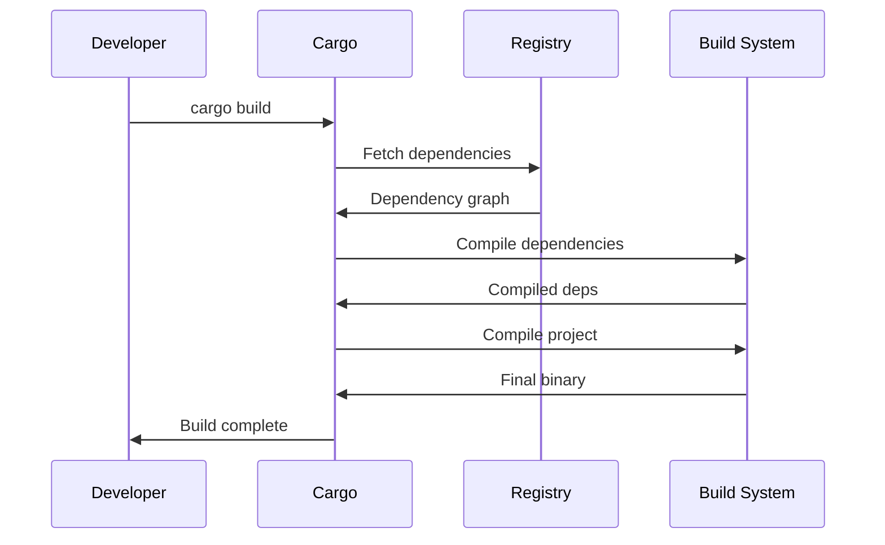

# Cargo.toml Command Cheatsheet

## Core Build Commands

### Basic Compilation & Building
```bash
# Build the project
cargo build

# Build with release optimizations
cargo build --release

# Build without dependencies (faster)
cargo build --workspace

# Build specific package in workspace
cargo build -p my_package

# Build for specific target
cargo build --target x86_64-unknown-linux-gnu

# Build with specific features
cargo build --features "serde,json"

# Build all features
cargo build --all-features

# Build without default features
cargo build --no-default-features
```

### Running & Execution
```bash
# Build and run the project
cargo run

# Run with release optimizations
cargo run --release

# Run with specific features
cargo run --features "cli,database"

# Run with command-line arguments
cargo run -- --help
cargo run -- -v -c config.toml

# Run specific binary
cargo run --bin my_binary

# Run tests
cargo test

# Run specific test
cargo test test_function_name

# Run tests with specific pattern
cargo test -- my_test_pattern

# Run tests in release mode
cargo test --release
```

## Code Quality & Analysis

### Clippy (Linting)
```bash
# Run clippy linter
cargo clippy

# Run clippy with all warnings
cargo clippy -- -W clippy::all

# Run clippy with specific warnings
cargo clippy -- -W clippy::pedantic

# Run clippy and treat warnings as errors
cargo clippy -- -D warnings

# Run clippy on specific package
cargo clippy -p my_package

# Run clippy with release profile
cargo clippy --release
```

### Formatting
```bash
# Format code with rustfmt
cargo fmt

# Check formatting without changes
cargo fmt -- --check

# Format with specific configuration
cargo fmt -- --config tab_spaces=2

# Format with verbose output
cargo fmt -- --verbose
```

### Security & Auditing
```bash
# Check for vulnerable dependencies
cargo audit

# Audit with specific options
cargo audit --deny-warnings

# Update advisory database
cargo audit update

# Scan for security issues
cargo audit --ignore RUSTSEC-2023-0000

# Check for outdated dependencies
cargo outdated

# Outdated with specific output format
cargo outdated -R --format json
```

### Static Analysis
```bash
# Run static analysis with cargo-check
cargo check

# Check specific package
cargo check -p my_package

# Check with all features
cargo check --all-features

# Check for unused dependencies
cargo udeps

# Generate documentation
cargo doc

# Open documentation in browser
cargo doc --open

# Document with private items
cargo doc --document-private-items
```

## Testing & Verification

### Test Commands
```bash
# Run all tests
cargo test

# Run tests with detailed output
cargo test -- --nocapture

# Run tests in single thread
cargo test -- --test-threads=1

# Run specific test module
cargo test my_module

# Run integration tests only
cargo test --test integration_tests

# Run benchmarks
cargo bench

# Run specific benchmark
cargo bench my_benchmark

# Run tests with coverage (requires cargo-tarpaulin)
cargo tarpaulin --out Html
```

### Verification & Sanity Checks
```bash
# Verify package is buildable
cargo verify-project

# Check package metadata
cargo package --list

# Check if package can be published
cargo publish --dry-run

# Check for license compliance
cargo deny check

# Verify dependency tree
cargo tree

# Show dependency tree with duplicates
cargo tree --duplicates
```

## Dependency Management

### Dependency Operations
```bash
# Add a new dependency
cargo add serde

# Add dependency with specific version
cargo add serde@1.0

# Add development dependency
cargo add --dev tokio-test

# Add build dependency
cargo add --build protobuf-codegen

# Add dependency with specific features
cargo add tokio --features full

# Remove a dependency
cargo remove serde

# Update dependencies
cargo update

# Update specific dependency
cargo update -p serde

# Update to latest compatible versions
cargo upgrade

# Update to latest versions (including major)
cargo upgrade --to-latest
```

### Workspace Management
```bash
# Build all workspace members
cargo build --workspace

# Test all workspace members
cargo test --workspace

# Run command on all workspace members
cargo run --workspace

# Build specific workspace member
cargo build -p member1 -p member2

# List workspace members
cargo metadata --format-version=1 | jq '.packages[].name'
```

## Publishing & Distribution

### Package Management
```bash
# Create a new package
cargo new my_project

# Create a library package
cargo new my_lib --lib

# Create with specific VCS
cargo new my_project --vcs git

# Create in existing directory
cargo init

# Package for distribution
cargo package

# Publish to crates.io
cargo publish

# Publish with specific token
cargo publish --token YOUR_TOKEN

# Yank a crate version
cargo yank --vers 1.0.0

# Yank with undo
cargo yank --vers 1.0.0 --undo
```

### Installation & Binary Distribution
```bash
# Install a binary crate
cargo install cargo-edit

# Install specific version
cargo install cargo-edit@0.10.0

# Install from git repository
cargo install --git https://github.com/user/repo

# Install with specific features
cargo install my_tool --features cli

# List installed binaries
cargo install --list

# Uninstall a binary
cargo uninstall my_tool

# Build for cross-compilation
cargo build --target aarch64-unknown-linux-gnu
```

## Performance & Optimization

### Build Optimization
```bash
# Build with optimizations for size
cargo build --release -Z build-std=std,panic_abort -Z build-std-features=panic_immediate_abort --target x86_64-unknown-linux-gnu

# Build with LTO (Link Time Optimization)
cargo build --release --config 'profile.release.lto = true'

# Build with specific codegen units
cargo build --release --config 'profile.release.codegen-units = 1'

# Build with CPU-specific optimizations
RUSTFLAGS='-C target-cpu=native' cargo build --release

# Build with incremental compilation disabled
cargo build --release -Z unstable-options --config 'profile.release.incremental = false'
```

### Profiling & Debugging
```bash
# Build with debug symbols
cargo build --release --debug=1

# Run with memory sanitizer
RUSTFLAGS='-Z sanitizer=memory' cargo test

# Run with address sanitizer
RUSTFLAGS='-Z sanitizer=address' cargo test

# Generate flamegraph
cargo flamegraph

# Generate callgrind data
cargo valgrind --tool=callgrind
```

## Common Command Combinations

### Complete Development Workflow
```bash
# Full development cycle
cargo check
cargo fmt
cargo clippy -- -D warnings
cargo test
cargo build --release
cargo run --release
```

### CI/CD Pipeline
```bash
# Complete CI pipeline
cargo check --workspace
cargo fmt -- --check
cargo clippy --workspace -- -D warnings
cargo test --workspace
cargo audit
cargo build --release --workspace
cargo test --release --workspace
```

### Quality Assurance Pipeline
```bash
# Quality checks
cargo fmt
cargo clippy -- -D warnings
cargo test
cargo audit
cargo deny check
cargo outdated
cargo udeps
```

### Pre-commit Hook
```bash
# Quick pre-commit checks
cargo fmt
cargo check
cargo clippy -- -D warnings
cargo test --quiet
```

## Cargo.toml Structure Reference

### Basic Cargo.toml Example
```toml
[package]
name = "my_project"
version = "0.1.0"
edition = "2021"
authors = ["Your Name <email@example.com>"]
description = "A fantastic Rust project"
license = "MIT OR Apache-2.0"

[dependencies]
serde = { version = "1.0", features = ["derive"] }
tokio = { version = "1.0", features = ["full"] }
reqwest = "0.11"

[dev-dependencies]
tokio-test = "0.4"

[build-dependencies]
protobuf-codegen = "4.0"

[features]
default = ["cli"]
cli = ["dep1/cli", "dep2/terminal"]
server = ["dep1/server", "dep2/http"]

[profile.dev]
opt-level = 0
debug = true

[profile.release]
opt-level = 3
lto = true
```

### Workspace Cargo.toml
```toml
[workspace]
members = [
    "crates/*",
    "binaries/*",
    "examples/*",
]

resolver = "2"

[workspace.dependencies]
common-dep = "1.0"
serde = { version = "1.0", features = ["derive"] }
```

## Cargo Workflow Diagram



## Dependency Resolution Flow



## Quick Reference Table

| Command | Purpose | Common Use |
|---------|---------|------------|
| `cargo build` | Compile project | Development |
| `cargo run` | Build and run | Testing |
| `cargo test` | Run tests | CI/CD |
| `cargo check` | Quick compile check | Pre-commit |
| `cargo clippy` | Linting | Code quality |
| `cargo fmt` | Format code | Consistency |
| `cargo audit` | Security audit | Security |
| `cargo add` | Add dependency | Dependency mgmt |
| `cargo update` | Update deps | Maintenance |
| `cargo publish` | Publish crate | Distribution |

## Environment Variables & Configuration

### Common Environment Variables
```bash
# Build configuration
export RUSTFLAGS="-C target-cpu=native"
export CARGO_BUILD_JOBS=8
export RUST_LOG=debug

# Network configuration
export CARGO_HTTP_DEBUG=true
export CARGO_NET_GIT_FETCH_WITH_CLI=true

# Registry configuration
export CARGO_REGISTRIES_CRATES_IO_PROTOCOL=sparse

# Feature flags
export CARGO_FEATURE_DEV=true
```

### Cargo Configuration (.cargo/config.toml)
```toml
[build]
jobs = 4
rustc-wrapper = "sccache"

[target.x86_64-unknown-linux-gnu]
linker = "clang"

[net]
git-fetch-with-cli = true

[registry]
default = "crates-io"

[install]
root = "/usr/local"
```

This cheatsheet covers essential Cargo commands for Rust development, including building, testing, code quality, dependency management, and publishing. Use these commands to streamline your Rust workflow!