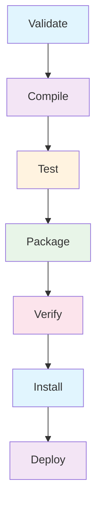
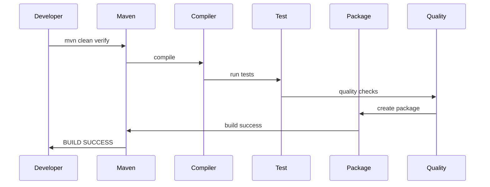

# Maven Command Cheatsheet

## Core Lifecycle Commands

### Basic Build Commands
```bash
# Compile source code
mvn compile

# Run unit tests
mvn test

# Package application
mvn package

# Install to local repository
mvn install

# Deploy to remote repository
mvn deploy

# Clean target directory
mvn clean

# Generate site documentation
mvn site
```

### Combined Lifecycle Commands
```bash
# Clean and package
mvn clean package

# Clean, compile, and test
mvn clean test

# Clean, compile, test, and package
mvn clean verify

# Clean and install
mvn clean install

# Clean, test, and deploy
mvn clean deploy
```

## Code Quality & Static Analysis

### Checkstyle
```bash
# Generate checkstyle report
mvn checkstyle:checkstyle

# Checkstyle with specific config
mvn checkstyle:checkstyle -Dcheckstyle.config.location=my_checks.xml

# Checkstyle check only (fails on violations)
mvn checkstyle:check

# Generate HTML report
mvn checkstyle:checkstyle -Dcheckstyle.output.format=html
```

### PMD
```bash
# Generate PMD report
mvn pmd:pmd

# Run PMD checks (fails on violations)
mvn pmd:check

# PMD with custom ruleset
mvn pmd:pmd -Dpmd.rulesets=rulesets/java/myrules.xml

# Generate both PMD and CPD (copy-paste detection)
mvn pmd:pmd -Dpmd.cpd.skip=false
```

### SpotBugs
```bash
# Generate SpotBugs report
mvn spotbugs:spotbugs

# Run SpotBugs checks (fails on violations)
mvn spotbugs:check

# Generate HTML report
mvn spotbugs:spotbugs -Dspotbugs.htmlOutput=true

# SpotBugs with specific effort level
mvn spotbugs:spotbugs -Dspotbugs.effort=Max
```

### JaCoCo (Code Coverage)
```bash
# Generate code coverage report
mvn jacoco:report

# Check coverage thresholds
mvn jacoco:check

# Prepare agent for tests
mvn jacoco:prepare-agent test jacoco:report

# Generate coverage report with thresholds
mvn jacoco:prepare-agent test jacoco:report jacoco:check
```

### SonarQube Integration
```bash
# Analyze project with SonarQube
mvn sonar:sonar

# Sonar with specific properties
mvn sonar:sonar -Dsonar.host.url=http://sonar:9000

# Sonar with branch analysis
mvn sonar:sonar -Dsonar.branch.name=feature-branch

# Sonar with test coverage
mvn clean test jacoco:report sonar:sonar
```

## Testing Commands

### Test Execution
```bash
# Run all tests
mvn test

# Run specific test class
mvn test -Dtest=MyTestClass

# Run multiple test classes
mvn test -Dtest=TestClass1,TestClass2

# Run tests matching pattern
mvn test -Dtest=*Test

# Run tests with specific method
mvn test -Dtest=MyTestClass#myTestMethod

# Skip tests
mvn package -DskipTests

# Skip tests during install
mvn install -DskipTests

# Compile tests but don't run
mvn package -Dmaven.test.skip=true
```

### Surefire & Failsafe
```bash
# Run unit tests (Surefire)
mvn surefire:test

# Run integration tests (Failsafe)
mvn failsafe:integration-test

# Verify integration tests
mvn failsafe:verify

# Run with specific test suite
mvn test -Dsurefire.suiteXmlFiles=testng.xml
```

## Dependency Management

### Dependency Commands
```bash
# Display dependency tree
mvn dependency:tree

# Show dependency conflicts
mvn dependency:tree -Dverbose

# Analyze dependencies
mvn dependency:analyze

# Copy dependencies to target
mvn dependency:copy-dependencies

# Resolve dependencies
mvn dependency:resolve

# List all dependencies
mvn dependency:list

# Check for updated dependencies
mvn versions:display-dependency-updates

# Update project version
mvn versions:set -DnewVersion=2.0.0
```

### Plugin Management
```bash
# Display plugin information
mvn help:describe -Dplugin=org.apache.maven.plugins:maven-compiler-plugin

# Show effective POM
mvn help:effective-pom

# Show effective settings
mvn help:effective-settings

# Evaluate expression
mvn help:evaluate -Dexpression=project.version
```

## Project Creation & Structure

### Archetype Commands
```bash
# Generate project from archetype
mvn archetype:generate

# Generate with specific archetype
mvn archetype:generate -DgroupId=com.mycompany -DartifactId=myapp -DarchetypeArtifactId=maven-archetype-quickstart -DinteractiveMode=false

# Create from custom archetype
mvn archetype:generate -DarchetypeGroupId=com.mycompany -DarchetypeArtifactId=my-archetype -DarchetypeVersion=1.0.0
```

## Build Optimization

### Parallel Builds
```bash
# Build modules in parallel
mvn -T 4 clean install

# Use one thread per core
mvn -T 1C clean install

# Parallel builds with specific thread count
mvn -T 2 clean install
```

### Profile Management
```bash
# Activate specific profile
mvn clean install -Pproduction

# Activate multiple profiles
mvn clean install -Pdev,integration-tests

# List available profiles
mvn help:all-profiles

# Skip profile activation
mvn clean install -P!production
```

## Release Management

### Release Plugin
```bash
# Prepare release
mvn release:prepare

# Perform release
mvn release:perform

# Clean release preparation
mvn release:clean

# Rollback release
mvn release:rollback

# Prepare with specific versions
mvn release:prepare -DreleaseVersion=2.0.0 -DdevelopmentVersion=2.0.1-SNAPSHOT
```

## Maven Wrapper

### Wrapper Commands
```bash
# Install Maven wrapper
mvn wrapper:wrapper

# Install specific Maven version
mvn wrapper:wrapper -DmavenVersion=3.8.1

# Use wrapper instead of system Maven
./mvnw clean install

# On Windows
mvnw.cmd clean install
```

## Common Command Combinations

### Complete CI/CD Pipeline
```bash
# Full quality pipeline
mvn clean compile
mvn checkstyle:checkstyle
mvn pmd:check
mvn spotbugs:check
mvn test
mvn jacoco:report
mvn sonar:sonar
mvn package -DskipTests
mvn verify
```

### Quick Development Build
```bash
# Fast development build (skip quality checks)
mvn clean compile test package -DskipTests -Dcheckstyle.skip=true -Dpmd.skip=true -Dspotbugs.skip=true
```

### Production Ready Build
```bash
# Production build with all checks
mvn clean 
mvn compile 
mvn checkstyle:check 
mvn pmd:check 
mvn spotbugs:check 
mvn test 
mvn jacoco:check 
mvn package 
mvn verify
```

### Security Scanning Build
```bash
# Security-focused build
mvn clean compile
mvn owasp:dependency-check
mvn spotbugs:check
mvn pmd:check -Dpmd.rulesets=rulesets/java/security.xml
mvn package
```

## Maven Lifecycle Diagram



## Plugin Execution Flow



## Quick Reference Table

| Command | Purpose | Common Use |
|---------|---------|------------|
| `mvn compile` | Compile source | Development |
| `mvn test` | Run tests | Pre-commit |
| `mvn package` | Create package | CI build |
| `mvn install` | Install locally | Local repo |
| `mvn clean` | Clean target | Before build |
| `mvn checkstyle:check` | Code style | Quality gate |
| `mvn pmd:check` | Static analysis | Code quality |
| `mvn spotbugs:check` | Bug patterns | Security scan |
| `mvn sonar:sonar` | Sonar analysis | Quality metrics |
| `mvn dependency:tree` | Dependency graph | Conflict resolution |

## Properties & Configuration

### Common Maven Properties
```bash
# Skip tests
-DskipTests

# Skip quality checks
-Dcheckstyle.skip=true
-Dpmd.skip=true  
-Dspotbugs.skip=true

# Specific test configuration
-Dtest.include=**/*Test.java
-Dmaven.test.failure.ignore=true

# Memory settings
-DargLine="-Xmx1024m -XX:MaxPermSize=256m"

# Build properties
-Dbuild.version=1.0.0
-Dbuild.timestamp=$(date +%Y%m%d%H%M%S)
```

### Settings.xml Configuration
```xml
<!-- ~/.m2/settings.xml -->
<settings>
    <servers>
        <server>
            <id>my-repo</id>
            <username>deploy-user</username>
            <password>deploy-pass</password>
        </server>
    </servers>
    <profiles>
        <profile>
            <id>default</id>
            <activation>
                <activeByDefault>true</activeByDefault>
            </activation>
            <properties>
                <java.version>11</java.version>
            </properties>
        </profile>
    </profiles>
</settings>
```

This cheatsheet covers essential Maven commands for building, testing, quality checking, and deploying Java applications. Use these commands to streamline your development workflow!