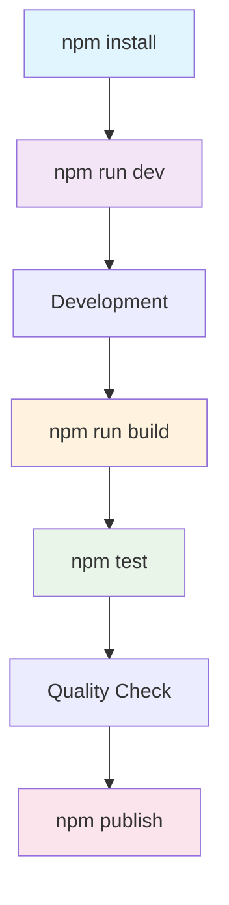
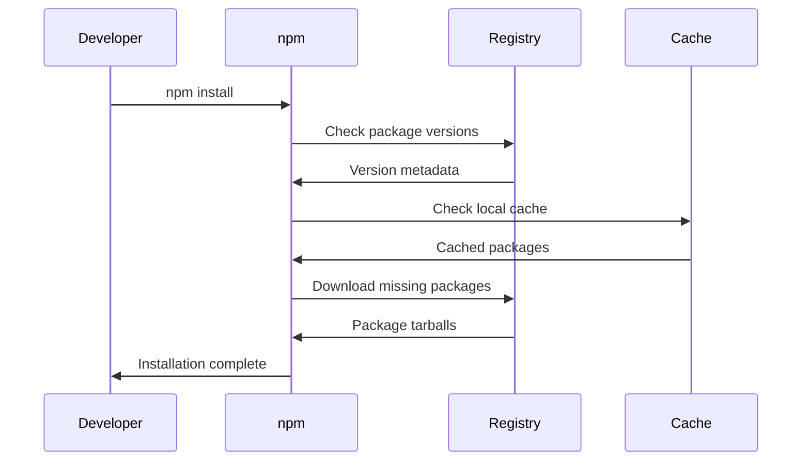

# npm Command Cheatsheet

## Core Package Management

### Installation Commands
```bash
# Install all dependencies from package.json
npm install

# Install production dependencies only
npm install --production

# Install and save to dependencies
npm install package-name
npm install package-name --save

# Install and save to devDependencies
npm install package-name --save-dev

# Install globally
npm install -g package-name

# Install specific version
npm install package-name@1.2.3

# Install from GitHub
npm install github:username/repo

# Install from local path
npm install ../local-package

# Install exact version (no ^)
npm install package-name --save-exact

# Install peer dependencies
npm install --legacy-peer-deps
```

### Dependency Management
```bash
# Update all packages
npm update

# Update specific package
npm update package-name

# Check for outdated packages
npm outdated

# Audit for vulnerabilities
npm audit

# Fix vulnerabilities automatically
npm audit fix

# Fix vulnerabilities aggressively
npm audit fix --force

# Remove package
npm uninstall package-name

# Remove and remove from package.json
npm uninstall package-name --save

# Clean node_modules cache
npm clean-install
```

## Scripts & Execution

### Running Scripts
```bash
# Run script defined in package.json
npm run script-name

# Run start script
npm start

# Run test script
npm test

# Run with additional arguments
npm run build -- --watch

# Run multiple scripts
npm run script1 && npm run script2

# List available scripts
npm run

# Run pre and post scripts automatically
npm run build # runs prebuild, build, postbuild
```

### Common Development Scripts
```bash
# Development with hot reload
npm run dev
npm run develop
npm run serve

# Build for production
npm run build

# Build with analysis
npm run build:analyze

# Lint code
npm run lint

# Lint with fix
npm run lint:fix

# Type checking
npm run type-check
npm run tsc

# Test with coverage
npm run test:coverage

# E2E testing
npm run test:e2e
```

## Publishing & Distribution

### Package Publishing
```bash
# Login to npm registry
npm login

# Logout from npm
npm logout

# Publish package
npm publish

# Publish with specific tag
npm publish --tag beta

# Unpublish package (within 72 hours)
npm unpublish package-name@version

# Deprecate package version
npm deprecate package-name@version "message"

# Update package version
npm version patch
npm version minor
npm version major

# Set specific version
npm version 1.2.3
```

### Version Management
```bash
# Show current version
npm version

# Bump patch version (1.0.0 → 1.0.1)
npm version patch

# Bump minor version (1.0.0 → 1.1.0)
npm version minor

# Bump major version (1.0.0 → 2.0.0)
npm version major

# Create git tag with version
npm version patch -m "Bump version to %s"

# Version with specific number
npm version 2.1.0
```

## Code Quality & Testing

### Linting & Formatting
```bash
# Run ESLint
npx eslint .

# Run ESLint with fix
npx eslint . --fix

# Run Prettier
npx prettier --write .

# Check formatting without changes
npx prettier --check .

# Run TypeScript compiler
npx tsc --noEmit

# Run type checking
npx tsc

# Run stylelint
npx stylelint "**/*.css"
```

### Testing
```bash
# Run tests once
npm test

# Run tests in watch mode
npm run test:watch

# Run tests with coverage
npm run test:coverage

# Run specific test file
npm test -- src/file.test.js

# Run E2E tests
npm run test:e2e

# Run performance tests
npm run test:performance

# Debug tests
npm run test:debug
```

### Security & Auditing
```bash
# Audit for vulnerabilities
npm audit

# Fix vulnerabilities
npm audit fix

# Force fix vulnerabilities
npm audit fix --force

# Show detailed audit report
npm audit --json

# Check for license compliance
npx license-checker

# Check for outdated dependencies
npm outdated

# Check dependency size
npx cost-of-modules
```

## Workspace Management (Monorepo)

### Workspace Commands
```bash
# Install all workspace dependencies
npm install

# Run script in all workspaces
npm run build --workspaces

# Run script in specific workspace
npm run dev --workspace=packages/app

# Run script in multiple workspaces
npm run test --workspace=packages/*

# Add dependency to specific workspace
npm install package-name --workspace=packages/app

# Add dependency to all workspaces
npm install package-name --workspaces

# List all workspaces
npm ls --workspaces
```

### Monorepo Management
```bash
# Run in topological order
npm run build --ws --if-present

# Run only in changed packages
npx lerna run build --since main

# Link local packages
npm link ../shared-package

# Bootstrap monorepo
npx lerna bootstrap
```

## Configuration & Environment

### Configuration Management
```bash
# Set configuration
npm config set key value

# Get configuration
npm config get key

# List all configurations
npm config list

# Delete configuration
npm config delete key

# Edit npmrc file
npm config edit

# Set registry
npm config set registry https://registry.npmjs.org/

# Set scope registry
npm config set @myscope:registry https://my-registry.com/
```

### Environment-Specific Commands
```bash
# Set environment variable
NODE_ENV=production npm run build

# Use different configuration
npm run build -- --config custom.config.js

# Pass arguments to scripts
npm run start -- --port 3000

# Load environment variables
npm run start:dev
```

## Build & Optimization

### Build Commands
```bash
# Build for production
npm run build

# Build with analysis
npm run build:analyze

# Build for different environments
npm run build:dev
npm run build:staging
npm run build:prod

# Clean build artifacts
npm run clean

# Build with source maps
npm run build:sourcemaps

# Bundle analysis
npm run bundle-analysis
```

### Performance Optimization
```bash
# Analyze bundle size
npx webpack-bundle-analyzer

# Check package size
npx package-size package-name

# Audit bundle
npm run build:audit

# Optimize images
npm run optimize:images

# Generate sitemap
npm run generate:sitemap
```

## Debugging & Diagnostics

### Debugging Commands
```bash
# Show package information
npm info package-name

# List installed packages
npm list

# List top-level packages only
npm list --depth=0

# Check why a package is installed
npm why package-name

# Verify cache integrity
npm cache verify

# Clear npm cache
npm cache clean --force

# Check disk usage
npm config get cache
du -sh ~/.npm
```

### Diagnostic Tools
```bash
# Check node version compatibility
npx check-node-version

# Check for unused dependencies
npx depcheck

# Check for duplicate dependencies
npm ls --all

# Analyze dependency tree
npm ls --depth=10

# Check for circular dependencies
npx madge --circular src/
```

## Common Command Combinations

### Development Workflow
```bash
# Complete development setup
npm install
npm run dev
npm run lint
npm run test
npm run build

# Pre-commit hook
npm run lint
npm run type-check
npm run test

# CI/CD pipeline
npm ci
npm run lint
npm run type-check
npm run test
npm run build
npm audit
```

### Production Deployment
```bash
# Production build pipeline
npm ci --only=production
npm run build
npm run test:ci
npm audit --audit-level=high
npm start

# Docker build optimization
npm ci --only=production --prefer-offline
npm run build
npm prune --production
```

### Quality Assurance
```bash
# Full quality check
npm run lint
npm run type-check
npm run test
npm run test:coverage
npm audit
npm outdated
npx depcheck
```

## package.json Scripts Reference

### Common Scripts Configuration
```json
{
  "scripts": {
    "dev": "next dev",
    "build": "next build",
    "start": "next start",
    "lint": "eslint . --ext .js,.jsx,.ts,.tsx",
    "lint:fix": "eslint . --ext .js,.jsx,.ts,.tsx --fix",
    "type-check": "tsc --noEmit",
    "test": "jest",
    "test:watch": "jest --watch",
    "test:coverage": "jest --coverage",
    "test:e2e": "playwright test",
    "clean": "rm -rf dist build .next",
    "preview": "vite preview"
  }
}
```

### Monorepo Scripts
```json
{
  "scripts": {
    "build": "npm run build --workspaces --if-present",
    "test": "npm run test --workspaces --if-present",
    "dev": "npm run dev --workspace=apps/web",
    "lint": "eslint . --ext .js,.jsx,.ts,.tsx",
    "clean": "npm run clean --workspaces"
  },
  "workspaces": [
    "packages/*",
    "apps/*"
  ]
}
```

## npm Workflow Diagram



## Dependency Resolution Flow



## Quick Reference Table

| Command | Purpose | Common Use |
|---------|---------|------------|
| `npm install` | Install dependencies | Project setup |
| `npm run dev` | Start development | Daily development |
| `npm run build` | Build project | Production build |
| `npm test` | Run tests | CI/CD pipeline |
| `npm run lint` | Code linting | Code quality |
| `npm audit` | Security audit | Security check |
| `npm publish` | Publish package | Package distribution |
| `npm update` | Update dependencies | Maintenance |
| `npm outdated` | Check outdated deps | Dependency health |
| `npm version` | Bump version | Release management |

## Environment Variables & Configuration

### Common Environment Variables
```bash
# Node environment
export NODE_ENV=production

# npm configuration
export npm_config_registry=https://registry.npmjs.org/
export npm_config_save_exact=true

# Build optimization
export NODE_OPTIONS="--max-old-space-size=4096"

# Debug information
export DEBUG=*
export NODE_DEBUG=module

# Registry authentication
export NPM_TOKEN=your_token_here
```

### .npmrc Configuration
```ini
# Project-specific .npmrc
registry=https://registry.npmjs.org/
save-exact=true
package-lock=true
engine-strict=true

# Scope-specific registry
@myorg:registry=https://npm.pkg.github.com/
//npm.pkg.github.com/:_authToken=${GITHUB_TOKEN}

# Performance optimizations
prefer-offline=true
fetch-retries=3
fetch-timeout=60000
```

This cheatsheet covers essential npm commands for JavaScript/TypeScript development, including package management, scripting, testing, security, and publishing. Use these commands to streamline your Node.js workflow!