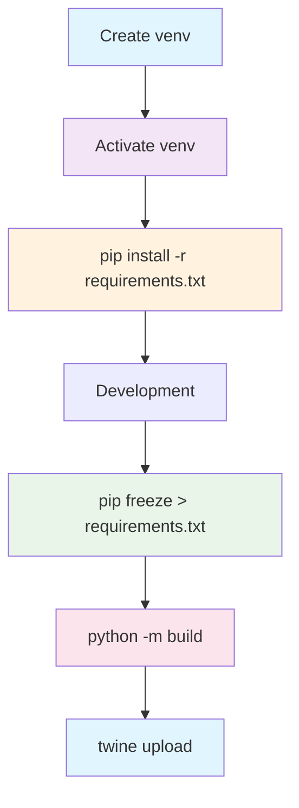
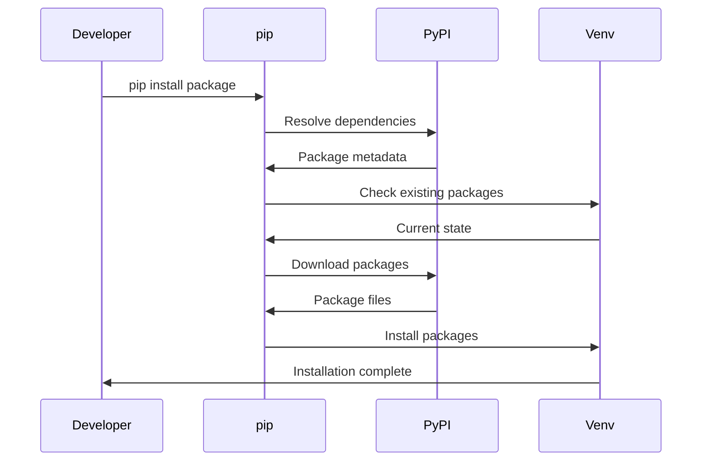

# pip Command Cheatsheet

## Core Package Management

### Installation Commands
```bash
# Install a package
pip install package_name

# Install specific version
pip install package_name==1.2.3

# Install version range
pip install package_name>=1.2.0,<2.0.0

# Install from requirements file
pip install -r requirements.txt

# Install from local directory
pip install .

# Install from source repository
pip install git+https://github.com/user/repo.git

# Install from branch
pip install git+https://github.com/user/repo.git@branch_name

# Install from local git repository
pip install git+file:///local/path/to/repo

# Install with extras
pip install package_name[extra1,extra2]

# Install in development/editable mode
pip install -e .

# Install from wheel file
pip install package_name.whl

# Install from tar.gz source
pip install package_name.tar.gz
```

### Dependency Management
```bash
# List installed packages
pip list

# List outdated packages
pip list --outdated

# Show package information
pip show package_name

# Check package dependencies
pip show package_name --verbose

# Update a package
pip install --upgrade package_name

# Update all packages
pip list --outdated --format=freeze | grep -v '^\-e' | cut -d = -f 1 | xargs -n1 pip install -U

# Uninstall package
pip uninstall package_name

# Uninstall multiple packages
pip uninstall package1 package2

# Uninstall with confirmation
pip uninstall package_name -y
```

## Environment Management

### Virtual Environments
```bash
# Create virtual environment
python -m venv venv

# Activate virtual environment (Linux/Mac)
source venv/bin/activate

# Activate virtual environment (Windows)
venv\Scripts\activate

# Deactivate virtual environment
deactivate

# Create virtual environment with specific Python version
python3.9 -m venv venv

# Create with system site packages
python -m venv venv --system-site-packages

# List packages in virtual environment
pip list

# Export environment packages
pip freeze > requirements.txt

# Install from requirements file
pip install -r requirements.txt
```

### Alternative Environment Managers
```bash
# Using conda
conda create -n myenv python=3.9
conda activate myenv
conda install package_name

# Using pipenv
pipenv install package_name
pipenv install --dev package_name
pipenv shell

# Using poetry
poetry add package_name
poetry add --dev package_name
poetry install
```

## Requirements Files

### Requirements File Management
```bash
# Generate requirements file
pip freeze > requirements.txt

# Generate with hashes (for security)
pip freeze --all --format=freeze > requirements.txt

# Install from requirements file
pip install -r requirements.txt

# Install with constraints
pip install -c constraints.txt package_name

# Generate requirements with pip-tools
pip-compile requirements.in
pip-sync requirements.txt

# Check for dependency conflicts
pip check
```

### Requirements File Examples
```txt
# requirements.txt
Django==4.2.0
requests>=2.25.0,<3.0.0
numpy==1.24.0
pandas>=1.5.0

# Development requirements
# requirements-dev.txt
-r requirements.txt
pytest>=7.0.0
black>=23.0.0
flake8>=6.0.0
mypy>=1.0.0
pre-commit>=3.0.0

# With index URLs
# requirements-prod.txt
--index-url https://pypi.org/simple/
--extra-index-url https://pypi.example.com/simple/
package_name==1.0.0
```

## Configuration & Sources

### Configuration Management
```bash
# Show current configuration
pip config list

# Set global configuration
pip config set global.index-url https://pypi.org/simple/

# Set user configuration
pip config set install.user true

# Edit configuration file
pip config edit

# Get specific configuration value
pip config get global.index-url

# Unset configuration
pip config unset global.index-url
```

### Package Sources & Indexes
```bash
# Install from specific index
pip install --index-url https://pypi.org/simple/ package_name

# Use extra index URL
pip install --extra-index-url https://pypi.example.com/ package_name

# Install with trusted host
pip install --trusted-host pypi.example.com package_name

# Use find-links for local packages
pip install --find-links /path/to/wheels/ package_name

# Install with no index (only --find-links)
pip install --no-index --find-links /path/to/wheels/ package_name
```

## Code Quality & Testing

### Testing & Quality Tools
```bash
# Install testing tools
pip install pytest pytest-cov pytest-mock

# Run tests
pytest

# Run with coverage
pytest --cov=my_package tests/

# Run specific test
pytest tests/test_module.py::test_function

# Install linting tools
pip install flake8 black isort mypy

# Run linter
flake8 .

# Format code
black .

# Sort imports
isort .

# Type checking
mypy .

# Security scanning
pip install safety bandit
safety check
bandit -r my_package/
```

### Development Tools
```bash
# Install development dependencies
pip install -e .[dev]

# Install with all extras
pip install -e .[all]

# Pre-commit hooks
pip install pre-commit
pre-commit install
pre-commit run --all-files

# Documentation tools
pip install sphinx sphinx-rtd-theme

# Build tools
pip install build twine

# Debugging tools
pip install ipdb debugpy
```

## Build & Distribution

### Package Building
```bash
# Build package
python -m build

# Build source distribution
python setup.py sdist

# Build wheel
python setup.py bdist_wheel

# Install build dependencies
pip install build

# Check build
twine check dist/*

# Upload to PyPI
twine upload dist/*

# Upload to test PyPI
twine upload --repository testpypi dist/*
```

### Distribution Commands
```bash
# Create source distribution
python setup.py sdist

# Create wheel distribution
python setup.py bdist_wheel

# Universal wheel (py2.py3)
python setup.py bdist_wheel --universal

# Build with modern build
pip install build
python -m build

# Check distribution
twine check dist/*

# Upload to PyPI
twine upload dist/*

# Upload with specific repository
twine upload --repository-url https://upload.pypi.org/legacy/ dist/*
```

## Advanced Usage

### Performance & Optimization
```bash
# Install with no cache
pip install --no-cache-dir package_name

# Install with cache directory
pip install --cache-dir /path/to/cache package_name

# Install with timeout
pip install --timeout 60 package_name

# Install with retries
pip install --retries 3 package_name

# Install with parallel builds
pip install --use-pep517 --parallel package_name

# Install with build isolation disabled
pip install --no-build-isolation package_name
```

### Dependency Resolution
```bash
# Install with dependency resolution
pip install package_name --use-deprecated=legacy-resolver

# Install with no dependencies
pip install --no-deps package_name

# Install only dependencies
pip install --no-deps --only-binary=:all: package_name

# Check for dependency conflicts
pip check

# Show dependency tree
pip install pipdeptree
pipdeptree

# Show reverse dependencies
pipdeptree --reverse
```

### Debugging & Diagnostics
```bash
# Show pip version
pip --version

# Show debug information
pip install -vvv package_name

# Show pip configuration
pip debug

# Show compatible tags
pip debug --verbose

# Check environment markers
pip install package_name --no-binary=:all:

# Download without installing
pip download package_name

# Download source distribution
pip download --no-binary=:all: package_name
```

## Security & Verification

### Security Commands
```bash
# Check for vulnerabilities
pip install safety
safety check

# Check with specific requirements file
safety check -r requirements.txt

# Check with JSON output
safety check --json

# Scan for security issues
pip install bandit
bandit -r my_package/

# Check package hashes
pip install --require-hashes -r requirements.txt

# Verify installed packages
pip verify package_name
```

### Hash Checking
```bash
# Generate hashes for requirements
pip hash package_name

# Install with hash checking
pip install --require-hashes -r requirements.txt

# Generate hashes file
pip freeze --all --format=freeze > requirements.txt
pip hash -r requirements.txt > requirements.hashes

# Install with specific hashes
pip install package_name --hash=sha256:abc123...
```

## Common Command Combinations

### Development Workflow
```bash
# Complete development setup
python -m venv venv
source venv/bin/activate
pip install -e .[dev]
pre-commit install
pytest

# Pre-commit checks
black .
isort .
flake8 .
mypy .
pytest

# CI/CD pipeline
python -m pip install --upgrade pip
pip install -r requirements.txt
pip install -r requirements-dev.txt
pytest --cov --cov-report=xml
safety check
bandit -r my_package/
```

### Production Deployment
```bash
# Production installation
python -m venv venv
source venv/bin/activate
pip install --upgrade pip
pip install -r requirements.txt
pip check

# Docker optimization
pip install --no-cache-dir -r requirements.txt
pip install --user --no-warn-script-location package_name
```

### Package Development
```bash
# Package development cycle
pip install -e .[dev]
pytest
black .
isort .
mypy .
python -m build
twine check dist/*
# twine upload dist/*  # When ready to publish
```

## pip Workflow Diagram



## Dependency Resolution Flow



## Quick Reference Table

| Command | Purpose | Common Use |
|---------|---------|------------|
| `pip install` | Install package | Daily development |
| `pip install -r` | Install from requirements | Project setup |
| `pip freeze` | Export dependencies | Dependency management |
| `pip list` | List packages | Environment inspection |
| `pip show` | Package info | Debugging |
| `pip uninstall` | Remove package | Cleanup |
| `pip install -e` | Editable install | Package development |
| `python -m build` | Build package | Distribution |
| `twine upload` | Upload to PyPI | Publishing |
| `pip check` | Check conflicts | Dependency health |

## Configuration Files

### pip.conf / pip.ini
```ini
# Global configuration (Linux: /etc/pip.conf, Windows: C:\ProgramData\pip\pip.ini)
[global]
index-url = https://pypi.org/simple/
trusted-host = pypi.org
                pypi.python.org
                files.pythonhosted.org
timeout = 60
retries = 3

[install]
user = false
no-deps = false

[list]
format = columns
```

### requirements.in (for pip-tools)
```txt
# requirements.in
django>=4.2.0
requests>=2.25.0
numpy
pandas
celery[redis]

# requirements-dev.in
-c requirements.txt
pytest
black
flake8
mypy
sphinx
```

## Environment Variables

### Common Environment Variables
```bash
# pip configuration
export PIP_INDEX_URL=https://pypi.org/simple/
export PIP_TRUSTED_HOST=pypi.org
export PIP_TIMEOUT=60
export PIP_RETRIES=3

# Virtual environment
export VIRTUAL_ENV=~/venvs/myproject
export PATH="$VIRTUAL_ENV/bin:$PATH"

# Python path
export PYTHONPATH=/path/to/my/project
export PYTHONUNBUFFERED=1

# Build configuration
export PIP_BUILD_ISOLATION=0
export PIP_NO_BINARY=:all:

# Security
export PIP_REQUIRE_VIRTUALENV=1
export PIP_NO_INDEX=1
```

This cheatsheet covers essential pip commands for Python development, including package management, virtual environments, dependency management, and distribution. Use these commands to streamline your Python workflow!