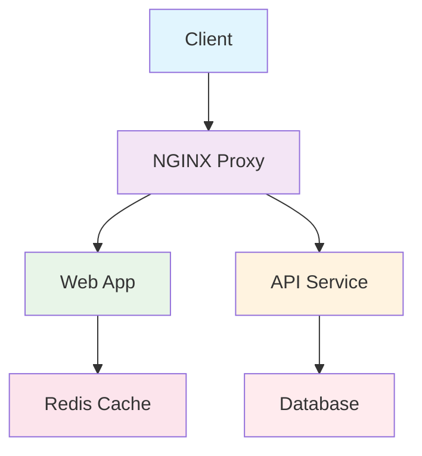

# Docker Command Cheatsheet

## 📋 Table of Contents
- [Container Management](#container-management)
- [Image Management](#image-management)
- [Network Management](#network-management)
- [Volume Management](#volume-management)
- [Docker Compose](#docker-compose)
- [Dockerfile](#dockerfile)
- [System & Cleanup](#system--cleanup)
- [Monitoring & Debugging](#monitoring--debugging)

## 🐳 Container Management

### Basic Container Operations
```bash
# Run a container
docker run <image>
docker run -d <image>                    # Detached mode
docker run -it <image> /bin/bash        # Interactive with terminal

# Run with common options
docker run -p 8080:80 <image>           # Port mapping
docker run -v /host:/container <image>  # Volume mount
docker run -e "ENV=value" <image>       # Environment variable
docker run --name mycontainer <image>   # Custom name

# Container lifecycle
docker start <container>                # Start stopped container
docker stop <container>                 # Stop gracefully
docker restart <container>              # Restart container
docker pause <container>                # Pause container
docker unpause <container>              # Unpause container
```

### Container Information
```bash
# List containers
docker ps                              # Running containers
docker ps -a                          # All containers
docker ps -q                          # Only container IDs
docker ps --filter "status=running"   # Filtered list

# Container details
docker inspect <container>            # Detailed info
docker logs <container>               # View logs
docker logs -f <container>            # Follow logs
docker top <container>                # Running processes
docker stats <container>              # Resource usage
```

### Container Operations
```bash
# Execute commands
docker exec -it <container> /bin/bash    # Interactive shell
docker exec <container> <command>        # Run command

# File operations
docker cp <container>:/path /host/path   # Copy from container
docker cp /host/path <container>:/path   # Copy to container

# Remove containers
docker rm <container>                    # Remove stopped container
docker rm -f <container>                 # Force remove running container
docker container prune                   # Remove all stopped containers
```

## 📦 Image Management

### Image Operations
```bash
# Build images
docker build -t myimage:tag .           # Build from Dockerfile
docker build -f Dockerfile.dev .        # Specify Dockerfile

# Image registry operations
docker pull <image>                     # Pull from registry
docker push <image>                     # Push to registry
docker tag <image> newname:tag          # Tag an image

# List and inspect
docker images                           # List images
docker image ls                         # List images
docker inspect <image>                  # Image details
docker history <image>                  # Image layers

# Remove images
docker rmi <image>                      # Remove image
docker image prune                      # Remove unused images
docker image prune -a                   # Remove all unused images
```

## 🌐 Network Management

```bash
# Network operations
docker network ls                       # List networks
docker network create <network>         # Create network
docker network inspect <network>        # Network details
docker network connect <net> <container> # Connect container
docker network disconnect <net> <container> # Disconnect

# Network types
docker network create --driver bridge <net>
docker network create --driver overlay <net>
docker network create --driver macvlan <net>
```

## 💾 Volume Management

```bash
# Volume operations
docker volume ls                        # List volumes
docker volume create <volume>           # Create volume
docker volume inspect <volume>          # Volume details
docker volume rm <volume>               # Remove volume
docker volume prune                     # Remove unused volumes

# Volume usage
docker run -v myvol:/path <image>      # Named volume
docker run -v /host/path:/path <image> # Host path mount
```

## 🚀 Docker Compose

### Basic Commands
```bash
docker-compose up                      # Start services
docker-compose up -d                   # Start in background
docker-compose down                    # Stop and remove
docker-compose ps                      # List services
docker-compose logs                    # View logs
docker-compose logs -f                 # Follow logs
```

### Service Management
```bash
docker-compose start                   # Start services
docker-compose stop                    # Stop services
docker-compose restart                 # Restart services
docker-compose pause                   # Pause services
docker-compose unpause                 # Unpause services
```

### Development
```bash
docker-compose build                   # Build images
docker-compose exec <service> bash     # Execute in service
docker-compose run <service> <cmd>     # Run one-off command
docker-compose config                  # Validate config
```

## 📝 Dockerfile Reference

### Example Dockerfile
```dockerfile
# Multi-stage build example
FROM node:16-alpine AS builder
WORKDIR /app
COPY package*.json ./
RUN npm ci --only=production

FROM node:16-alpine
WORKDIR /app
COPY --from=builder /app/node_modules ./node_modules
COPY . .
EXPOSE 3000
USER node
CMD ["node", "server.js"]
```

### Common Instructions
```dockerfile
FROM ubuntu:20.04           # Base image
RUN apt-get update && apt-get install -y package
COPY . /app                 # Copy files
ADD . /app                  # Copy with extraction
WORKDIR /app                # Set working directory
EXPOSE 80                   # Expose port
ENV NODE_ENV=production     # Environment variable
CMD ["npm", "start"]        # Default command
ENTRYPOINT ["/app/start.sh"] # Entry point
```

## 🧹 System & Cleanup

### System Information
```bash
docker version              # Docker version
docker info                 # System information
docker system df            # Disk usage
```

### Cleanup Commands
```bash
# Container cleanup
docker container prune      # Remove stopped containers

# Image cleanup
docker image prune          # Remove unused images
docker image prune -a       # Remove all unused images

# Volume cleanup
docker volume prune         # Remove unused volumes

# Network cleanup
docker network prune        # Remove unused networks

# Full system cleanup
docker system prune         # Remove all unused data
docker system prune -a      # Remove all unused images too
```

## 🔍 Monitoring & Debugging

### Monitoring
```bash
docker stats                           # Live container stats
docker stats --format "table {{.Name}}\t{{.CPUPerc}}\t{{.MemUsage}}"
docker events                         # Real-time events
docker top <container>                # Container processes
```

### Debugging
```bash
docker logs <container>               # Container logs
docker logs --tail 100 <container>    # Last 100 lines
docker logs -f <container>            # Follow logs
docker exec -it <container> sh        # Shell access
docker diff <container>               # Filesystem changes
```

## 🏗️ Advanced Examples

### Multi-container Application


### Docker Compose Example
```yaml
version: '3.8'
services:
  web:
    build: .
    ports:
      - "80:80"
    environment:
      - DB_HOST=database
    depends_on:
      - database
  
  database:
    image: postgres:13
    environment:
      - POSTGRES_DB=mydb
      - POSTGRES_USER=user
      - POSTGRES_PASSWORD=pass
    volumes:
      - db_data:/var/lib/postgresql/data

volumes:
  db_data:
```

### Health Check Example
```dockerfile
FROM nginx:alpine
COPY . /usr/share/nginx/html
HEALTHCHECK --interval=30s --timeout=3s --start-period=5s --retries=3 \
  CMD curl -f http://localhost/ || exit 1
EXPOSE 80
```

## 🎯 Quick Reference

### Common Port Mappings
```bash
# Web servers
docker run -p 80:80 nginx
docker run -p 8080:80 httpd

# Databases
docker run -p 5432:5432 postgres    # PostgreSQL
docker run -p 3306:3306 mysql       # MySQL
docker run -p 27017:27017 mongo     # MongoDB

# Development
docker run -p 3000:3000 node        # Node.js
docker run -p 8000:8000 python      # Python
```

### Useful Aliases
```bash
# Add to ~/.bashrc or ~/.zshrc
alias dps='docker ps'
alias dpsa='docker ps -a'
alias di='docker images'
alias drm='docker rm'
alias drmi='docker rmi'
alias dstop='docker stop $(docker ps -aq)'
alias dclean='docker system prune -a'
```

### Resource Limits
```bash
# Run with resource constraints
docker run --memory=512m <image>        # Memory limit
docker run --cpus=1.5 <image>           # CPU limit
docker run --memory=1g --cpus=2 <image> # Combined limits
```

## 🔧 Troubleshooting

### Common Issues
```bash
# Permission issues
docker run -u $(id -u):$(id -g) <image>

# Port already in use
docker run -p 8080:80 <image>          # Use different host port

# Container name conflict
docker run --name new_name <image>     # Use unique name

# Clean up orphaned containers
docker system prune -f
```

This cheatsheet covers the most essential Docker commands and concepts. Save it for quick reference! 🐳