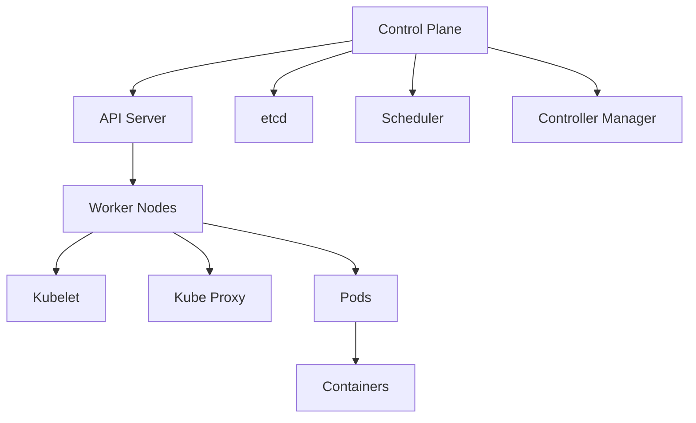
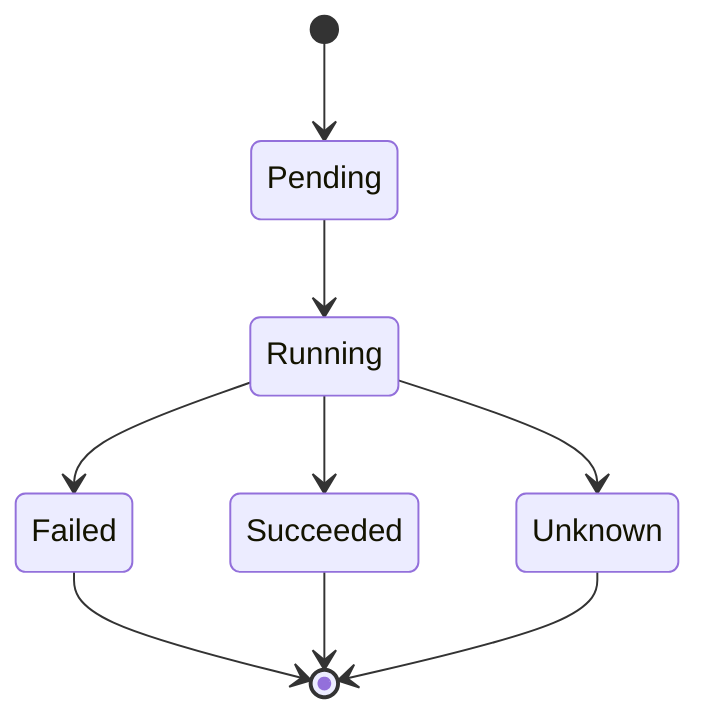
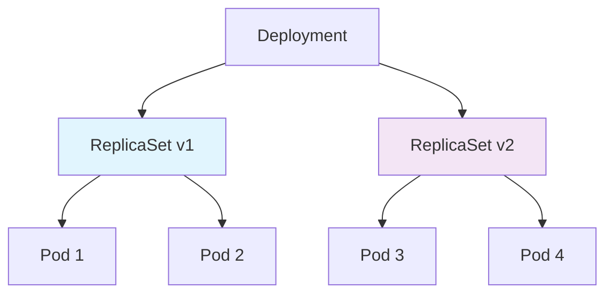
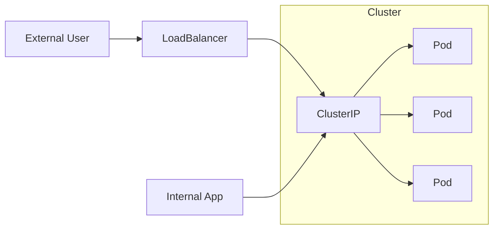
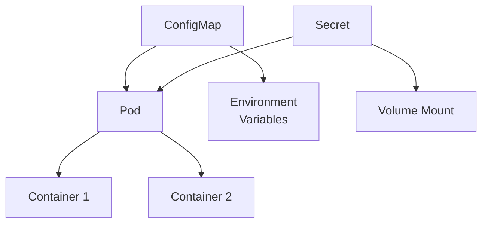
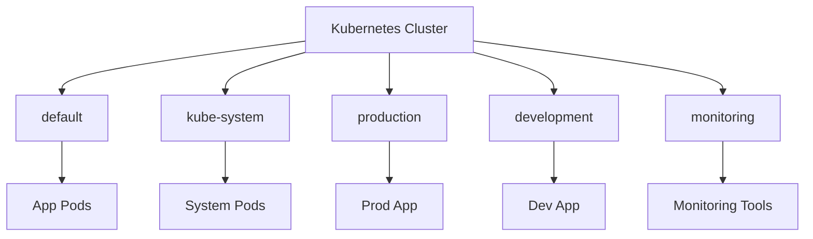
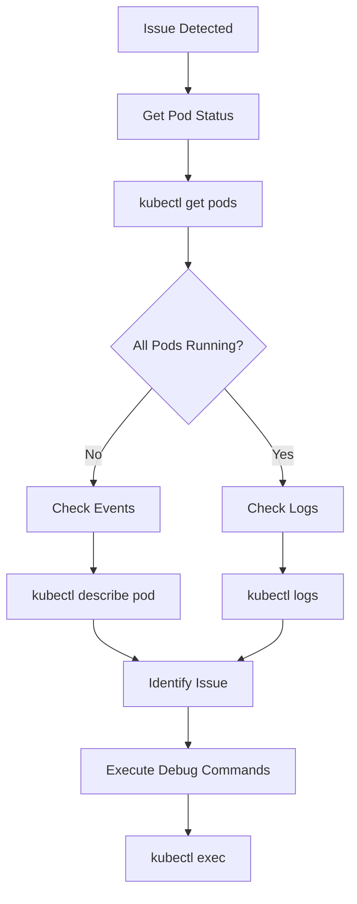
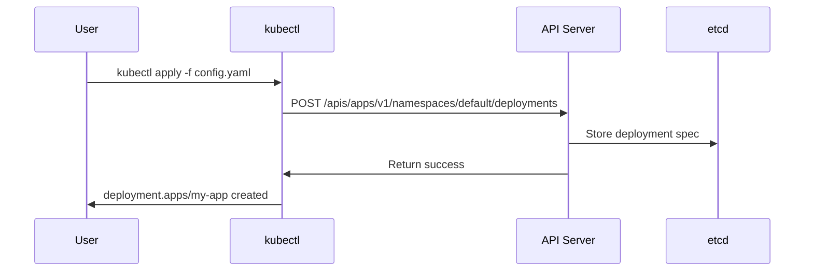
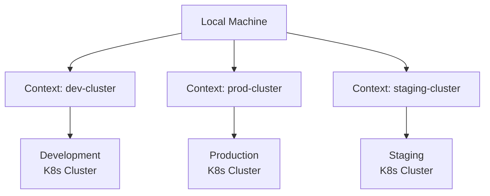
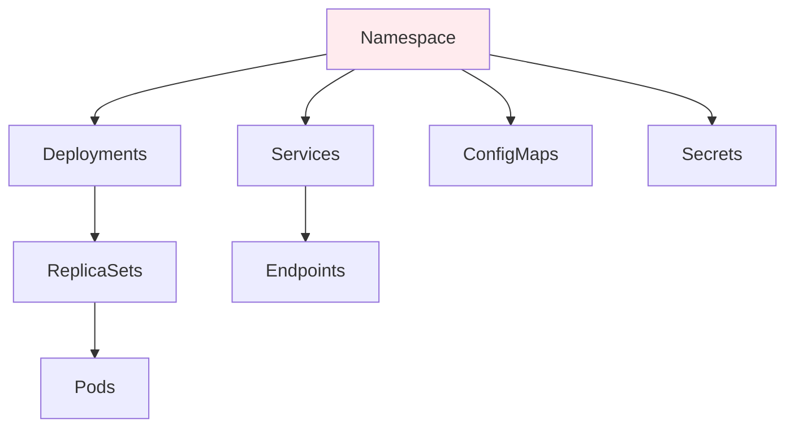

# Kubernetes Commands Cheat Sheet

## 1. Basic Cluster Management

### Cluster Information Commands
```bash
# Check cluster info
kubectl cluster-info

# View nodes in the cluster
kubectl get nodes

# Check k8s version
kubectl version --short
```

### Cluster Architecture Overview


---

## 2. Pod Operations

### Pod Management Commands
```bash
# List all pods
kubectl get pods

# List pods with details
kubectl get pods -o wide

# Get pod details including events
kubectl describe pod <pod-name>

# Delete a pod
kubectl delete pod <pod-name>

# Stream pod logs
kubectl logs <pod-name>

# Stream logs from multiple pods
kubectl logs -f deployment/<deployment-name>
```

### Pod Lifecycle


---

## 3. Deployments & ReplicaSets

### Deployment Commands
```bash
# List deployments
kubectl get deployments

# Create a deployment
kubectl create deployment <name> --image=<image>

# Scale a deployment
kubectl scale deployment/<name> --replicas=3

# Update deployment image
kubectl set image deployment/<name> <container>=<new-image>

# Check rollout status
kubectl rollout status deployment/<name>

# Rollback a deployment
kubectl rollout undo deployment/<name>
```

### Deployment Architecture


---

## 4. Services

### Service Management Commands
```bash
# List services
kubectl get svc

# Expose a deployment as a service
kubectl expose deployment/<name> --port=80 --target-port=8080 --type=LoadBalancer

# Get service details
kubectl describe svc <service-name>
```

### Service Types and Traffic Flow


---

## 5. ConfigMaps & Secrets

### Configuration Management Commands
```bash
# Create a ConfigMap from a file
kubectl create configmap <name> --from-file=<path-to-file>

# Create a Secret (generic)
kubectl create secret generic <name> --from-literal=key=value

# List ConfigMaps/Secrets
kubectl get configmaps
kubectl get secrets
```

### ConfigMap/Secret Usage in Pods


---

## 6. Namespaces

### Namespace Commands
```bash
# Switch namespaces
kubectl config set-context --current --namespace=<namespace>

# List all namespaces
kubectl get namespaces

# Create a namespace
kubectl create namespace <name>
```

### Namespace Isolation


---

## 7. Debugging & Inspection

### Debugging Commands
```bash
# Execute a command in a pod
kubectl exec -it <pod-name> -- /bin/bash

# Port-forward to a pod
kubectl port-forward <pod-name> <local-port>:<pod-port>

# Check resource usage
kubectl top pods
kubectl top nodes
```

### Debugging Workflow


---

## 8. YAML Management

### YAML Operations
```bash
# Create resources from YAML
kubectl apply -f <file.yaml>

# Delete resources from YAML
kubectl delete -f <file.yaml>

# Generate YAML for a resource
kubectl create deployment <name> --image=<image> --dry-run=client -o yaml
```

### Resource Creation Flow


---

## 9. Context & Configuration

### Context Management
```bash
# View current context
kubectl config current-context

# List all contexts
kubectl config get-contexts

# Switch context
kubectl config use-context <context-name>
```

### Multi-Context Architecture


---

## 10. Cleanup Operations

### Cleanup Commands
```bash
# Delete all pods in a namespace
kubectl delete pods --all

# Delete all resources in a namespace
kubectl delete all --all
```

### Resource Hierarchy for Cleanup


---

## Quick Reference Tips

### Common Flags
| Flag | Description | Example |
|------|-------------|---------|
| `-n` | Namespace | `kubectl get pods -n kube-system` |
| `-o wide` | Detailed output | `kubectl get nodes -o wide` |
| `--watch` | Real-time monitoring | `kubectl get pods --watch` |
| `--dry-run` | Simulation mode | `kubectl create --dry-run=client` |

### Resource Types Shortcuts
| Shortcut | Full Name |
|----------|-----------|
| `po` | pods |
| `deploy` | deployments |
| `svc` | services |
| `cm` | configmaps |
| `ns` | namespaces |

### Helpful Tips
- Use `kubectl explain <resource>` for documentation
- Use `kubectl api-resources` to see all available resources
- Add `--v=6` for debug-level logging
- Use `kubectl get events --sort-by=.metadata.creationTimestamp` to see recent events