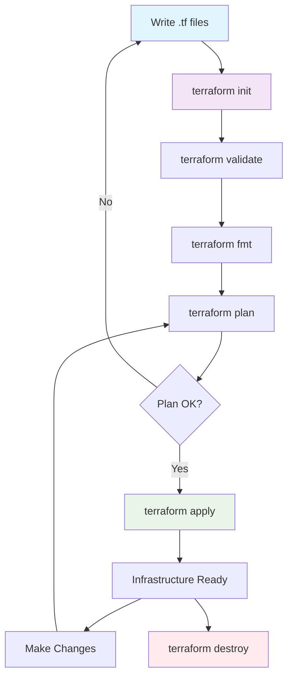
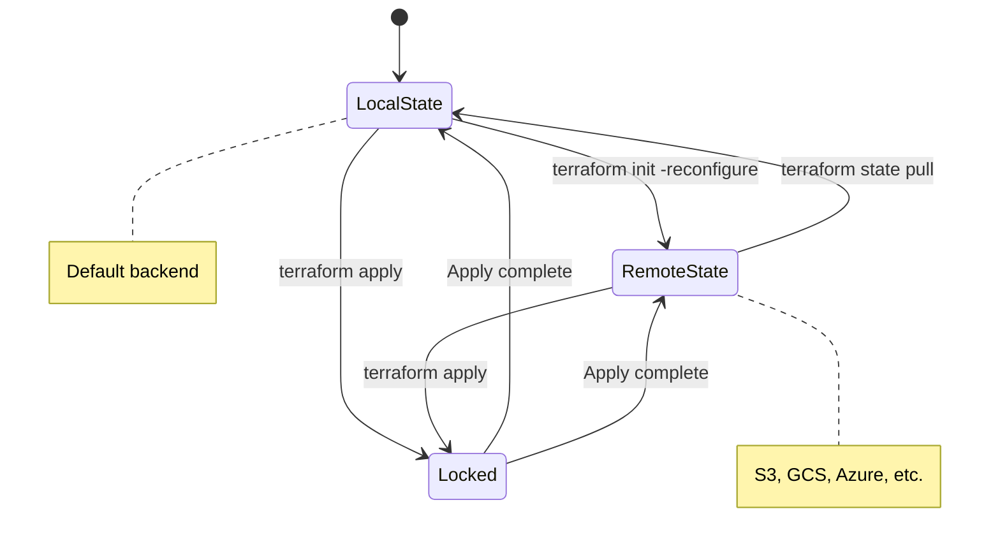
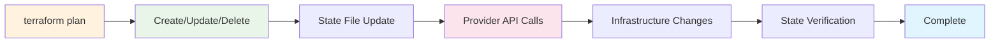

# Terraform Command Cheatsheet

## Core Workflow Commands

### Initialization & Setup
```bash
# Initialize Terraform in a directory
terraform init

# Initialize with upgraded modules/plugins
terraform init -upgrade

# Initialize with backend configuration
terraform init -backend-config="key=value"

# Initialize without backend
terraform init -backend=false
```

### Planning & Applying
```bash
# Create execution plan
terraform plan

# Save plan to file
terraform plan -out=plan.tfplan

# Apply with confirmation
terraform apply

# Apply saved plan
terraform apply plan.tfplan

# Apply without confirmation
terraform apply -auto-approve

# Apply specific targets
terraform apply -target=aws_instance.web

# Plan with variable file
terraform plan -var-file="production.tfvars"
```

### Destruction & Cleanup
```bash
# Destroy with confirmation
terraform destroy

# Destroy without confirmation
terraform destroy -auto-approve

# Destroy specific resource
terraform destroy -target=aws_instance.web

# Destroy with variable file
terraform destroy -var-file="production.tfvars"
```

## State Management Commands

### Basic State Operations
```bash
# List resources in state
terraform state list

# Show resource details
terraform state show aws_instance.web

# Move resource in state (refactoring)
terraform state mv aws_instance.old aws_instance.new

# Remove resource from state (does NOT destroy)
terraform state rm aws_instance.web

# Pull current state
terraform state pull

# Push state file
terraform state push
```

### State Locking & Backup
```bash
# Force unlock state (if locked)
terraform force-unlock LOCK_ID

# List state versions (with proper backend)
terraform state list
```

## Validation & Formatting

### Code Quality
```bash
# Validate configuration syntax
terraform validate

# Format code automatically
terraform fmt

# Check formatting without changes
terraform fmt -check

# Format recursively
terraform fmt -recursive

# Format specific directory
terraform fmt ./modules/

# Show differences
terraform fmt -diff
```

## Workspace Management

### Multi-environment Setup
```bash
# List workspaces
terraform workspace list

# Create new workspace
terraform workspace new dev

# Select workspace
terraform workspace select dev

# Show current workspace
terraform workspace show

# Delete workspace
terraform workspace delete dev
```

## Output & Debugging

### Inspection Commands
```bash
# Show outputs
terraform output

# Show specific output
terraform output instance_ip

# Show in JSON format
terraform output -json

# Show raw output
terraform output -raw

# Show current configuration
terraform show

# Show plan file
terraform show plan.tfplan

# Refresh state
terraform refresh
```

### Debugging & Logging
```bash
# Enable debug logging
export TF_LOG=DEBUG

# Enable trace logging (very verbose)
export TF_LOG=TRACE

# Log to file
export TF_LOG_PATH=./terraform.log

# Graph visualization
terraform graph | dot -Tsvg > graph.svg

# Disable logging
unset TF_LOG
```

## Module Management

### Module Operations
```bash
# Get modules
terraform get

# Get modules and update
terraform get -update

# Validate modules
terraform validate
```

## Provider Management

### Provider Operations
```bash
# Show provider requirements
terraform providers

# Mirror providers locally
terraform providers mirror /path/to/mirror

# Lock provider versions
terraform providers lock

# Show provider schema
terraform providers schema -json
```

## Advanced Operations

### Import & Tainting
```bash
# Import existing infrastructure
terraform import aws_instance.web i-1234567890abcdef0

# Mark resource for recreation
terraform taint aws_instance.web

# Unmark resource
terraform untaint aws_instance.web

# Import with complex addresses
terraform import 'module.vpc.aws_vpc.main[0]' vpc-123456
```

### Console & Testing
```bash
# Interactive console
terraform console

# Test expressions
# In console: aws_instance.web.private_ip

# Run specific tests
terraform test

# Run tests with verbose output
terraform test -verbose
```

## Workflow Diagram



## State Management Diagram



## Common Command Sequences

### Basic Development Flow
```bash
# Complete development workflow
terraform init
terraform validate
terraform fmt
terraform plan -out=tfplan
terraform apply tfplan
```

### CI/CD Pipeline Flow
```bash
# Automated pipeline workflow
terraform init -input=false
terraform validate
terraform fmt -check -diff
terraform plan -out=tfplan -input=false -detailed-exitcode
terraform apply tfplan -auto-approve -input=false
```

### Emergency Rollback
```bash
# Rollback to previous state
terraform plan -out=rollback_plan
terraform apply rollback_plan
# OR use versioned state backend
```

### Module Development
```bash
# Test module locally
terraform init
terraform plan -var="input_var=value"
terraform apply -auto-approve
terraform destroy -auto-approve
```

## Useful Flags & Options

### Common Flags
```bash
# Common useful flags
-var="name=value"          # Set variable
-var-file="prod.tfvars"    # Use var file
-backend-config="key=value" # Backend config
-lock=true/false           # State locking
-lock-timeout=30s          # Lock timeout
-parallelism=10            # Parallel operations
-refresh=true/false        # Refresh state
-input=true/false          # Interactive input
```

### Plan-Specific Flags
```bash
# Plan-specific options
-refresh-only             # Only refresh state
-replace="aws_instance.web" # Force replacement
-detailed-exitcode        # Detailed exit codes for automation
```

## Best Practices Summary

### Security & Safety
```bash
# Never commit state files
echo "*.tfstate" >> .gitignore
echo "*.tfstate.*" >> .gitignore
echo ".terraform/" >> .gitignore
echo "*.terraform.lock.hcl" >> .gitignore

# Use remote state backends
terraform {
  backend "s3" {
    bucket = "my-terraform-state"
    key    = "prod/terraform.tfstate"
    region = "us-east-1"
    dynamodb_table = "terraform-locks"
  }
}

# Use variable files for secrets
terraform apply -var-file="secrets.tfvars"
```

### Module Structure Example
```hcl
# modules/web_server/main.tf
resource "aws_instance" "web" {
  ami           = var.ami_id
  instance_type = var.instance_type
  subnet_id     = var.subnet_id
  
  tags = {
    Name = var.name
  }
}

# modules/web_server/variables.tf
variable "ami_id" {
  description = "AMI ID for the instance"
  type        = string
}

variable "instance_type" {
  description = "Instance type"
  type        = string
  default     = "t3.micro"
}

variable "name" {
  description = "Instance name"
  type        = string
}

variable "subnet_id" {
  description = "Subnet ID"
  type        = string
}

# modules/web_server/outputs.tf
output "instance_ip" {
  description = "Private IP address"
  value       = aws_instance.web.private_ip
}

output "instance_id" {
  description = "Instance ID"
  value       = aws_instance.web.id
}
```

### Main Configuration Using Module
```hcl
# main.tf
module "web_server" {
  source = "./modules/web_server"
  
  ami_id        = "ami-12345678"
  instance_type = "t3.small"
  name          = "production-web"
  subnet_id     = "subnet-12345678"
}

output "web_server_ip" {
  value = module.web_server.instance_ip
}
```

## Quick Reference Table

| Command | Purpose | Common Use |
|---------|---------|------------|
| `init` | Initialize project | First command in new project |
| `plan` | Preview changes | Before every apply |
| `apply` | Apply changes | Deploy infrastructure |
| `destroy` | Clean up | Remove all resources |
| `validate` | Check syntax | CI/CD pipeline |
| `fmt` | Format code | Pre-commit hook |
| `state list` | List resources | Debugging |
| `import` | Import existing | Migrate to Terraform |
| `workspace` | Manage environments | Multi-env setups |
| `output` | Show outputs | Get resource info |

## Environment Variables

```bash
# Common Terraform environment variables
export TF_VAR_region="us-west-2"           # Set variables
export TF_CLI_ARGS="-input=false"          # Default CLI args
export TF_DATA_DIR="./terraform_data"      # Change data directory
export TF_IN_AUTOMATION="true"             # Disable color/formatting
export TF_REGISTRY_DISCOVERY_RETRY=5       # Registry retries
export TF_REGISTRY_CLIENT_TIMEOUT=15       # Registry timeout
```

## Resource Lifecycle Diagram



This cheatsheet covers all essential Terraform commands with practical examples and workflows. Keep it handy for daily Terraform operations!