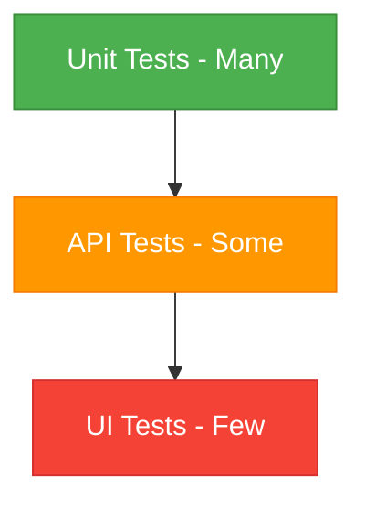

# Test Automation

## Test Automation Pyramid

## Automation Strategy
### What to Automate
- Regression tests
- Smoke tests
- Data-driven tests
- Performance tests
- API tests

### What NOT to Automate
- UI tests that change frequently
- Tests requiring human judgment
- One-time tests
- Exploratory testing

