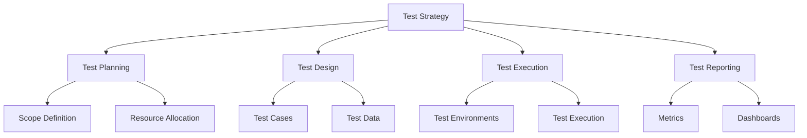

# Test Strategy

## Test Strategy Overview

```mermaid
graph TB
    A[Test Strategy] --> B[Test Planning]
    A --> C[Test Design]
    A --> D[Test Execution]
    A --> E[Test Reporting]
    
    B --> B1[Scope Definition]
    B --> B2[Resource Allocation]
    
    C --> C1[Test Cases]
    C --> C2[Test Data]
    
    D --> D1[Test Environments]
    D --> D2[Test Execution]
    
    E --> E1[Metrics]
    E --> E2[Dashboards]
```

## Test Levels
1. Unit Testing
2. Integration Testing
3. System Testing
4. Acceptance Testing

