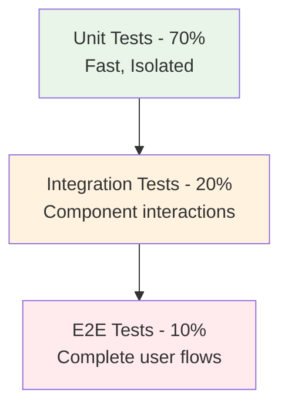

# Testing Pyramid

## The Testing Pyramid Concept

## Pyramid Layers Explained

### Unit Tests
- Test individual components in isolation
- Fast execution
- High coverage
- Mock external dependencies

### Integration Tests
- Test interactions between components
- Medium execution speed
- Cover critical integration points

### End-to-End Tests
- Test complete user workflows
- Slow execution
- Validate business requirements

