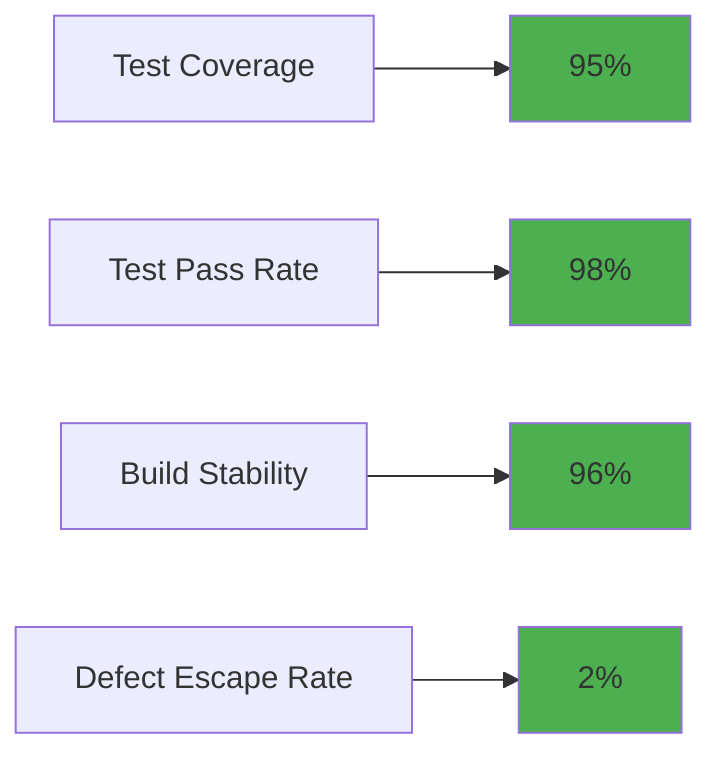
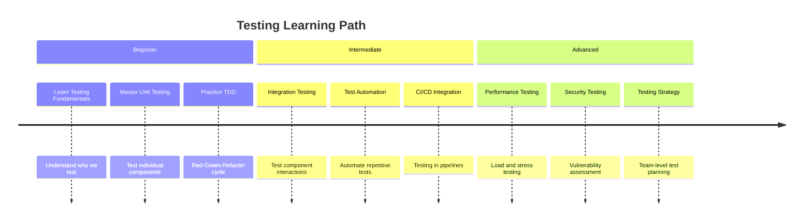

# Testing Documentation Hub

> Comprehensive guide to software testing methodologies, tools, and best practices

```mermaid
graph TD
    A[Testing Documentation] --> B[Fundamentals]
    A --> C[Testing Techniques]
    A --> D[Methodologies]
    A --> E[Quality Assurance]
    A --> F[Automation]
    A --> G[Tools & Platforms]
    A --> H[Best Practices]
    
    B --> B1[Testing Pyramid]
    B --> B2[Testing Principles]
    B --> B3[Test Strategy]
    
    C --> C1[Unit Testing]
    C --> C2[Integration Testing]
    C --> C3[E2E Testing]
    C --> C4[Performance Testing]
    C --> C5[Security Testing]
    
    D --> D1[TDD]
    D --> D2[BDD]
    D --> D3[ATDD]
    
    E --> E1[Static Analysis]
    E --> E2[Code Review]
    E --> E3[Quality Metrics]
    
    F --> F1[Test Automation]
    F --> F2[CI/CD Testing]
    F --> F3[Test Frameworks]
    
    G --> G1[Tools Overview]
    G --> G2[Language Guides]
    G --> G3[Cloud Testing]
    
    H --> H1[Test Maintenance]
    H --> H2[Test Data Management]
    H --> H3[Troubleshooting]
    
    style A fill:#2196F3,stroke:#1976D2,color:white
    style B fill:#4CAF50,stroke:#388E3C,color:white
    style C fill:#FF9800,stroke:#F57C00,color:white
    style D fill:#9C27B0,stroke:#7B1FA2,color:white
```

## 📚 Quick Navigation

### 🎯 Fundamentals
- [**Testing Pyramid**](fundamentals/testing-pyramid.md) - Understanding the testing hierarchy
- [**Testing Principles**](fundamentals/testing-principles.md) - FIRST principles and best practices
- [**Test Strategy**](fundamentals/test-strategy.md) - Planning and approach to testing

### 🛠️ Testing Techniques
- [**Unit Testing**](techniques/unit-testing.md) - Testing individual components in isolation
- [**Integration Testing**](techniques/integration-testing.md) - Testing component interactions
- [**End-to-End Testing**](techniques/e2e-testing.md) - Testing complete user workflows
- [**Performance Testing**](techniques/performance-testing.md) - Load, stress, and performance testing
- [**Security Testing**](techniques/security-testing.md) - Security vulnerability testing

### 🔄 Methodologies
- [**Test-Driven Development (TDD)**](methodologies/tdd.md) - Red-Green-Refactor cycle
- [**Behavior-Driven Development (BDD)**](methodologies/bdd.md) - Collaboration-focused testing
- [**Acceptance Test-Driven Development (ATDD)**](methodologies/atdd.md) - Business-focused testing

### 📊 Quality Assurance
- [**Static Analysis**](quality/static-analysis.md) - Code analysis without execution
- [**Code Review Guide**](quality/code-review-guide.md) - Effective code review practices
- [**Quality Metrics**](quality/quality-metrics.md) - Measuring and tracking quality

### 🤖 Automation
- [**Test Automation**](automation/test-automation.md) - Automation strategies and patterns
- [**CI/CD Testing**](automation/ci-cd-testing.md) - Testing in continuous integration pipelines
- [**Test Frameworks**](automation/test-frameworks.md) - Framework comparison and selection

### 🛠️ Tools & Platforms
- [**Testing Tools Overview**](tools/testing-tools-overview.md) - Comprehensive tool comparison
<!-- - [**Language-Specific Guides**](tools/language-specific-guides/) - Testing in different programming languages -->
- [**Cloud Testing**](tools/cloud-testing.md) - Cloud-based testing platforms

### 💡 Best Practices
- [**Test Maintenance**](best-practices/test-maintenance.md) - Keeping tests healthy and effective
- [**Test Data Management**](best-practices/test-data-management.md) - Managing test data effectively
- [**Troubleshooting Guide**](best-practices/troubleshooting-guide.md) - Solving common testing problems

## 🚀 Getting Started

### For New Developers
1. **Start with** → [Testing Fundamentals](fundamentals/testing-principles.md)
2. **Learn** → [Unit Testing](techniques/unit-testing.md) and [TDD](methodologies/tdd.md)
<!-- 3. **Practice** → [Code Examples](examples/) -->

### For Team Leads
1. **Establish** → [Test Strategy](fundamentals/test-strategy.md)
2. **Implement** → [CI/CD Testing](automation/ci-cd-testing.md)
3. **Monitor** → [Quality Metrics](quality/quality-metrics.md)

### For QA Engineers
1. **Master** → [Test Automation](automation/test-automation.md)
2. **Explore** → [Testing Tools](tools/testing-tools-overview.md)
3. **Optimize** → [Test Maintenance](best-practices/test-maintenance.md)

## 📈 Testing Metrics Dashboard

## 🔧 Popular Testing Tools

| Category | Tools |
|----------|-------|
| **Unit Testing** | Jest, pytest, JUnit, Mocha |
| **E2E Testing** | Cypress, Playwright, Selenium |
| **Performance** | k6, JMeter, Gatling |
| **Security** | OWASP ZAP, SonarQube, Snyk |
| **Mobile** | Appium, Detox, Espresso |
| **API Testing** | Postman, REST Assured, Supertest |

## 🎯 Testing Checklists

### Pre-commit Checklist
- [ ] Unit tests passing
- [ ] Code formatted and linted
- [ ] No new security vulnerabilities
- [ ] Test coverage maintained
- [ ] Documentation updated

### Release Checklist
- [ ] All tests passing in CI
- [ ] Performance tests completed
- [ ] Security scan clean
- [ ] E2E tests verified
- [ ] Rollback plan tested

## 📖 Learning Path

## 🌟 Best Practices Highlights

### ✅ Do
- Write tests before code (TDD)
- Keep tests fast and isolated
- Use meaningful test names
- Test behavior, not implementation
- Maintain test documentation

### ❌ Don't
- Skip tests to meet deadlines
- Write flaky tests
- Test multiple concerns in one test
- Ignore test failures
- Forget to update tests with code changes

<!-- ## 🔗 Related Resources

### Internal Links
- [Code Style Guide](../code-style-guide/) - Coding standards and conventions
- [DevOps Handbook](../devops/) - Deployment and operations
- [Architecture Decisions](../adr/) - Technical decision records

### External Resources
- [Martin Fowler on Testing](https://martinfowler.com/testing/)
- [Google Testing Blog](https://testing.googleblog.com/)
- [Test Automation University](https://testautomationu.applitools.com/) -->

## 🤝 Contributing

We welcome contributions to improve this documentation!

1. **Fork** the repository
2. **Create** a feature branch
3. **Add** your improvements
4. **Submit** a pull request

<!-- Please follow our [contribution guidelines](CONTRIBUTING.md) and maintain the existing structure and style. -->
