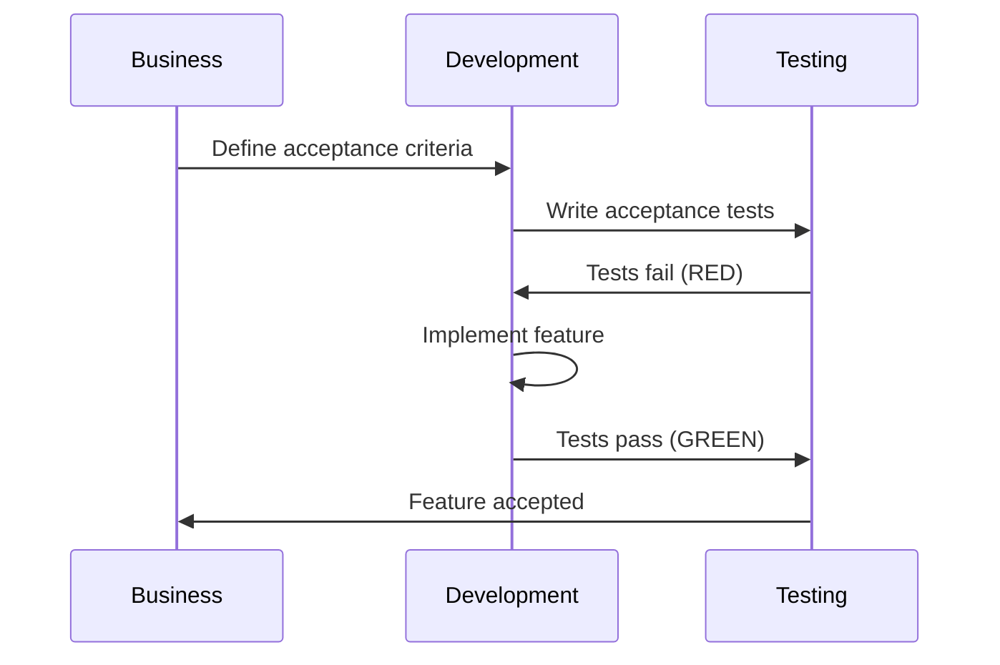

# Acceptance Test-Driven Development (ATDD)

## ATDD Process

## ATDD vs TDD
| Aspect | TDD | ATDD |
|--------|-----|------|
| Focus | Technical implementation | Business requirements |
| Tests | Unit tests | Acceptance tests |
| Audience | Developers | Whole team |
| Scope | Code level | Feature level |

