# Test-Driven Development (TDD) Comprehensive Guide

## TDD Fundamentals

### What is Test-Driven Development?
```python
# TDD follows a simple three-step process:
# 1. Write a failing test (RED)
# 2. Write minimal code to pass (GREEN)
# 3. Refactor while tests pass (REFACTOR)

def test_addition():
    # RED: Write failing test first
    calculator = Calculator()
    result = calculator.add(2, 3)
    assert result == 5  # This will fail initially
```

### The TDD Cycle

```mermaid
flowchart TD
    A[📝 Write Failing Test<br/>RED] --> B[🔨 Write Minimal Code<br/>GREEN]
    B --> C[♻️ Refactor Code<br/>REFACTOR]
    C --> A
    
    style A fill:#FFEBEE,stroke:#F44336,color:black
    style B fill:#E8F5E8,stroke:#4CAF50,color:black
    style C fill:#E3F2FD,stroke:#2196F3,color:black
```


## TDD Process Deep Dive

### The Three Laws of TDD
```python
# 1. You must write a failing test before production code
# 2. You must not write more test than is sufficient to fail
# 3. You must not write more production code than is sufficient to pass

class TestThreeLaws:
    def test_first_law(self):
        # Law 1: Write failing test first
        # This test should fail initially
        result = production_code_that_doesnt_exist()
        assert result == expected_value
    
    def test_second_law(self):
        # Law 2: Minimal failing test
        # Don't write complex tests upfront
        pass
    
    def test_third_law(self):
        # Law 3: Minimal production code
        # Only write enough code to make test pass
        pass
```

### TDD Workflow in Practice

```mermaid
sequenceDiagram
    participant D as Developer
    participant T as Test Suite
    participant C as Production Code
    
    Note over D: 🟥 RED PHASE
    D->>T: Write failing test
    T->>D: ❌ Test fails
    
    Note over D: 🟩 GREEN PHASE
    D->>C: Write minimal code
    C->>T: Run tests
    T->>D: ✅ Tests pass
    
    Note over D: 🔄 REFACTOR PHASE
    D->>C: Improve code design
    C->>T: Run tests
    T->>D: ✅ Tests still pass
    
    Note over D: Repeat cycle
```


## TDD by Example: Building a Stack

### Step 1: RED - Write Failing Test
```python
# test_stack.py
import pytest

def test_create_empty_stack():
    # Arrange & Act
    stack = Stack()
    
    # Assert - This will fail initially
    assert stack.is_empty() == True
    assert stack.size() == 0
```

### Step 2: GREEN - Write Minimal Implementation
```python
# stack.py
class Stack:
    def is_empty(self):
        return True
    
    def size(self):
        return 0
```

### Step 3: REFACTOR - Improve Design
```python
# stack.py (refactored)
class Stack:
    def __init__(self):
        self._items = []
    
    def is_empty(self):
        return len(self._items) == 0
    
    def size(self):
        return len(self._items)
```

### Continuing the TDD Cycle
```python
# test_stack.py - Add more tests
def test_push_adds_item():
    # RED
    stack = Stack()
    stack.push("item")
    assert stack.is_empty() == False
    assert stack.size() == 1

def test_pop_removes_item():
    # RED
    stack = Stack()
    stack.push("item")
    popped = stack.pop()
    assert popped == "item"
    assert stack.is_empty() == True

def test_pop_empty_stack_raises_error():
    # RED
    stack = Stack()
    with pytest.raises(IndexError):
        stack.pop()
```

## TDD Patterns and Techniques

### The Transformation Priority Premise

```mermaid
graph TD
    A[Test Fails] --> B[Apply Transformations]
    
    B --> C[NULL] --> C1[None → constant]
    B --> D[NULL] --> D1[None → scalar]
    B --> E[UNCONDITIONAL] --> E1[Constant → variable]
    B --> F[UNCONDITIONAL] --> F1[Add computation]
    B --> G[CONDITIONAL] --> G1[Split execution path]
    B --> H[LOOP] --> H1[Add iteration]
    B --> I[RECURSION] --> I1[Add recursion]
    
    style C fill:#E8F5E8
    style D fill:#E3F2FD
    style E fill:#FFF3E0
    style F fill:#F3E5F5
    style G fill:#FFEBEE
    style H fill:#E0F2F1
    style I fill:#FCE4EC
```


### Test Doubles in TDD
```python
from unittest.mock import Mock, patch

class TestPaymentProcessor:
    def test_process_payment_success(self):
        # RED: Test payment processing
        payment_gateway = Mock()
        payment_gateway.charge.return_value = {"status": "success", "id": "ch_123"}
        
        processor = PaymentProcessor(payment_gateway)
        result = processor.process_payment(100, "tok_visa")
        
        # Assertions
        assert result.success == True
        assert result.transaction_id == "ch_123"
        payment_gateway.charge.assert_called_once_with(100, "tok_visa")
    
    def test_process_payment_failure(self):
        # RED: Test error handling
        payment_gateway = Mock()
        payment_gateway.charge.return_value = {"status": "failed", "error": "card_declined"}
        
        processor = PaymentProcessor(payment_gateway)
        result = processor.process_payment(100, "tok_visa")
        
        assert result.success == False
        assert result.error == "card_declined"
```

## TDD in Different Languages

### Python TDD with pytest
```python
# test_calculator.py
import pytest

class TestCalculator:
    def test_addition(self):
        # RED
        calc = Calculator()
        result = calc.add(2, 3)
        assert result == 5
    
    def test_subtraction(self):
        # RED
        calc = Calculator()
        result = calc.subtract(5, 3)
        assert result == 2
    
    def test_division_by_zero(self):
        # RED
        calc = Calculator()
        with pytest.raises(ValueError):
            calc.divide(10, 0)

# calculator.py (implementation)
class Calculator:
    def add(self, a, b):
        return a + b
    
    def subtract(self, a, b):
        return a - b
    
    def divide(self, a, b):
        if b == 0:
            raise ValueError("Cannot divide by zero")
        return a / b
```

### JavaScript TDD with Jest
```javascript
// calculator.test.js
describe('Calculator', () => {
  let calculator;
  
  beforeEach(() => {
    calculator = new Calculator();
  });
  
  test('adds two numbers', () => {
    // RED
    const result = calculator.add(2, 3);
    expect(result).toBe(5);
  });
  
  test('subtracts two numbers', () => {
    // RED
    const result = calculator.subtract(5, 3);
    expect(result).toBe(2);
  });
  
  test('throws error when dividing by zero', () => {
    // RED
    expect(() => calculator.divide(10, 0)).toThrow('Cannot divide by zero');
  });
});

// calculator.js
class Calculator {
  add(a, b) {
    return a + b;
  }
  
  subtract(a, b) {
    return a - b;
  }
  
  divide(a, b) {
    if (b === 0) {
      throw new Error('Cannot divide by zero');
    }
    return a / b;
  }
}
```

### Java TDD with JUnit
```java
// CalculatorTest.java
import org.junit.jupiter.api.Test;
import static org.junit.jupiter.api.Assertions.*;

class CalculatorTest {
    private Calculator calculator = new Calculator();
    
    @Test
    void testAddition() {
        // RED
        int result = calculator.add(2, 3);
        assertEquals(5, result);
    }
    
    @Test
    void testSubtraction() {
        // RED
        int result = calculator.subtract(5, 3);
        assertEquals(2, result);
    }
    
    @Test
    void testDivisionByZero() {
        // RED
        assertThrows(IllegalArgumentException.class, () -> {
            calculator.divide(10, 0);
        });
    }
}

// Calculator.java
public class Calculator {
    public int add(int a, int b) {
        return a + b;
    }
    
    public int subtract(int a, int b) {
        return a - b;
    }
    
    public double divide(int a, int b) {
        if (b == 0) {
            throw new IllegalArgumentException("Cannot divide by zero");
        }
        return (double) a / b;
    }
}
```

## Advanced TDD Techniques

### Property-Based Testing
```python
import pytest
from hypothesis import given, strategies as st

class TestBankAccount:
    @given(st.integers(min_value=0))
    def test_deposit_never_decreases_balance(self, amount):
        # RED: Property-based test
        account = BankAccount(initial_balance=100)
        initial_balance = account.balance
        
        account.deposit(amount)
        
        assert account.balance >= initial_balance
    
    @given(st.integers(min_value=1), st.integers(min_value=1))
    def test_transfer_preserves_total_balance(self, amount1, amount2):
        # RED: Test mathematical properties
        account1 = BankAccount(initial_balance=amount1)
        account2 = BankAccount(initial_balance=amount2)
        total_before = account1.balance + account2.balance
        
        account1.transfer(50, account2)
        total_after = account1.balance + account2.balance
        
        assert total_before == total_after
```

### London School vs Chicago School


### Outside-In TDD (London School)
```python
from unittest.mock import Mock

class TestOrderService:
    def test_place_order_creates_order_and_sends_email(self):
        # RED: Outside-in approach
        order_repo = Mock()
        email_service = Mock()
        inventory_service = Mock()
        
        inventory_service.check_stock.return_value = True
        order_repo.save.return_value = Order(id=1, status="CONFIRMED")
        
        order_service = OrderService(order_repo, email_service, inventory_service)
        result = order_service.place_order(customer_id=123, product_id=456, quantity=2)
        
        # Assert interactions
        inventory_service.check_stock.assert_called_once_with(456, 2)
        order_repo.save.assert_called_once()
        email_service.send_confirmation.assert_called_once_with(123, 1)
        assert result.success == True
```

## TDD Best Practices

### The Rules of TDD


### Test Quality Guidelines
```python
class TestQualityExamples:
    def test_good_test(self):
        """
        ✅ Good tests are:
        - Fast (run in milliseconds)
        - Isolated (no dependencies)
        - Repeatable (same result every time)
        - Self-validating (clear pass/fail)
        - Timely (written before code)
        """
        pass
    
    def test_bad_test(self):
        """
        ❌ Bad tests:
        - Slow (access database/network)
        - Dependent on other tests
        - Non-deterministic (random results)
        - Require manual verification
        - Written after production code
        """
        pass
    
    def test_fast(self):
        # ✅ Fast: No I/O, simple computation
        result = fast_calculation(2, 3)
        assert result == 5
    
    def test_isolated(self):
        # ✅ Isolated: Doesn't depend on other tests
        calculator = Calculator()
        assert calculator is not None
    
    def test_repeatable(self):
        # ✅ Repeatable: Same result every time
        result = deterministic_function(5)
        assert result == 10
```

## TDD Workflow Integration

### TDD in CI/CD Pipeline


### Git Workflow with TDD
```bash
#!/bin/bash
# TDD Development Workflow

# Start with a failing test
git checkout -b feature/new-calculation
echo "Write failing test"
git add test_calculation.py
git commit -m "RED: Test for new calculation"

# Make test pass
echo "Write minimal implementation"
git add calculator.py
git commit -m "GREEN: Implement calculation"

# Refactor
echo "Improve code design"
git add calculator.py
git commit -m "REFACTOR: Clean up implementation"

# Push and create PR
git push origin feature/new-calculation
```

## Common TDD Patterns

### Test List Technique
```python
# test_list.md
"""
TEST LIST for Shopping Cart:
- ✅ Can create empty cart
- ✅ Can add item to cart
- ✅ Can remove item from cart
- 🔲 Can calculate total price
- 🔲 Can apply discount
- 🔲 Can handle multiple quantities
- 🔲 Can clear cart
- 🔲 Can persist cart between sessions
"""

class TestShoppingCart:
    def test_empty_cart(self):
        # ✅ Implemented
        cart = ShoppingCart()
        assert cart.is_empty()
    
    def test_add_item(self):
        # ✅ Implemented
        cart = ShoppingCart()
        cart.add_item("apple", 1.0)
        assert not cart.is_empty()
    
    def test_calculate_total(self):
        # 🔲 Next test to write
        cart = ShoppingCart()
        cart.add_item("apple", 1.0)
        cart.add_item("banana", 0.5)
        total = cart.calculate_total()
        assert total == 1.5
```

### Triangulation Technique
```python
class TestTriangulation:
    def test_addition_first_case(self):
        # Start with simplest case
        calc = Calculator()
        assert calc.add(0, 0) == 0
    
    def test_addition_second_case(self):
        # Add second case to force generalization
        calc = Calculator()
        assert calc.add(1, 0) == 1
    
    def test_addition_third_case(self):
        # Third case confirms the pattern
        calc = Calculator()
        assert calc.add(1, 2) == 3
    
    def test_addition_negative_numbers(self):
        # Edge case
        calc = Calculator()
        assert calc.add(-1, 1) == 0
```

## TDD Benefits and Metrics

### Benefits of TDD


### TDD Metrics
```python
class TDDAnalytics:
    def calculate_tdd_metrics(self):
        return {
            "test_coverage": "95%",
            "defect_density": "0.1 defects/KLOC",
            "cycle_time": "2 hours",
            "red_green_refactor_ratio": "30%-40%-30%",
            "test_execution_time": "30 seconds",
            "code_quality_score": "A"
        }
    
    def track_improvement(self):
        metrics_before_tdd = {
            "defect_rate": "5%",
            "test_coverage": "40%",
            "debugging_time": "30% of dev time"
        }
        
        metrics_after_tdd = {
            "defect_rate": "1%",
            "test_coverage": "95%", 
            "debugging_time": "5% of dev time"
        }
        
        return {
            "defect_reduction": "80%",
            "coverage_improvement": "137%",
            "debugging_time_reduction": "83%"
        }
```

## Common TDD Anti-patterns

### TDD Mistakes to Avoid
```python
class TestAntiPatterns:
    def test_too_many_assertions(self):
        """
        ❌ Anti-pattern: Testing multiple behaviors in one test
        """
        calculator = Calculator()
        
        # Too many assertions - split into separate tests
        assert calculator.add(2, 3) == 5
        assert calculator.subtract(5, 3) == 2
        assert calculator.multiply(2, 3) == 6
        assert calculator.divide(6, 3) == 2
    
    def test_test_implementation_not_behavior(self):
        """
        ❌ Anti-pattern: Testing how it works, not what it does
        """
        stack = Stack()
        stack.push("item")
        
        # Testing implementation details
        assert len(stack._items) == 1  # ❌ Brittle test
        assert stack._items[0] == "item"  # ❌ Brittle test
        
        # ✅ Better: Test behavior
        assert stack.size() == 1
        assert stack.pop() == "item"
    
    def test_slow_tests(self):
        """
        ❌ Anti-pattern: Tests that are slow
        """
        # ❌ Slow: Network call in test
        response = requests.get("https://api.example.com/data")
        assert response.status_code == 200
        
        # ❌ Slow: Database access in unit test
        user = database.get_user(123)
        assert user is not None
        
        # ✅ Fast: Use test doubles
        mock_api = Mock()
        mock_api.get.return_value = Mock(status_code=200)
        
        mock_db = Mock()
        mock_db.get_user.return_value = User(id=123)
```

## TDD Tools and Frameworks

### Popular TDD Frameworks


### IDE Integration
```python
# .vscode/settings.json for TDD
{
    "python.testing.pytestEnabled": true,
    "python.testing.unittestEnabled": false,
    "python.testing.autoTestDiscoverOnSaveEnabled": true,
    "python.testing.pytestArgs": [
        "tests",
        "--verbose",
        "--tb=short"
    ],
    "editor.codeActionsOnSave": {
        "source.organizeImports": true
    }
}
```

This comprehensive TDD guide covers the fundamentals, workflows, techniques, and best practices for implementing Test-Driven Development across different programming languages and scenarios.