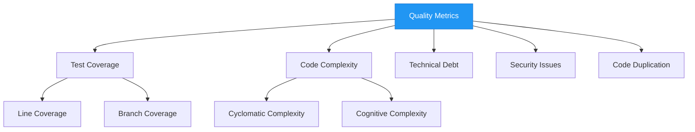

# Quality Metrics

## Code Quality Metrics

## Quality Gates
- Test coverage > 80%
- No critical security issues
- Code complexity < 15 per method
- Duplication < 5%
- All tests passing
- No breaking changes

