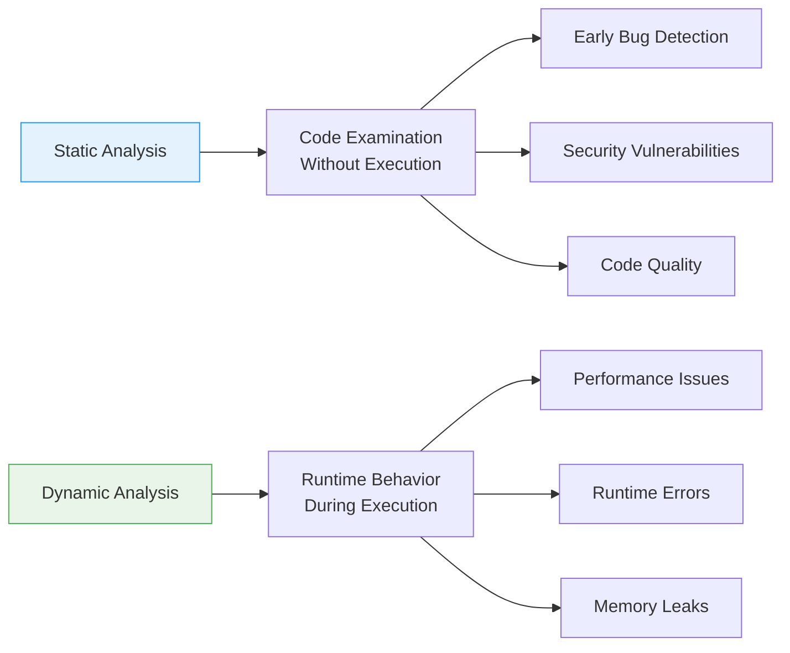
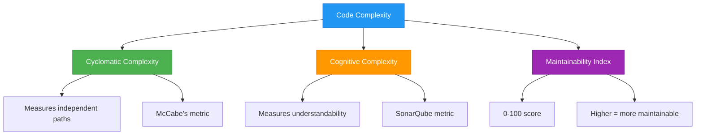
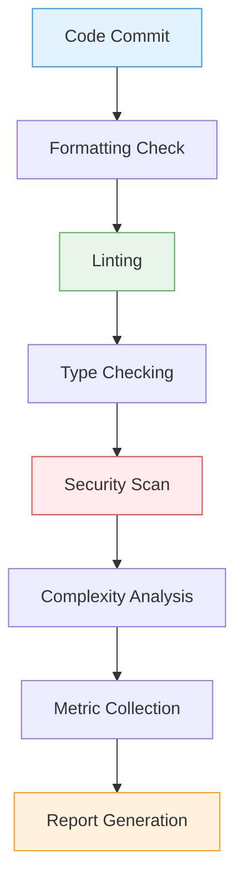
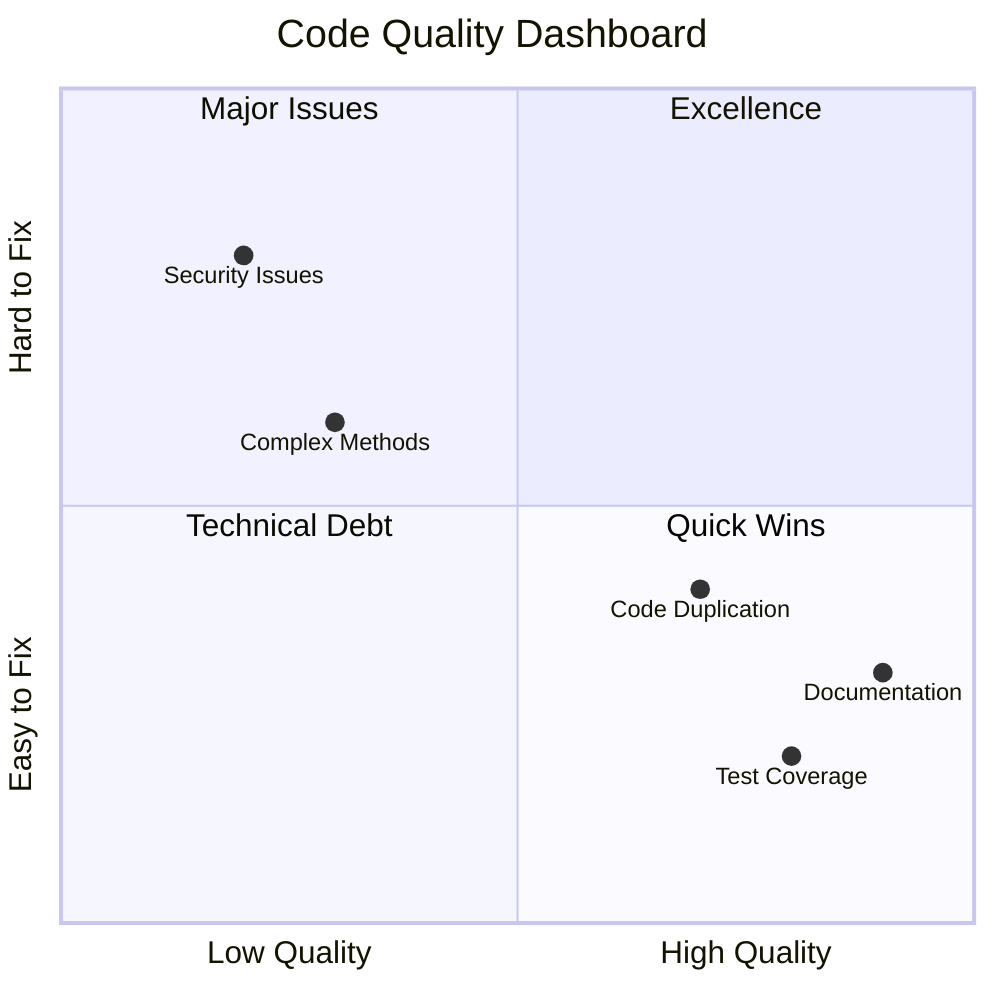
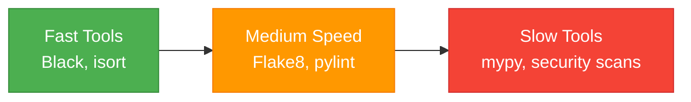
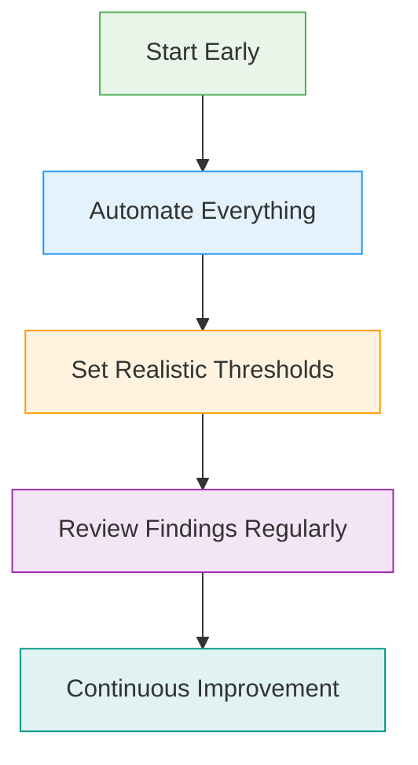
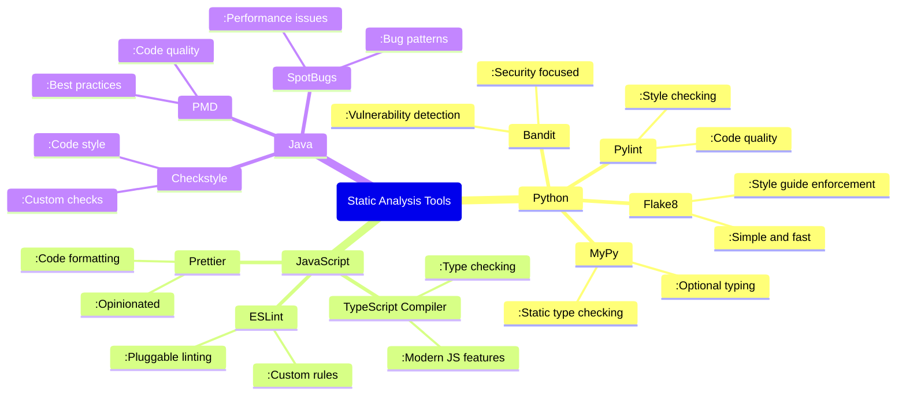

# Static Analysis Comprehensive Guide

## Static Analysis Fundamentals

### What is Static Analysis?
```python
# Static analysis examines code without executing it
# Example: Finding potential bugs before runtime

def calculate_total(price, quantity):
    # Static analysis can catch:
    # - Unused variables
    # - Type inconsistencies  
    # - Security vulnerabilities
    # - Code style violations
    total = price * quantity
    return total  # No actual execution needed for analysis
```

### Static vs Dynamic Analysis


## Static Analysis Tools by Language

### Python Static Analysis Tools

#### Comprehensive Python Analysis
```bash
# Install analysis tools
pip install pylint flake8 mypy bandit black isort safety

# Code linting
pylint my_package/
flake8 my_package/

# Type checking
mypy my_package/

# Security analysis
bandit -r my_package/
safety check

# Code formatting
black my_package/
isort my_package/
```

#### Pylint Configuration
```ini
# .pylintrc
[MASTER]
extension-pkg-whitelist=numpy
load-plugins=pylint.extensions.mccabe

[MESSAGES CONTROL]
disable=
    missing-docstring,
    too-few-public-methods,
    import-error

[DESIGN]
max-args=8
max-locals=15

[FORMAT]
max-line-length=100
max-module-lines=1000

[TYPECHECK]
generated-members=numpy.*,pandas.*
```

### JavaScript/TypeScript Static Analysis

#### Comprehensive JS/TS Analysis
```bash
# Install analysis tools
npm install --save-dev eslint @typescript-eslint/eslint-plugin 
npm install --save-dev prettier typescript
npm install --save-dev sonarjs eslint-plugin-sonarjs

# Linting
npx eslint src/ --ext .js,.jsx,.ts,.tsx

# Type checking
npx tsc --noEmit

# Code formatting
npx prettier --check src/

# Security scanning
npm audit
npx snyk test
```

#### ESLint Configuration
```javascript
// .eslintrc.js
module.exports = {
  env: {
    browser: true,
    es2021: true,
    node: true,
  },
  extends: [
    'eslint:recommended',
    '@typescript-eslint/recommended',
    'plugin:sonarjs/recommended',
  ],
  parser: '@typescript-eslint/parser',
  plugins: ['@typescript-eslint', 'sonarjs'],
  rules: {
    'no-unused-vars': 'error',
    'no-console': 'warn',
    'complexity': ['error', 10],
    'sonarjs/cognitive-complexity': ['error', 15],
  },
};
```

### Java Static Analysis

#### Comprehensive Java Analysis
```bash
# Maven plugins for static analysis
mvn checkstyle:checkstyle
mvn pmd:check
mvn spotbugs:check
mvn org.sonarsource.scanner.maven:sonar-maven-plugin:sonar

# Standalone tools
java -jar checkstyle-8.45-all.jar -c google_checks.xml src/
java -jar pmd-bin-6.46.0/bin/run.sh pmd -d src/ -R rulesets/java/quickstart.xml
```

#### Checkstyle Configuration
```xml
<!-- checkstyle.xml -->
<?xml version="1.0"?>
<!DOCTYPE module PUBLIC
          "-//Checkstyle//DTD Checkstyle Configuration 1.3//EN"
          "https://checkstyle.org/dtds/configuration_1_3.dtd">
<module name="Checker">
    <module name="TreeWalker">
        <module name="IllegalImport"/>
        <module name="RedundantImport"/>
        <module name="UnusedImports"/>
        <module name="MethodLength">
            <property name="max" value="50"/>
        </module>
        <module name="ParameterNumber">
            <property name="max" value="7"/>
        </module>
    </module>
    <module name="FileLength">
        <property name="max" value="2000"/>
    </module>
</module>
```

### C# Static Analysis

#### .NET Analysis Tools
```bash
# Install analyzers
dotnet add package SonarAnalyzer.CSharp
dotnet add package StyleCop.Analyzers
dotnet add package SecurityCodeScan

# Run analysis
dotnet build /p:TreatWarningsAsErrors=true
dotnet format --verify-no-changes
dotnet ef migrations script --idempotent --output migrations.sql
```

#### Analyzer Configuration
```xml
<!-- .editorconfig -->
root = true

[*]
indent_style = space
indent_size = 4
charset = utf-8
trim_trailing_whitespace = true
insert_final_newline = true

[*.cs]
csharp_style_var_elsewhere = false:warning
csharp_style_var_when_type_is_apparent = true:warning
```

## Security-Focused Static Analysis

### Security Vulnerability Scanning
```python
# Bandit security analysis example
"""
bandit -r my_package/ --configfile bandit.yml

Finds:
- Hardcoded passwords
- SQL injection vulnerabilities
- Shell injection risks
- Use of insecure libraries
"""
```

#### Bandit Configuration
```yaml
# bandit.yml
skips: ['B101', 'B301']
tests: ['B201', 'B301', 'B303', 'B304', 'B305', 'B306', 'B307', 'B308', 'B309', 'B310', 'B311', 'B312', 'B313', 'B314', 'B501', 'B502', 'B503', 'B504', 'B505', 'B506', 'B507', 'B508', 'B509', 'B510', 'B511', 'B512', 'B513', 'B514', 'B515', 'B516', 'B517', 'B518', 'B519', 'B520', 'B521', 'B522', 'B523', 'B524', 'B525', 'B526', 'B527', 'B601', 'B602', 'B603', 'B604', 'B605', 'B606', 'B607', 'B608', 'B609', 'B610', 'B611', 'B612', 'B613', 'B614', 'B615', 'B616', 'B617', 'B618', 'B619', 'B620', 'B621', 'B622', 'B623', 'B624', 'B625', 'B626', 'B627', 'B628', 'B629', 'B630', 'B631', 'B632', 'B633', 'B634', 'B635', 'B636', 'B637', 'B638', 'B639', 'B640', 'B641', 'B642', 'B643', 'B644', 'B645', 'B646', 'B647', 'B648', 'B649', 'B650']
```

### Dependency Vulnerability Scanning
```bash
# Python dependency security
safety check
pip-audit

# JavaScript dependency security  
npm audit
yarn audit
npx snyk test

# Java dependency security
mvn org.owasp:dependency-check-maven:check
```

## Code Quality Metrics

### Complexity Analysis


### Complexity Calculation Example
```python
def complex_function(a, b, c, d):
    # Cyclomatic complexity = 8
    # Cognitive complexity = 7
    result = 0
    if a > 0:  # +1
        if b > 0:  # +2 (nesting = 1)
            result += 1
        elif c > 0:  # +1
            for i in range(10):  # +2 (nesting = 1)
                if d > 0:  # +3 (nesting = 2)
                    result += i
    else:
        while a < 0:  # +2 (nesting = 1)
            a += 1
            if a == 0:  # +3 (nesting = 2)
                break
    return result

def simple_function(a, b):
    # Cyclomatic complexity = 1
    # Cognitive complexity = 0
    return a + b
```

## Static Analysis Workflow

### Analysis Pipeline


### Pre-commit Hook Example
```yaml
# .pre-commit-config.yaml
repos:
  - repo: https://github.com/pre-commit/pre-commit-hooks
    rev: v4.4.0
    hooks:
      - id: trailing-whitespace
      - id: end-of-file-fixer
      - id: check-yaml
      - id: check-added-large-files

  - repo: https://github.com/psf/black
    rev: 23.3.0
    hooks:
      - id: black

  - repo: https://github.com/pycqa/isort
    rev: 5.12.0
    hooks:
      - id: isort

  - repo: https://github.com/pycqa/flake8
    rev: 6.0.0
    hooks:
      - id: flake8

  - repo: https://github.com/pre-commit/mirrors-mypy
    rev: v1.3.0
    hooks:
      - id: mypy
```

## Advanced Static Analysis Techniques

### Custom Rule Development
```python
# Custom pylint checker
from pylint.checkers import BaseChecker
from pylint.interfaces import IAstroidChecker

class CustomNamingChecker(BaseChecker):
    __implements__ = IAstroidChecker
    
    name = 'custom-naming'
    msgs = {
        'C9999': (
            'Function name should follow snake_case pattern',
            'function-naming',
            'Function names should be in snake_case'
        )
    }
    
    def visit_functiondef(self, node):
        function_name = node.name
        if not self._is_snake_case(function_name):
            self.add_message('function-naming', node=node)
    
    def _is_snake_case(self, name):
        return name.replace('_', '').islower()

def register(linter):
    linter.register_checker(CustomNamingChecker(linter))
```

### AST-Based Analysis
```python
import ast
import astroid

class ComplexityVisitor(ast.NodeVisitor):
    def __init__(self):
        self.complexity = 1  # Start with 1 for the function
    
    def visit_If(self, node):
        self.complexity += 1
        self.generic_visit(node)
    
    def visit_For(self, node):
        self.complexity += 1
        self.generic_visit(node)
    
    def visit_While(self, node):
        self.complexity += 1
        self.generic_visit(node)
    
    def visit_BoolOp(self, node):
        # Each boolean operator adds complexity
        self.complexity += len(node.values) - 1
        self.generic_visit(node)

def calculate_complexity(source_code):
    tree = ast.parse(source_code)
    visitor = ComplexityVisitor()
    visitor.visit(tree)
    return visitor.complexity
```

## Integration with CI/CD

### GitHub Actions Workflow
```yaml
name: Static Analysis
on: [push, pull_request]

jobs:
  static-analysis:
    runs-on: ubuntu-latest
    steps:
      - uses: actions/checkout@v3
      
      - name: Set up Python
        uses: actions/setup-python@v4
        with:
          python-version: '3.9'
          
      - name: Install dependencies
        run: |
          pip install pylint flake8 mypy bandit black isort safety
          
      - name: Code formatting check
        run: |
          black --check .
          isort --check-only .
          
      - name: Linting
        run: |
          flake8 .
          pylint my_package/
          
      - name: Type checking
        run: |
          mypy my_package/
          
      - name: Security scanning
        run: |
          bandit -r my_package/
          safety check
          
      - name: Upload results
        uses: actions/upload-artifact@v3
        with:
          name: static-analysis-results
          path: |
            pylint-report.xml
            bandit-report.json
```

### SonarQube Integration
```yaml
# sonar-project.properties
sonar.projectKey=my_project
sonar.projectName=My Project
sonar.projectVersion=1.0

sonar.sources=src
sonar.tests=tests
sonar.language=py
sonar.sourceEncoding=UTF-8

sonar.python.coverage.reportPaths=coverage.xml
sonar.python.xunit.reportPath=test-results.xml
```

## Code Quality Gates

### Quality Thresholds
```yaml
# quality-gates.yml
quality_gates:
  coverage:
    minimum: 80%
    target: 90%
  
  complexity:
    maximum_method_complexity: 15
    maximum_file_complexity: 50
  
  duplication:
    maximum_duplication: 5%
  
  security:
    zero_critical_vulnerabilities: true
    maximum_high_vulnerabilities: 0
  
  maintainability:
    minimum_maintainability_index: 65
```

### Quality Dashboard


## Common Static Analysis Patterns

### False Positive Management
```python
# Suppressing false positives in Python
def calculate_value(data):
    # pylint: disable=too-many-branches
    # This function legitimately needs many branches
    result = 0
    if condition1:
        result += 1
    elif condition2:
        result += 2
    # ... many more branches
    return result

# Bandit false positive suppression
def get_password():
    password = "hardcoded_secret"  # nosec B105
    return password  # Bandit will ignore this line
```

### Analysis Configuration Management
```ini
# .flake8
[flake8]
max-line-length = 100
exclude = .git,__pycache__,build,dist,migrations
ignore = 
    E203,  # whitespace before ':'
    W503,  # line break before binary operator
    E501,  # line too long (handled by black)
per-file-ignores =
    __init__.py: F401
    tests/*: S101
```

## Performance Optimization

### Efficient Analysis Configuration
```yaml
# analysis-config.yml
parallel_analysis: true
cache_results: true
incremental_analysis: true
exclude_patterns:
  - "**/migrations/**"
  - "**/generated/**"
  - "**/node_modules/**"
  - "**/vendor/**"
file_size_limit: 1000000  # 1MB
```

### Analysis Performance Comparison


## Best Practices & Anti-patterns

### Effective Static Analysis


### Common Anti-patterns
```python
# ❌ Disabling all warnings
# pylint: disable=all

# ❌ Ignoring security findings
# bandit: skip

# ❌ Setting unrealistic thresholds
# max-complexity = 5  # Too strict

# ❌ Running analysis only locally
# No CI integration

# ✅ Targeted suppression
# pylint: disable=too-many-arguments

# ✅ Justified security exceptions  
# nosec B108  # File open justified

# ✅ Progressive improvement
# max-complexity = 15  # Realistic goal

# ✅ Automated CI pipeline
# Always run in CI
```

## Tool Comparison Matrix

### Popular Static Analysis Tools


This comprehensive static analysis guide covers tools, techniques, and best practices for improving code quality, security, and maintainability across multiple programming languages.