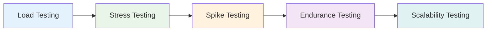

# Performance Testing

## Performance Testing Types

## Performance Testing Tools
- **JMeter** - Load testing
- **k6** - Modern load testing
- **Gatling** - High-performance testing
- **Locust** - Python-based load testing
- **Lighthouse** - Web performance

## Key Metrics
- Response time
- Throughput
- Error rate
- Resource utilization
- Concurrent users

