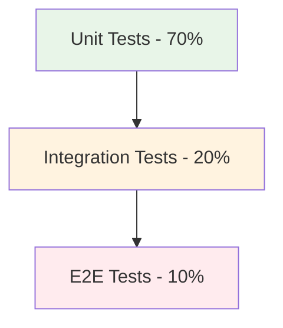
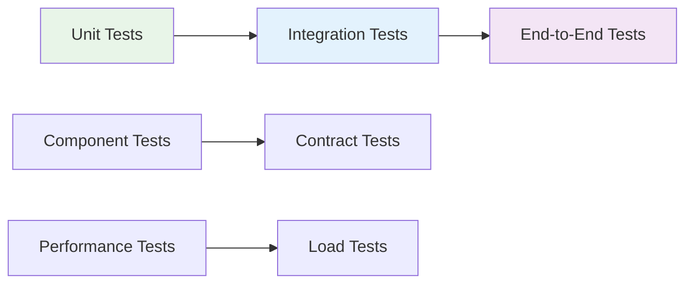

# Unit Testing Comprehensive Guide

## Unit Testing Fundamentals

### What is Unit Testing?
```python
# A unit test verifies a single unit of code in isolation
def test_addition():
    # Arrange
    calculator = Calculator()
    
    # Act
    result = calculator.add(2, 3)
    
    # Assert
    assert result == 5
```

### Testing Pyramid


## Testing Frameworks by Language

### Python Testing Frameworks

#### unittest (Built-in)
```python
import unittest

class TestCalculator(unittest.TestCase):
    def setUp(self):
        self.calc = Calculator()
    
    def test_addition(self):
        result = self.calc.add(2, 3)
        self.assertEqual(result, 5)
    
    def test_division_by_zero(self):
        with self.assertRaises(ValueError):
            self.calc.divide(10, 0)
    
    def tearDown(self):
        self.calc.cleanup()

if __name__ == '__main__':
    unittest.main()
```

#### pytest (Popular Alternative)
```python
import pytest

class TestCalculator:
    @pytest.fixture
    def calculator(self):
        return Calculator()
    
    def test_addition(self, calculator):
        assert calculator.add(2, 3) == 5
    
    @pytest.mark.parametrize("a,b,expected", [(1,2,3), (0,0,0), (-1,1,0)])
    def test_addition_multiple(self, calculator, a, b, expected):
        assert calculator.add(a, b) == expected
    
    def test_division_by_zero(self, calculator):
        with pytest.raises(ValueError):
            calculator.divide(10, 0)
```

### JavaScript/TypeScript Testing Frameworks

#### Jest
```javascript
// calculator.test.js
const Calculator = require('./calculator');

describe('Calculator', () => {
  let calculator;
  
  beforeEach(() => {
    calculator = new Calculator();
  });
  
  test('adds two numbers correctly', () => {
    expect(calculator.add(2, 3)).toBe(5);
  });
  
  test.each([[1, 2, 3], [0, 0, 0], [-1, 1, 0]])(
    'adds %i and %i to equal %i',
    (a, b, expected) => {
      expect(calculator.add(a, b)).toBe(expected);
    }
  );
  
  test('throws error when dividing by zero', () => {
    expect(() => calculator.divide(10, 0)).toThrow('Cannot divide by zero');
  });
  
  afterEach(() => {
    calculator.cleanup();
  });
});
```

#### Mocha + Chai
```javascript
const { expect } = require('chai');
const Calculator = require('./calculator');

describe('Calculator', function() {
  let calculator;
  
  beforeEach(function() {
    calculator = new Calculator();
  });
  
  it('should add two numbers correctly', function() {
    expect(calculator.add(2, 3)).to.equal(5);
  });
  
  it('should handle division by zero', function() {
    expect(() => calculator.divide(10, 0)).to.throw('Cannot divide by zero');
  });
});
```

### Java Testing Frameworks

#### JUnit 5
```java
import org.junit.jupiter.api.*;
import static org.junit.jupiter.api.Assertions.*;

class CalculatorTest {
    private Calculator calculator;
    
    @BeforeEach
    void setUp() {
        calculator = new Calculator();
    }
    
    @Test
    void testAddition() {
        assertEquals(5, calculator.add(2, 3));
    }
    
    @ParameterizedTest
    @CsvSource({"1,2,3", "0,0,0", "-1,1,0"})
    void testAdditionMultiple(int a, int b, int expected) {
        assertEquals(expected, calculator.add(a, b));
    }
    
    @Test
    void testDivisionByZero() {
        assertThrows(ArithmeticException.class, () -> calculator.divide(10, 0));
    }
    
    @AfterEach
    void tearDown() {
        calculator.cleanup();
    }
}
```

### C# Testing Frameworks

#### xUnit
```csharp
using Xunit;

public class CalculatorTests
{
    private readonly Calculator _calculator;
    
    public CalculatorTests()
    {
        _calculator = new Calculator();
    }
    
    [Fact]
    public void Add_TwoNumbers_ReturnsSum()
    {
        // Act
        var result = _calculator.Add(2, 3);
        
        // Assert
        Assert.Equal(5, result);
    }
    
    [Theory]
    [InlineData(1, 2, 3)]
    [InlineData(0, 0, 0)]
    [InlineData(-1, 1, 0)]
    public void Add_MultipleNumbers_ReturnsCorrectSum(int a, int b, int expected)
    {
        var result = _calculator.Add(a, b);
        Assert.Equal(expected, result);
    }
    
    [Fact]
    public void Divide_ByZero_ThrowsException()
    {
        Assert.Throws<DivideByZeroException>(() => _calculator.Divide(10, 0));
    }
}
```

## Test Structure & Patterns

### AAA Pattern (Arrange-Act-Assert)
```python
def test_user_registration():
    # Arrange
    user_service = UserService()
    user_data = {"email": "test@example.com", "password": "secure123"}
    
    # Act
    result = user_service.register(user_data)
    
    # Assert
    assert result.success == True
    assert result.user_id is not None
    assert result.email == user_data["email"]
```

### Test Doubles (Mocks, Stubs, Fakes)

#### Mocking with unittest.mock (Python)
```python
from unittest.mock import Mock, patch, MagicMock

def test_send_notification():
    # Arrange
    mock_email_service = Mock()
    user_service = UserService(email_service=mock_email_service)
    user = User(email="test@example.com")
    
    # Act
    user_service.send_welcome_email(user)
    
    # Assert
    mock_email_service.send.assert_called_once_with(
        to=user.email,
        subject="Welcome!",
        body="Welcome to our service!"
    )
```

#### Mocking with Jest (JavaScript)
```javascript
// Mocking an entire module
jest.mock('./emailService');

const emailService = require('./emailService');
const UserService = require('./userService');

test('sends welcome email on registration', () => {
  const userService = new UserService();
  const user = { email: 'test@example.com' };
  
  userService.sendWelcomeEmail(user);
  
  expect(emailService.send).toHaveBeenCalledWith({
    to: user.email,
    subject: 'Welcome!',
    body: 'Welcome to our service!'
  });
});
```

## Test Types & Strategies

### Test Classification


### Test Doubles Comparison
```python
# Stub - provides predetermined responses
stub_database = StubDatabase()
stub_database.configure_response("get_user", User(id=1, name="John"))

# Mock - verifies interactions
mock_database = MockDatabase()
mock_database.expect_call("save_user", User(id=1, name="John"))

# Fake - working implementation for testing
fake_database = FakeDatabase()  # In-memory database

# Spy - records interactions for verification
spy_logger = SpyLogger()
```

## Best Practices & Patterns

### FIRST Principles
```python
# F - Fast
def test_fast_calculation():
    # Tests should run in milliseconds
    result = fast_algorithm.process()
    assert result is not None

# I - Isolated
def test_isolated_function():
    # Tests shouldn't depend on each other
    # No shared state between tests

# R - Repeatable
def test_repeatable_in_different_environments():
    # Same results locally, CI, production-like environments

# S - Self-validating
def test_self_validating():
    # Tests should pass or fail clearly
    # No manual interpretation needed

# T - Thorough (Timely)
def test_edge_cases():
    # Cover normal, edge, and error cases
    # Write tests alongside code
```

### Good Test Characteristics
```python
def test_good_example():
    """
    Good tests are:
    - Readable and maintainable
    - Reliable and consistent
    - Fast execution
    - Isolated from other tests
    - Cover the right scenarios
    """
    pass

def test_bad_example():
    """
    Bad tests:
    - Depend on external services
    - Have complex setup
    - Are slow to run
    - Test multiple things
    - Are fragile and break often
    """
    pass
```

## Advanced Testing Techniques

### Parameterized Tests
```python
# pytest parameterized tests
import pytest

@pytest.mark.parametrize("input_a,input_b,expected", [
    (1, 1, 2),
    (0, 0, 0),
    (-1, 1, 0),
    (100, 200, 300)
])
def test_addition_parameterized(calculator, input_a, input_b, expected):
    result = calculator.add(input_a, input_b)
    assert result == expected

# Testing with different scenarios
@pytest.mark.parametrize("user_role,expected_access", [
    ("admin", True),
    ("user", True),
    ("guest", False),
    ("", False)
])
def test_access_control(user_role, expected_access):
    result = has_access(user_role)
    assert result == expected_access
```

### Test Fixtures and Setup
```python
import pytest

@pytest.fixture
def database_connection():
    """Setup database connection for tests"""
    connection = Database.connect()
    yield connection
    connection.close()  # Cleanup

@pytest.fixture
def sample_user(database_connection):
    """Create a sample user for testing"""
    user = User.create(name="Test User", email="test@example.com")
    yield user
    user.delete()  # Cleanup

def test_user_operations(sample_user, database_connection):
    # Use both fixtures
    user = database_connection.get_user(sample_user.id)
    assert user.name == "Test User"
```

### Behavior-Driven Development (BDD)
```python
# pytest-bdd example
from pytest_bdd import scenarios, given, when, then

scenarios('user_registration.feature')

@given('I am a new user')
def new_user():
    return User()

@when('I register with valid credentials')
def register_user(new_user):
    new_user.register("test@example.com", "password123")

@then('I should receive a confirmation email')
def check_confirmation_email(new_user):
    assert new_user.confirmation_sent is True

@then('my account should be created')
def check_account_created(new_user):
    assert new_user.is_active is True
```

## Test Organization & Structure

### Test Directory Structure
```
project/
├── src/
│   ├── calculator.py
│   ├── user_service.py
│   └── models/
├── tests/
│   ├── unit/
│   │   ├── test_calculator.py
│   │   └── test_user_service.py
│   ├── integration/
│   │   ├── test_database.py
│   │   └── test_api.py
│   ├── fixtures/
│   │   └── test_data.py
│   └── conftest.py
├── pytest.ini
└── requirements-test.txt
```

### Test Configuration Files

#### pytest.ini
```ini
[pytest]
testpaths = tests
python_files = test_*.py
python_classes = Test*
python_functions = test_*
addopts = -v --tb=short --strict-markers
markers =
    slow: marks tests as slow (deselect with '-m "not slow"')
    integration: marks tests as integration tests
    smoke: smoke tests
```

#### jest.config.js
```javascript
module.exports = {
  testEnvironment: 'node',
  roots: ['<rootDir>/src', '<rootDir>/tests'],
  testMatch: [
    '**/__tests__/**/*.+(ts|tsx|js)',
    '**/?(*.)+(spec|test).+(ts|tsx|js)'
  ],
  collectCoverageFrom: [
    'src/**/*.{js,jsx,ts,tsx}',
    '!src/**/*.d.ts'
  ],
  coverageThreshold: {
    global: {
      branches: 80,
      functions: 80,
      lines: 80,
      statements: 80
    }
  }
};
```

## Running Tests & CI/CD

### Common Test Commands
```bash
# Python pytest
pytest                           # Run all tests
pytest tests/unit/               # Run specific directory
pytest test_calculator.py        # Run specific file
pytest -k "test_addition"        # Run tests matching pattern
pytest -v                        # Verbose output
pytest --cov=src                 # With coverage
pytest -m "not slow"             # Exclude slow tests

# JavaScript Jest
npm test                         # Run tests
npm test -- --coverage           # With coverage
npm test -- --watch              # Watch mode
npm test -- -t "test name"       # Run specific test

# Java Maven
mvn test                         # Run unit tests
mvn verify                       # Run all tests including integration
mvn test -Dtest=CalculatorTest   # Run specific test class
```

### CI/CD Integration
```yaml
# GitHub Actions example
name: Tests
on: [push, pull_request]
jobs:
  test:
    runs-on: ubuntu-latest
    steps:
      - uses: actions/checkout@v3
      - name: Setup Python
        uses: actions/setup-python@v4
        with:
          python-version: '3.9'
      - name: Install dependencies
        run: |
          pip install -r requirements.txt
          pip install -r requirements-test.txt
      - name: Run tests
        run: |
          pytest --cov=src --cov-report=xml
      - name: Upload coverage
        uses: codecov/codecov-action@v3
        with:
          file: ./coverage.xml
```

## Common Testing Patterns

### Testing Async Code
```python
# Python asyncio
import pytest

@pytest.mark.asyncio
async def test_async_operation():
    result = await async_function()
    assert result == expected_value

# JavaScript async
test('async operation', async () => {
  const result = await asyncFunction();
  expect(result).toBe(expectedValue);
});
```

### Testing Exceptions
```python
def test_exception_handling():
    # Python
    with pytest.raises(ValueError) as exc_info:
        function_that_raises()
    assert "expected message" in str(exc_info.value)
    
    # Using unittest
    with self.assertRaises(ValueError) as context:
        function_that_raises()
    self.assertEqual(str(context.exception), "expected message")
```

### Database Testing
```python
@pytest.fixture
def test_database():
    """Create a test database"""
    db = create_test_database()
    yield db
    db.drop_all_tables()

class TestUserRepository:
    def test_create_user(self, test_database):
        repo = UserRepository(test_database)
        user = repo.create_user("test@example.com")
        
        assert user.id is not None
        assert user.email == "test@example.com"
        
        # Verify in database
        db_user = test_database.get_user(user.id)
        assert db_user == user
```

## Performance & Best Practices

### Test Performance Optimization
```python
# Use fixtures efficiently
@pytest.fixture(scope="session")
def database_pool():
    """Session-scoped fixture for expensive setup"""
    pool = create_database_pool()
    yield pool
    pool.close()

# Mock expensive operations
@patch('requests.get')
def test_api_call(mock_get):
    mock_get.return_value.json.return_value = {"data": "test"}
    # Test without actual HTTP call
```

### Test Maintainability Tips
```python
# Good: Clear test names
def test_calculate_tax_for_high_income_bracket():
    # ...

# Good: One assertion per concept
def test_user_creation():
    user = create_user("test@example.com")
    assert user.email == "test@example.com"
    assert user.is_active is True
    assert user.created_at is not None

# Good: Use helper functions
def create_test_user(email="test@example.com"):
    return User(email=email, password="temp123")

def test_with_helper():
    user = create_test_user()
    # Test logic...
```

## Code Coverage & Quality

### Coverage Metrics
```python
# Understanding coverage types
"""
- Line Coverage: Which lines were executed?
- Branch Coverage: Which code branches were taken?
- Function Coverage: Which functions were called?
- Statement Coverage: Which statements were executed?
"""

# Aim for:
# - 80-90% line coverage
# - 100% for critical paths
# - Meaningful tests over high coverage numbers
```

### Coverage Commands
```bash
# Python coverage
coverage run -m pytest
coverage report
coverage html  # Generate HTML report

# JavaScript coverage
npm test -- --coverage
npx jest --coverage

# Java coverage
mvn test jacoco:report
```

This comprehensive unit testing guide covers fundamentals, frameworks, patterns, and best practices across multiple programming languages. Use these techniques to build reliable, maintainable test suites for your applications.