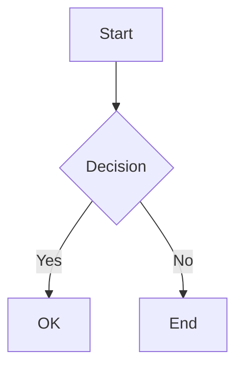
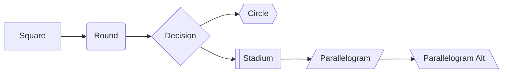
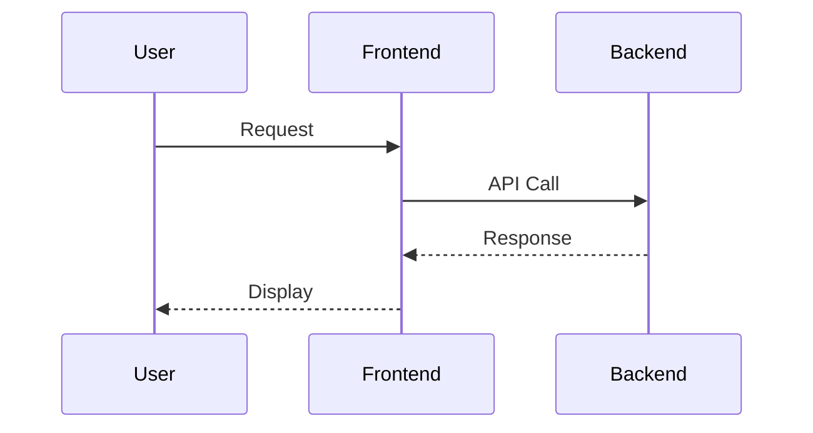
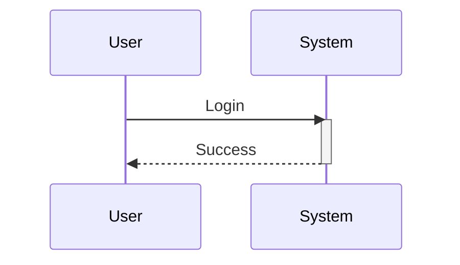
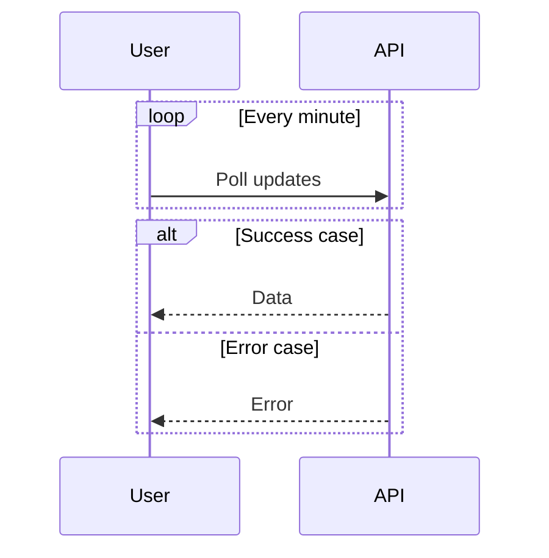
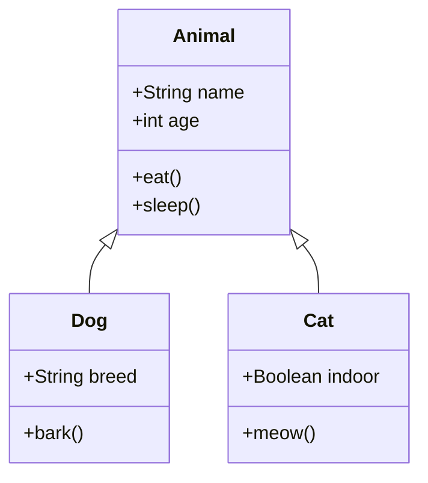
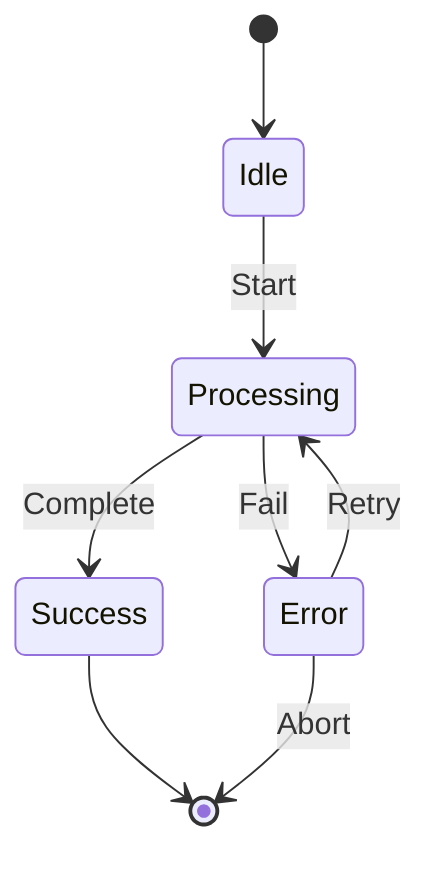
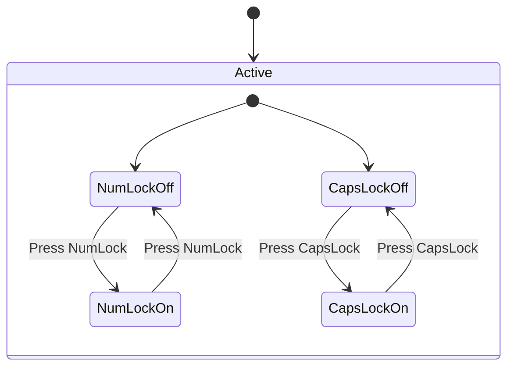
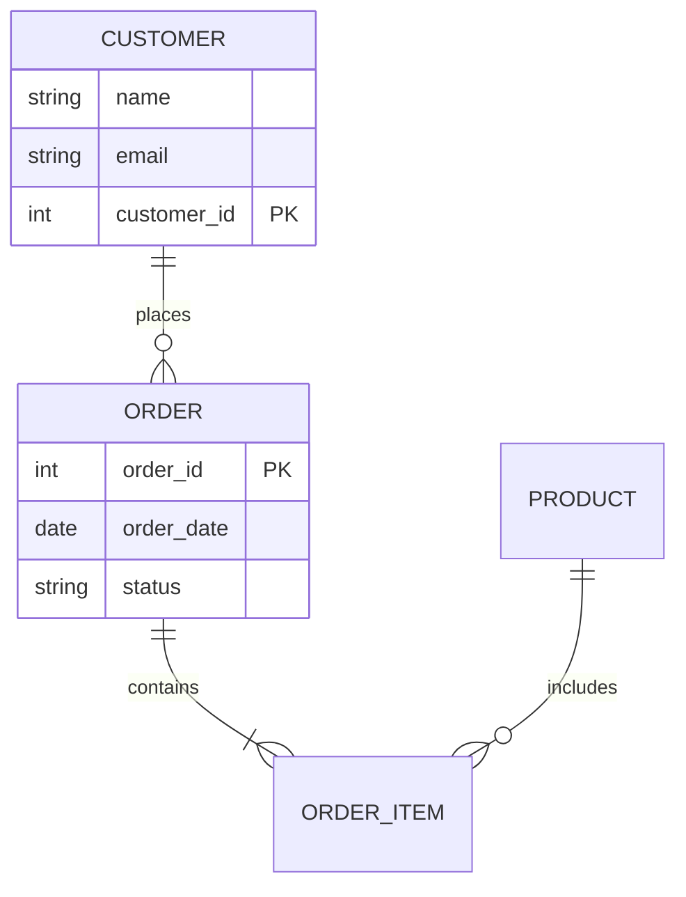

# Mermaid Cheat Sheet

Complete syntax reference and examples for Mermaid diagrams in documentation.

## Basic Syntax

````md
```mermaid
[diagram-type]
  [diagram-content]
```
````

## Flowchart

### Basic Structure

````md

````


### Syntax

````md

````


### Node Types

- `[Square]` - Rectangle

- `(Round)` - Rounded rectangle

- `{Decision}` - Diamond

- `{{Circle}}` - Circle

- `[[Stadium]]` - Stadium

- `[/Parallelogram/]` - Parallelogram

- `[\Parallelogram Alt\]` - Parallelogram alternative


### Directions

- `TB` / `TD` - Top to bottom

- `BT` - Bottom to top

- `RL` - Right to left

- `LR` - Left to right

## Sequence Diagrams

### Basic Structure

````md

````


### Arrow Types
- `->` Solid line without arrow

- `-->` Dotted line without arrow

- `->>` Solid line with arrowhead

- `-->>` Dotted line with arrowhead

- `-x` Solid line with cross

- `--x` Dotted line with cross

- `-)` Solid line with open arrow

- `--)` Dotted line with open arrow

### Activations

````md

````


### Loops and Alt

````md

````


## Class Diagrams

### Basic Structure

````md

````


### Relationship Types

- `<|--` Inheritance

- `*--` Composition

- `o--` Aggregation

- `-->` Association

- `--` Link

- `..>` Dependency

- `..|>` Realization

### Visibility

- `+` Public

- `-` Private

- `#` Protected

- `~` Package

## State Diagrams
Basic Structure

````md

````


Concurrent States
````md

````


## Entity Relationship Diagrams
Basic Structure

````md

````


Cardinality
- `||--o{` One to Many

- `||--||` One to One

- `}o--||` Many to One

- `}o--o{` Many to Many

## User Journey

Basic Structure

````md
```mermaid
journey
    title My Day
    section Morning
      Breakfast: 5: Me
      Work: 4: Me
    section Afternoon
      Lunch: 3: Me
      Work: 4: Me
    section Evening
      Dinner: 4: Me
      Relax: 5: Me
```
````

```mermaid
journey
    title My Day
    section Morning
      Breakfast: 5: Me
      Work: 4: Me
    section Afternoon
      Lunch: 3: Me
      Work: 4: Me
    section Evening
      Dinner: 4: Me
      Relax: 5: Me
```

## Gantt Charts

### Basic Structure
````md
```mermaid
gantt
    title Project Timeline
    dateFormat YYYY-MM-DD
    section Planning
    Requirements :done, req1, 2024-01-01, 14d
    Design :active, des1, after req1, 14d
    section Development
    Implementation :dev1, after des1, 21d
    Testing :test1, after dev1, 14d
```
````

```mermaid
gantt
    title Project Timeline
    dateFormat YYYY-MM-DD
    section Planning
    Requirements :done, req1, 2024-01-01, 14d
    Design :active, des1, after req1, 14d
    section Development
    Implementation :dev1, after des1, 21d
    Testing :test1, after dev1, 14d
```

### Task States

- `done` - Completed

- `active` - Currently working

- `crit` - Critical path

- `milestone` - Milestone marker

## Pie Charts
Basic Structure

````md
```mermaid
pie title Programming Languages
    "JavaScript" : 35
    "Python" : 25
    "Java" : 20
    "Other" : 20
```
````

```mermaid
pie title Programming Languages
    "JavaScript" : 35
    "Python" : 25
    "Java" : 20
    "Other" : 20
```

## Quadrant Charts
Basic Structure
````md
```mermaid
quadrantChart
    title Technology Assessment
    x-axis "Low" --> "High"
    y-axis "Low" --> "High"
    quadrant-1 "Adopt"
    quadrant-2 "Test"
    quadrant-3 "Hold"
    quadrant-4 "Assess"
    "React": [0.8, 0.9]
    "Vue": [0.7, 0.8]
    "Angular": [0.6, 0.7]
```
````

```mermaid
quadrantChart
    title Technology Assessment
    x-axis "Low" --> "High"
    y-axis "Low" --> "High"
    quadrant-1 "Adopt"
    quadrant-2 "Test"
    quadrant-3 "Hold"
    quadrant-4 "Assess"
    "React": [0.8, 0.9]
    "Vue": [0.7, 0.8]
    "Angular": [0.6, 0.7]
```

## Git Graphs

### Basic Structure

````md
```mermaid
gitGraph
   commit
   commit
   branch develop
   checkout develop
   commit
   commit
   checkout main
   merge develop
   commit
```
````

```mermaid
gitGraph
   commit
   commit
   branch develop
   checkout develop
   commit
   commit
   checkout main
   merge develop
   commit
```

### Advanced Git Graph

````md
```mermaid
gitGraph
   commit id: "Initial"
   commit id: "Feature A"
   branch feature-b
   checkout feature-b
   commit id: "Feature B start"
   commit id: "Feature B work"
   checkout main
   commit id: "Hotfix"
   checkout feature-b
   commit id: "Feature B complete"
   checkout main
   merge feature-b id: "Merge B"
   commit id: "v1.0" tag: "v1.0.0"
```
````

```mermaid
gitGraph
   commit id: "Initial"
   commit id: "Feature A"
   branch feature-b
   checkout feature-b
   commit id: "Feature B start"
   commit id: "Feature B work"
   checkout main
   commit id: "Hotfix"
   checkout feature-b
   commit id: "Feature B complete"
   checkout main
   merge feature-b id: "Merge B"
   commit id: "v1.0" tag: "v1.0.0"
```

## Mind Maps
Basic Structure

````md
```mermaid
mindmap
  root((Software Engineering))
    Backend
      API Design
        REST
        GraphQL
      Databases
        SQL
        NoSQL
    Frontend
      Frameworks
        React
        Vue
      State Management
    DevOps
      CI/CD
      Containerization
```
````

```mermaid
mindmap
  root((Software Engineering))
    Backend
      API Design
        REST
        GraphQL
      Databases
        SQL
        NoSQL
    Frontend
      Frameworks
        React
        Vue
      State Management
    DevOps
      CI/CD
      Containerization
```

## Timeline
Basic Structure

````md
```mermaid
timeline
    title Project History
    2023 : Project Start
            : Requirements
    2024 Q1 : Development
            : Testing
    2024 Q2 : Launch
            : User Feedback
```
````

```mermaid
timeline
    title Project History
    2023 : Project Start
            : Requirements
    2024 Q1 : Development
            : Testing
    2024 Q2 : Launch
            : User Feedback
```

## Styling and Themes

### Node Styling

````md
```mermaid
flowchart LR
    A[Node A] --> B[Node B]
    
    style A fill:#e1f5fe,stroke:#01579b,stroke-width:2px
    style B fill:#f3e5f5,stroke:#4a148c,stroke-width:2px,color:#fff,stroke-dasharray: 5 5
```
````

```mermaid
flowchart LR
    A[Node A] --> B[Node B]
    
    style A fill:#e1f5fe,stroke:#01579b,stroke-width:2px
    style B fill:#f3e5f5,stroke:#4a148c,stroke-width:2px,color:#fff,stroke-dasharray: 5 5
```

### Class Styling

````md
```mermaid
classDiagram
    class Animal
    class Dog
    
    Animal <|-- Dog
    
    %% Styling
    classDef animalClass fill:#e1f5fe
    classDef dogClass fill:#c8e6c9
    
    class Animal animalClass
    class Dog dogClass
```
````

```mermaid
classDiagram
    class Animal
    class Dog
    
    Animal <|-- Dog
    
    %% Styling
    classDef animalClass fill:#e1f5fe
    classDef dogClass fill:#c8e6c9
    
    class Animal animalClass
    class Dog dogClass
```


See detailed examples [Mermaid examples](mermaid_examples.md)