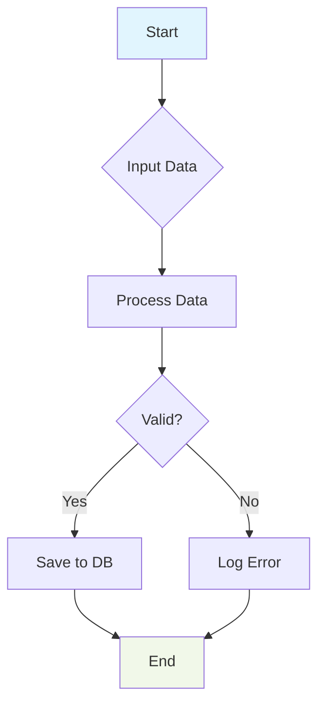
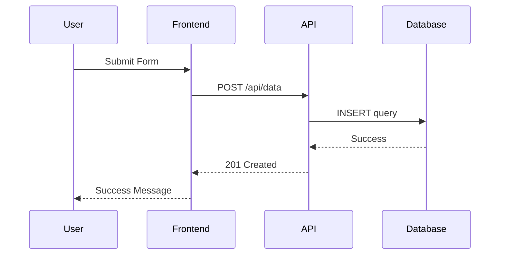
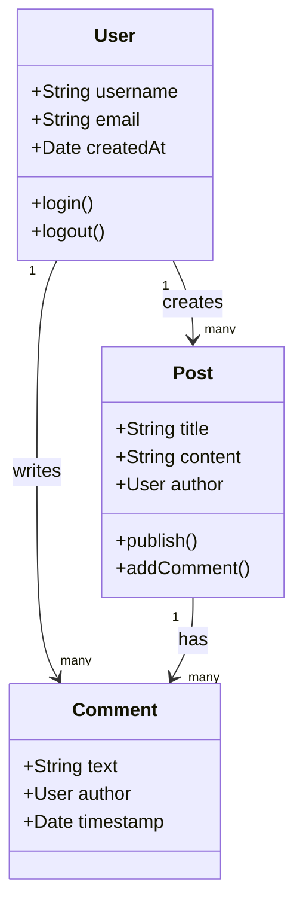
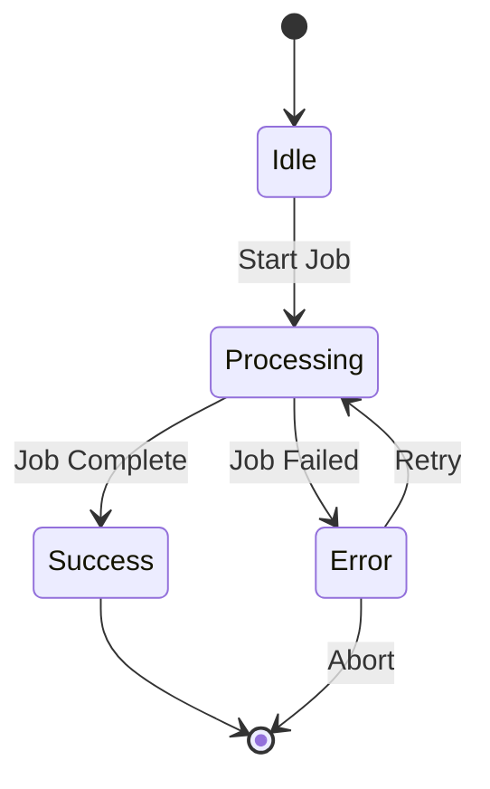
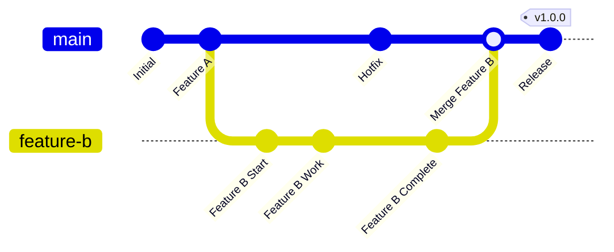
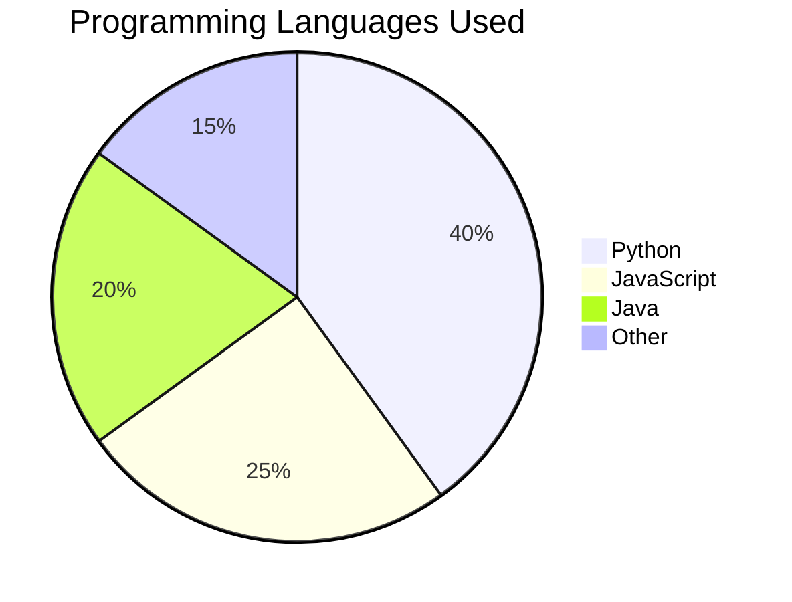
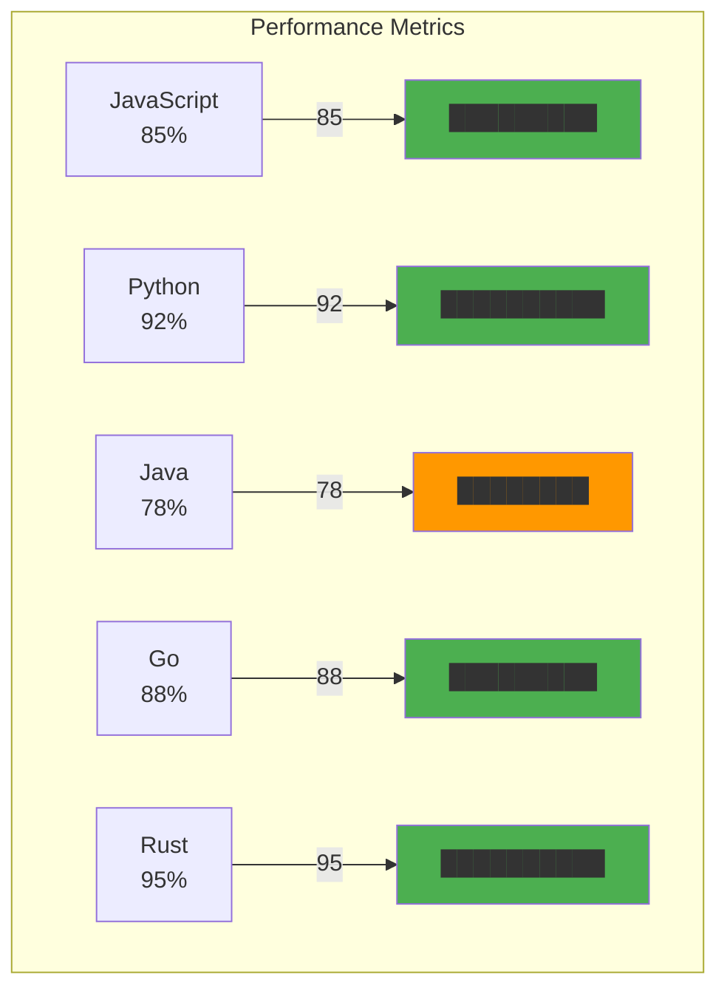
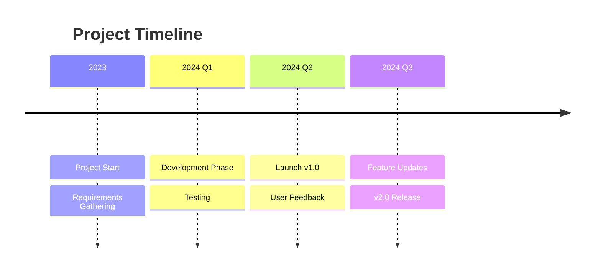
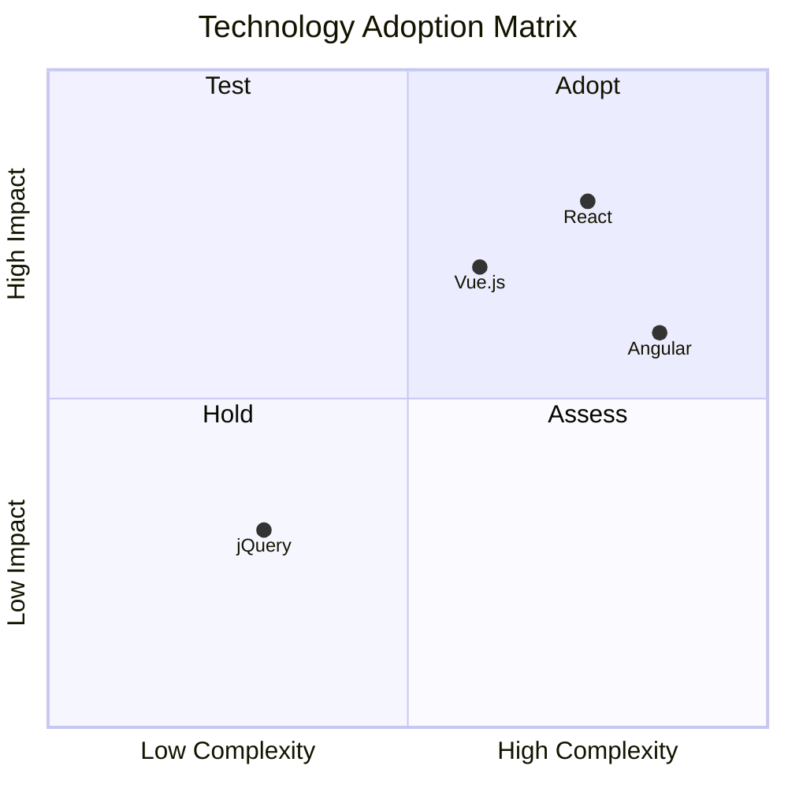
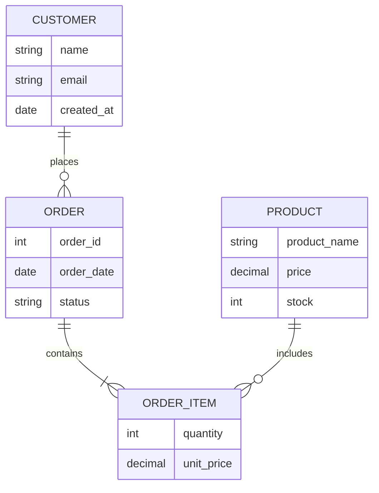

# Mermaid examples

This document will show some common examples of diagrams created using Mermaid syntax.

## Flowchart

````md

````


## Sequence Diagram

````md

````


## Class Diagram

````md

````


## State Diagram

````md

````


## Git Graph

````md

````


## Pie Chart

````md

````


## Flowcharts to Create Bar Charts

````md

````


## Timeline

````md

````


## Quadrant Chart

````md

````


## ER Diagrams

````md

````


## Mind Maps

````md
```mermaid
mindmap
  root((Software Architecture))
    Backend
      API Design
        REST
        GraphQL
      Database
        SQL
        NoSQL
      Caching
        Redis
        Memcached
    Frontend
      Frameworks
        React
        Vue
        Angular
      State Management
        Redux
        Vuex
    DevOps
      CI/CD
        GitHub Actions
        Jenkins
      Containerization
        Docker
        Kubernetes
```
````
```mermaid
mindmap
  root((Software Architecture))
    Backend
      API Design
        REST
        GraphQL
      Database
        SQL
        NoSQL
      Caching
        Redis
        Memcached
    Frontend
      Frameworks
        React
        Vue
        Angular
      State Management
        Redux
        Vuex
    DevOps
      CI/CD
        GitHub Actions
        Jenkins
      Containerization
        Docker
        Kubernetes
```

## Gantt Charts

````md
```mermaid
gantt
    title Project Development Timeline
    dateFormat  YYYY-MM-DD
    section Planning
    Requirements Gathering :crit, done, 2024-01-01, 14d
    System Design          :active, 2024-01-15, 14d
    section Development
    Backend Development    :2024-01-29, 28d
    Frontend Development   :2024-02-12, 28d
    section Testing
    Unit Testing           :2024-03-11, 14d
    Integration Testing    :2024-03-25, 14d
    section Deployment
    Production Release     :2024-04-08, 7d
```
````
```mermaid
gantt
    title Project Development Timeline
    dateFormat  YYYY-MM-DD
    section Planning
    Requirements Gathering :crit, done, 2024-01-01, 14d
    System Design          :active, 2024-01-15, 14d
    section Development
    Backend Development    :2024-01-29, 28d
    Frontend Development   :2024-02-12, 28d
    section Testing
    Unit Testing           :2024-03-11, 14d
    Integration Testing    :2024-03-25, 14d
    section Deployment
    Production Release     :2024-04-08, 7d
```

## Simple Flowchart

````md
```mermaid
flowchart LR
    A[Start] --> B[Process]
    B --> C{Decision}
    C -->|Yes| D[Success]
    C -->|No| E[Failure]
    D --> F[End]
    E --> F
```
````

```mermaid
flowchart LR
    A[Start] --> B[Process]
    B --> C{Decision}
    C -->|Yes| D[Success]
    C -->|No| E[Failure]
    D --> F[End]
    E --> F
```

## System Architecture

````md
```mermaid
flowchart TB
    subgraph Frontend
        A[React App]
        B[Vue.js App]
    end
    
    subgraph Backend
        C[API Gateway]
        D[Auth Service]
        E[User Service]
    end
    
    subgraph Database
        F[(MySQL)]
        G[(Redis)]
    end
    
    A --> C
    B --> C
    C --> D
    C --> E
    D --> F
    E --> F
    E --> G
```
````
```mermaid
flowchart TB
    subgraph Frontend
        A[React App]
        B[Vue.js App]
    end
    
    subgraph Backend
        C[API Gateway]
        D[Auth Service]
        E[User Service]
    end
    
    subgraph Database
        F[(MySQL)]
        G[(Redis)]
    end
    
    A --> C
    B --> C
    C --> D
    C --> E
    D --> F
    E --> F
    E --> G
```

## CI/CD Pipeline

````md
```mermaid
flowchart LR
    A[Code Commit] --> B[GitHub]
    B --> C[CI Pipeline]
    
    subgraph C [CI Pipeline]
        D[Lint & Test]
        E[Build]
        F[Security Scan]
    end
    
    C --> G{Docker Registry}
    G --> H[Kubernetes]
    H --> I[Production]
    
    style A fill:#e1f5fe
    style I fill:#c8e6c9
```
````
```mermaid
flowchart LR
    A[Code Commit] --> B[GitHub]
    B --> C[CI Pipeline]
    
    subgraph C [CI Pipeline]
        D[Lint & Test]
        E[Build]
        F[Security Scan]
    end
    
    C --> G{Docker Registry}
    G --> H[Kubernetes]
    H --> I[Production]
    
    style A fill:#e1f5fe
    style I fill:#c8e6c9
```

## Database Relations

````md
```mermaid
erDiagram
    USER {
        int user_id PK
        string username
        string email
        datetime created_at
    }
    
    POST {
        int post_id PK
        string title
        text content
        int user_id FK
        datetime published_at
    }
    
    COMMENT {
        int comment_id PK
        text content
        int user_id FK
        int post_id FK
        datetime created_at
    }
    
    USER ||--o{ POST : writes
    USER ||--o{ COMMENT : authors
    POST ||--o{ COMMENT : has
```
````
```mermaid
erDiagram
    USER {
        int user_id PK
        string username
        string email
        datetime created_at
    }
    
    POST {
        int post_id PK
        string title
        text content
        int user_id FK
        datetime published_at
    }
    
    COMMENT {
        int comment_id PK
        text content
        int user_id FK
        int post_id FK
        datetime created_at
    }
    
    USER ||--o{ POST : writes
    USER ||--o{ COMMENT : authors
    POST ||--o{ COMMENT : has
```
## Organizational Chart

````md
```mermaid
%%{ init : { "theme" : "default" } }%%
flowchart TD
    A[CEO] --> B[CTO]
    A --> C[CFO]
    A --> D[COO]
    B --> E[Engineering Manager]
    B --> F[Product Manager]
    C --> G[Finance Manager]
    D --> H[Operations Manager]
```
````
```mermaid
%%{ init : { "theme" : "default" } }%%
flowchart TD
    A[CEO] --> B[CTO]
    A --> C[CFO]
    A --> D[COO]
    B --> E[Engineering Manager]
    B --> F[Product Manager]
    C --> G[Finance Manager]
    D --> H[Operations Manager]
```

## User Journey

````md
```mermaid
journey
    title User Registration Journey
    section Visit Site
      Homepage: 5: User
    section Registration
      Sign Up: 4: User
      Verify Email: 3: User
    section Onboarding
      Complete Profile: 4: User
      First Action: 5: User
    section Regular Use
      Daily Usage: 5: User
      Feature Discovery: 3: User
```
````
```mermaid
journey
    title User Registration Journey
    section Visit Site
      Homepage: 5: User
    section Registration
      Sign Up: 4: User
      Verify Email: 3: User
    section Onboarding
      Complete Profile: 4: User
      First Action: 5: User
    section Regular Use
      Daily Usage: 5: User
      Feature Discovery: 3: User
```

## State Machine

````md
```mermaid
stateDiagram-v2
    [*] --> Idle
    Idle --> Processing : receive_request
    Processing --> Validating : parse_data
    Validating --> Success : data_valid
    Validating --> Error : data_invalid
    Success --> [*] : complete
    Error --> Retrying : attempt_retry
    Retrying --> Processing : retry
    Retrying --> [*] : max_retries_exceeded
```
````

```mermaid
stateDiagram-v2
    [*] --> Idle
    Idle --> Processing : receive_request
    Processing --> Validating : parse_data
    Validating --> Success : data_valid
    Validating --> Error : data_invalid
    Success --> [*] : complete
    Error --> Retrying : attempt_retry
    Retrying --> Processing : retry
    Retrying --> [*] : max_retries_exceeded
```

## Package/Dependency Diagrams

````md
```mermaid
graph TB
    subgraph "Frontend Packages"
        A[react] --> B[react-dom]
        A --> C[react-router]
        B --> D[webpack]
        C --> D
    end
    
    subgraph "Backend Packages"
        E[express] --> F[mongoose]
        E --> G[passport]
        F --> H[mongodb]
    end
    
    subgraph "Dev Dependencies"
        I[jest] --> J[eslint]
        K[webpack-dev-server] --> D
    end
    
    style A fill:#bbdefb
    style E fill:#c8e6c9
    style I fill:#ffecb3
```
````
```mermaid
graph TB
    subgraph "Frontend Packages"
        A[react] --> B[react-dom]
        A --> C[react-router]
        B --> D[webpack]
        C --> D
    end
    
    subgraph "Backend Packages"
        E[express] --> F[mongoose]
        E --> G[passport]
        F --> H[mongodb]
    end
    
    subgraph "Dev Dependencies"
        I[jest] --> J[eslint]
        K[webpack-dev-server] --> D
    end
    
    style A fill:#bbdefb
    style E fill:#c8e6c9
    style I fill:#ffecb3
```

## C4 Model Diagrams (Context & Containers)

````md
```mermaid
flowchart TB
    subgraph "System Context"
        U[User] --> S[Software System]
        A[Admin] --> S
        E[External API] --> S
    end
    
    subgraph "Container Diagram"
        subgraph "Web Application"
            FE[Single-Page App<br/>React]
        end
        
        subgraph "Backend Services"
            API[API Application<br/>Node.js]
            AUTH[Auth Service<br/>JWT]
            DB[(Database<br/>PostgreSQL)]
        end
        
        FE --> API
        API --> AUTH
        API --> DB
    end
    
    S --> FE
```
````

```mermaid
flowchart TB
    subgraph "System Context"
        U[User] --> S[Software System]
        A[Admin] --> S
        E[External API] --> S
    end
    
    subgraph "Container Diagram"
        subgraph "Web Application"
            FE[Single-Page App<br/>React]
        end
        
        subgraph "Backend Services"
            API[API Application<br/>Node.js]
            AUTH[Auth Service<br/>JWT]
            DB[(Database<br/>PostgreSQL)]
        end
        
        FE --> API
        API --> AUTH
        API --> DB
    end
    
    S --> FE
```

## Data Flow Diagrams

````md

```mermaid
flowchart LR
    subgraph External
        U[User Browser]
        M[Mobile App]
    end
    
    subgraph "Load Balancer"
        LB[NGINX LB]
    end
    
    subgraph "Application Layer"
        WS1[Web Server 1]
        WS2[Web Server 2]
        AS1[API Server 1]
        AS2[API Server 2]
    end
    
    subgraph "Data Layer"
        C[(Redis Cache)]
        DB1[(Primary DB)]
        DB2[(Replica DB)]
        ES[(Elasticsearch)]
    end
    
    U --> LB
    M --> LB
    LB --> WS1
    LB --> WS2
    WS1 --> AS1
    WS2 --> AS2
    AS1 --> C
    AS1 --> DB1
    AS2 --> C
    AS2 --> DB2
    DB1 -.-> DB2
    AS1 --> ES
    AS2 --> ES
```

````

```mermaid
flowchart LR
    subgraph External
        U[User Browser]
        M[Mobile App]
    end
    
    subgraph "Load Balancer"
        LB[NGINX LB]
    end
    
    subgraph "Application Layer"
        WS1[Web Server 1]
        WS2[Web Server 2]
        AS1[API Server 1]
        AS2[API Server 2]
    end
    
    subgraph "Data Layer"
        C[(Redis Cache)]
        DB1[(Primary DB)]
        DB2[(Replica DB)]
        ES[(Elasticsearch)]
    end
    
    U --> LB
    M --> LB
    LB --> WS1
    LB --> WS2
    WS1 --> AS1
    WS2 --> AS2
    AS1 --> C
    AS1 --> DB1
    AS2 --> C
    AS2 --> DB2
    DB1 -.-> DB2
    AS1 --> ES
    AS2 --> ES
```


## Kubernetes Architecture

````md
```mermaid
flowchart TB
    subgraph "Kubernetes Cluster"
        subgraph "Control Plane"
            API[API Server]
            SCH[Scheduler]
            CM[Controller Manager]
            ETCD[(etcd)]
        end
        
        subgraph "Worker Nodes"
            subgraph "Node 1"
                KPLET1[kubelet]
                POD1A[App Pod]
                POD1B[App Pod]
            end
            
            subgraph "Node 2"
                KPLET2[kubelet]
                POD2A[App Pod]
                POD2B[App Pod]
            end
        end
        
        subgraph "Networking"
            CNI[CNI Plugin]
            DNS[CoreDNS]
            ING[Ingress<br/>Controller]
        end
    end
    
    API --> ETCD
    API --> SCH
    API --> CM
    API --> KPLET1
    API --> KPLET2
    KPLET1 --> POD1A
    KPLET1 --> POD1B
    KPLET2 --> POD2A
    KPLET2 --> POD2B
    POD1A --> CNI
    POD2A --> CNI
    CNI --> DNS
    ING --> POD1A
    ING --> POD2A
```
````
```mermaid
flowchart TB
    subgraph "Kubernetes Cluster"
        subgraph "Control Plane"
            API[API Server]
            SCH[Scheduler]
            CM[Controller Manager]
            ETCD[(etcd)]
        end
        
        subgraph "Worker Nodes"
            subgraph "Node 1"
                KPLET1[kubelet]
                POD1A[App Pod]
                POD1B[App Pod]
            end
            
            subgraph "Node 2"
                KPLET2[kubelet]
                POD2A[App Pod]
                POD2B[App Pod]
            end
        end
        
        subgraph "Networking"
            CNI[CNI Plugin]
            DNS[CoreDNS]
            ING[Ingress<br/>Controller]
        end
    end
    
    API --> ETCD
    API --> SCH
    API --> CM
    API --> KPLET1
    API --> KPLET2
    KPLET1 --> POD1A
    KPLET1 --> POD1B
    KPLET2 --> POD2A
    KPLET2 --> POD2B
    POD1A --> CNI
    POD2A --> CNI
    CNI --> DNS
    ING --> POD1A
    ING --> POD2A
```
## Microservices Communication

````md

```mermaid
flowchart TB
    GW[API Gateway] --> AUTH[Auth Service]
    GW --> USER[User Service]
    GW --> ORDER[Order Service]
    GW --> PAYMENT[Payment Service]
    GW --> NOTIFY[Notification Service]
    
    USER --> UDB[(User DB)]
    ORDER --> ODB[(Order DB)]
    PAYMENT --> PDB[(Payment DB)]
    
    ORDER --> USER
    ORDER --> PAYMENT
    PAYMENT --> NOTIFY
    
    subgraph "Message Queue"
        MQ[(RabbitMQ)]
    end
    
    NOTIFY --> MQ
    MQ --> EMAIL[Email Service]
    MQ --> SMS[SMS Service]
    MQ --> PUSH[Push Service]
    
    style GW fill:#e3f2fd
    style MQ fill:#f3e5f5
```

````
```mermaid
flowchart TB
    GW[API Gateway] --> AUTH[Auth Service]
    GW --> USER[User Service]
    GW --> ORDER[Order Service]
    GW --> PAYMENT[Payment Service]
    GW --> NOTIFY[Notification Service]
    
    USER --> UDB[(User DB)]
    ORDER --> ODB[(Order DB)]
    PAYMENT --> PDB[(Payment DB)]
    
    ORDER --> USER
    ORDER --> PAYMENT
    PAYMENT --> NOTIFY
    
    subgraph "Message Queue"
        MQ[(RabbitMQ)]
    end
    
    NOTIFY --> MQ
    MQ --> EMAIL[Email Service]
    MQ --> SMS[SMS Service]
    MQ --> PUSH[Push Service]
    
    style GW fill:#e3f2fd
    style MQ fill:#f3e5f5
```

## Security Architecture

````md
```mermaid
flowchart LR
    CLIENT[Client] --> FW[Firewall]
    FW --> WAF[WAF]
    WAF --> LB[Load Balancer]
    LB --> GW[API Gateway]
    
    GW --> AUTH[Auth Service]
    AUTH --> JWT[JWT Validation]
    JWT --> POL[Policy Engine]
    
    subgraph "Internal Network"
        POL --> SVC1[Service 1]
        POL --> SVC2[Service 2]
        POL --> SVC3[Service 3]
        
        SVC1 --> AUDIT[Audit Log]
        SVC2 --> AUDIT
        SVC3 --> AUDIT
    end
    
    AUDIT --> SIEM[SIEM System]
    
    style FW fill:#ffcdd2
    style WAF fill:#ffcdd2
    style AUTH fill:#c8e6c9
    style AUDIT fill:#ffecb3
```
````
```mermaid
flowchart LR
    CLIENT[Client] --> FW[Firewall]
    FW --> WAF[WAF]
    WAF --> LB[Load Balancer]
    LB --> GW[API Gateway]
    
    GW --> AUTH[Auth Service]
    AUTH --> JWT[JWT Validation]
    JWT --> POL[Policy Engine]
    
    subgraph "Internal Network"
        POL --> SVC1[Service 1]
        POL --> SVC2[Service 2]
        POL --> SVC3[Service 3]
        
        SVC1 --> AUDIT[Audit Log]
        SVC2 --> AUDIT
        SVC3 --> AUDIT
    end
    
    AUDIT --> SIEM[SIEM System]
    
    style FW fill:#ffcdd2
    style WAF fill:#ffcdd2
    style AUTH fill:#c8e6c9
    style AUDIT fill:#ffecb3
```
## Monitoring & Observability Stack

````md
```mermaid
flowchart TB
    subgraph "Applications"
        APP1[App 1]
        APP2[App 2]
        APP3[App 3]
    end
    
    subgraph "Data Collection"
        MET[Metrics<br/>Prometheus]
        LOG[Logs<br/>Loki]
        TRACE[Traces<br/>Jaeger]
    end
    
    subgraph "Visualization"
        GRAFANA[Grafana]
    end
    
    subgraph "Alerting"
        ALERT[Alert Manager]
        NOTIFY[Slack/Email/PagerDuty]
    end
    
    APP1 --> MET
    APP2 --> MET
    APP3 --> MET
    
    APP1 --> LOG
    APP2 --> LOG
    APP3 --> LOG
    
    APP1 --> TRACE
    APP2 --> TRACE
    APP3 --> TRACE
    
    MET --> GRAFANA
    LOG --> GRAFANA
    TRACE --> GRAFANA
    
    MET --> ALERT
    ALERT --> NOTIFY
    
    style GRAFANA fill:#e8f5e8
    style ALERT fill:#ffebee
```
````
```mermaid
flowchart TB
    subgraph "Applications"
        APP1[App 1]
        APP2[App 2]
        APP3[App 3]
    end
    
    subgraph "Data Collection"
        MET[Metrics<br/>Prometheus]
        LOG[Logs<br/>Loki]
        TRACE[Traces<br/>Jaeger]
    end
    
    subgraph "Visualization"
        GRAFANA[Grafana]
    end
    
    subgraph "Alerting"
        ALERT[Alert Manager]
        NOTIFY[Slack/Email/PagerDuty]
    end
    
    APP1 --> MET
    APP2 --> MET
    APP3 --> MET
    
    APP1 --> LOG
    APP2 --> LOG
    APP3 --> LOG
    
    APP1 --> TRACE
    APP2 --> TRACE
    APP3 --> TRACE
    
    MET --> GRAFANA
    LOG --> GRAFANA
    TRACE --> GRAFANA
    
    MET --> ALERT
    ALERT --> NOTIFY
    
    style GRAFANA fill:#e8f5e8
    style ALERT fill:#ffebee
```

## Git Workflow

````md
```mermaid
gitGraph
   commit id: "Initial"
   commit id: "Feature A"
   branch feature-b
   checkout feature-b
   commit id: "Feature B start"
   commit id: "Feature B work"
   checkout main
   commit id: "Hotfix"
   checkout feature-b
   commit id: "Feature B complete"
   checkout main
   merge feature-b id: "Merge B"
   branch feature-c
   checkout feature-c
   commit id: "Feature C"
   checkout main
   commit id: "Release prep"
   checkout feature-c
   commit id: "Feature C fixes"
   checkout main
   merge feature-c id: "Merge C"
   commit id: "v1.0 Release" tag: "v1.0.0"
```
````

```mermaid
gitGraph
   commit id: "Initial"
   commit id: "Feature A"
   branch feature-b
   checkout feature-b
   commit id: "Feature B start"
   commit id: "Feature B work"
   checkout main
   commit id: "Hotfix"
   checkout feature-b
   commit id: "Feature B complete"
   checkout main
   merge feature-b id: "Merge B"
   branch feature-c
   checkout feature-c
   commit id: "Feature C"
   checkout main
   commit id: "Release prep"
   checkout feature-c
   commit id: "Feature C fixes"
   checkout main
   merge feature-c id: "Merge C"
   commit id: "v1.0 Release" tag: "v1.0.0"
```

## Database Migration Strategy

````md
```mermaid
flowchart TB
    START[Start Migration] --> BACKUP[Backup Production]
    BACKUP --> V1[Version 1: Schema Changes]
    V1 --> DEPLOY1[Deploy Backward Compatible]
    DEPLOY1 --> V2[Version 2: Data Migration]
    V2 --> DEPLOY2[Deploy with Dual Write]
    DEPLOY2 --> V3[Version 3: Switch Reads]
    V3 --> TEST[Verify Data Consistency]
    TEST --> V4[Version 4: Cleanup Old Data]
    V4 --> COMPLETE[Migration Complete]
    
    DEPLOY1 --> ROLLBACK1[Rollback Plan]
    DEPLOY2 --> ROLLBACK2[Rollback Plan]
    TEST --> ROLLBACK3[Rollback Plan]
    
    style START fill:#e3f2fd
    style COMPLETE fill:#c8e6c9
    style ROLLBACK1 fill:#ffebee
    style ROLLBACK2 fill:#ffebee
    style ROLLBACK3 fill:#ffebee
```
````
```mermaid
flowchart TB
    START[Start Migration] --> BACKUP[Backup Production]
    BACKUP --> V1[Version 1: Schema Changes]
    V1 --> DEPLOY1[Deploy Backward Compatible]
    DEPLOY1 --> V2[Version 2: Data Migration]
    V2 --> DEPLOY2[Deploy with Dual Write]
    DEPLOY2 --> V3[Version 3: Switch Reads]
    V3 --> TEST[Verify Data Consistency]
    TEST --> V4[Version 4: Cleanup Old Data]
    V4 --> COMPLETE[Migration Complete]
    
    DEPLOY1 --> ROLLBACK1[Rollback Plan]
    DEPLOY2 --> ROLLBACK2[Rollback Plan]
    TEST --> ROLLBACK3[Rollback Plan]
    
    style START fill:#e3f2fd
    style COMPLETE fill:#c8e6c9
    style ROLLBACK1 fill:#ffebee
    style ROLLBACK2 fill:#ffebee
    style ROLLBACK3 fill:#ffebee
```

## CI/CD Pipeline with Quality Gates

````md
```mermaid
flowchart LR
    subgraph Pipeline
        direction TB
        S1[Code Commit] --> S2[Lint & Format]
        S2 --> S3[Unit Tests]
        S3 --> S4[Security Scan]
        S4 --> S5[Build Image]
        S5 --> S6[Integration Tests]
        S6 --> S7[Deploy to Staging]
        S7 --> S8[E2E Tests]
        S8 --> S9[Performance Tests]
        S9 --> S10[Deploy to Production]
    end
    
    S3 -.->|Fail| FAIL[Fail Fast]
    S4 -.->|Vulnerabilities| FAIL
    S6 -.->|Test Failures| FAIL
    S8 -.->|E2E Failures| FAIL
    S9 -.->|Performance Issues| FAIL
    
    style S1 fill:#e3f2fd
    style S10 fill:#c8e6c9
    style FAIL fill:#ffebee
```
````
```mermaid
flowchart LR
    subgraph Pipeline
        direction TB
        S1[Code Commit] --> S2[Lint & Format]
        S2 --> S3[Unit Tests]
        S3 --> S4[Security Scan]
        S4 --> S5[Build Image]
        S5 --> S6[Integration Tests]
        S6 --> S7[Deploy to Staging]
        S7 --> S8[E2E Tests]
        S8 --> S9[Performance Tests]
        S9 --> S10[Deploy to Production]
    end
    
    S3 -.->|Fail| FAIL[Fail Fast]
    S4 -.->|Vulnerabilities| FAIL
    S6 -.->|Test Failures| FAIL
    S8 -.->|E2E Failures| FAIL
    S9 -.->|Performance Issues| FAIL
    
    style S1 fill:#e3f2fd
    style S10 fill:#c8e6c9
    style FAIL fill:#ffebee
```


## Team Organization & Ownership

````md
```mermaid
quadrantChart
    title Team Responsibility Matrix
    x-axis "Low Expertise" --> "High Expertise"
    y-axis "Low Business Impact" --> "High Business Impact"
    quadrant-1 "Invest & Grow"
    quadrant-2 "Leverage & Maintain"
    quadrant-3 "Outsource/Monitor"
    quadrant-4 "Manage Carefully"
    "Authentication Service": [0.8, 0.9]
    "Payment Processing": [0.9, 0.95]
    "User Dashboard": [0.7, 0.8]
    "Admin Panel": [0.6, 0.7]
    "Email Templates": [0.3, 0.4]
    "Logging Infrastructure": [0.4, 0.5]
    "Third-party Integrations": [0.2, 0.8]
```
````
```mermaid
quadrantChart
    title Team Responsibility Matrix
    x-axis "Low Expertise" --> "High Expertise"
    y-axis "Low Business Impact" --> "High Business Impact"
    quadrant-1 "Invest & Grow"
    quadrant-2 "Leverage & Maintain"
    quadrant-3 "Outsource/Monitor"
    quadrant-4 "Manage Carefully"
    "Authentication Service": [0.8, 0.9]
    "Payment Processing": [0.9, 0.95]
    "User Dashboard": [0.7, 0.8]
    "Admin Panel": [0.6, 0.7]
    "Email Templates": [0.3, 0.4]
    "Logging Infrastructure": [0.4, 0.5]
    "Third-party Integrations": [0.2, 0.8]
```

## Technology Radar

````md
```mermaid
quadrantChart
    title Technology Adoption Radar
    x-axis "Assess" --> "Trial"
    y-axis "Hold" --> "Adopt"
    quadrant-1 "Adopt"
    quadrant-2 "Trial" 
    quadrant-3 "Hold"
    quadrant-4 "Assess"
    "React 18": [0.8, 0.9]
    "Next.js 14": [0.7, 0.8]
    "GraphQL": [0.6, 0.7]
    "Micro Frontends": [0.4, 0.6]
    "WebAssembly": [0.3, 0.4]
    "Svelte": [0.5, 0.5]
    "Vue 3": [0.6, 0.6]
    "Angular 16": [0.2, 0.3]
```
````
```mermaid
quadrantChart
    title Technology Adoption Radar
    x-axis "Assess" --> "Trial"
    y-axis "Hold" --> "Adopt"
    quadrant-1 "Adopt"
    quadrant-2 "Trial" 
    quadrant-3 "Hold"
    quadrant-4 "Assess"
    "React 18": [0.8, 0.9]
    "Next.js 14": [0.7, 0.8]
    "GraphQL": [0.6, 0.7]
    "Micro Frontends": [0.4, 0.6]
    "WebAssembly": [0.3, 0.4]
    "Svelte": [0.5, 0.5]
    "Vue 3": [0.6, 0.6]
    "Angular 16": [0.2, 0.3]
```